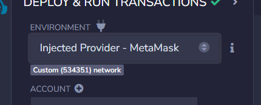

With Conflux eSpace, your favorite tools for building and testing smart contracts just work.

Since eSpace is EVM-Compatible, you’ll just need to point your favorite builder tools at a Conflux eSpace RPC Provider.

If you are not familiar with Ethereum development, you can start by learning the basics and understanding its stack through [Ethereum's official documentation](https://ethereum.org/en/developers/)

## Acquiring CFX

eSpace also uses CFX as its native currency, which will be needed to pay transaction fees for deploying and interacting with the network.

To start building on eSpace, we suggest you begin with using eSpace testnet. You'll first need to acquire some testnet CFX through [faucet](https://efaucet.confluxnetwork.org/).

Once you're ready to deploy on eSpace's mainnet, if you only have Core CFX, you can bridge over CFX from Core Space using [our space bridge](../general/tutorials/transferring-funds/transfer-funds-across-spaces.md).

## Network Configuration

### eSpace Mainnet

Use the table below to configure your Ethereum tools to the eSpace mainnet.

| Network Name       | Conflux eSpace                                                                                           |
| ------------------ | -------------------------------------------------------------------------------------------------------- |
| RPC URL            | [https://evm.confluxrpc.com](https://evm.confluxrpc.com) |
| Chain ID           | 1030                                                                                                     |
| Currency Symbol    | CFX                                                                                                      |
| Block Explorer URL | [https://evm.confluxscan.io](https://evm.confluxscan.io) |

### eSpace Testnet

Use the table below to configure your Ethereum tools to the eSpace Testnet.

| Network Name       | Conflux eSpace Testnet                                                                                                 |
| ------------------ | ---------------------------------------------------------------------------------------------------------------------- |
| RPC URL            | [https://evmtestnet.confluxrpc.com](https://evmtestnet.confluxrpc.com) |
| Chain ID           | 71                                                                                                                     |
| Currency Symbol    | CFX                                                                                                                    |
| Block Explorer URL | [https://evmtestnet.confluxscan.io](https://evmtestnet.confluxscan.io) |

## Configure your tooling

For setting up tooling to verify a smart contract deployment, see [Verifying Smart Contracts](./tutorials/VerifyContracts.md).

### Hardhat

Modify your Hardhat config file `hardhat.config.ts` to point at the eSpace Testnet public RPC.

```jsx
...

const config: HardhatUserConfig = {
  ...
  networks: {
    eSpaceTestnet: {
      url: "https://evmtestnet.confluxrpc.com" || "",
      accounts:
        process.env.PRIVATE_KEY !== undefined ? [process.env.PRIVATE_KEY] : [],
    },
  },
};

...
```

A complete workflow for using Hardhat deploy contract is shown [here](./tutorials/deployContract/hardhatAndFoundry.md)

### Foundry

To deploy using the eSpace Testnet Public RPC, run:

```bash
forge create ... --rpc-url=https://evmtestnet.confluxrpc.com --legacy
```

A complete workflow for using foundry deploy contract is shown [here](./tutorials/deployContract/hardhatAndFoundry.md)

### Remix Web IDE

After compiling your contracts, the easiest way to deploy using Remix is by [setting up Metamask](./UserGuide.md), then selecting the **Conflux eSpace Testnet** network.

Now, in the “Deploy and Run Transactions” tab, use the “Environment” drop-down and select “Injected Provider - MetaMask.”



Connect your wallet and select the Conflux eSpace Testnet. Your account should be selected automatically in Remix, and you can click “Deploy.” A complete workflow for Remix usage is shown [here](./tutorials/deployContract/remix.md)

### web3.py

:::tip

It is recommended to create virtual environments before using `web3.py` to avoid dependency conflicts, for example, by using [venv](https://docs.python.org/3/library/venv.html) or [conda](https://conda.io/projects/conda/en/latest/user-guide/tasks/manage-environments.html#creating-an-environment-with-commands).

:::

`web3.py` is one of the most widely used Python interfaces for interacting with the Ethereum blockchain and ecosystem. It can be installed using the command:

```bash
pip install web3 # or pip3 install web3
```

`web3.py` can also be used to interact with Conflux eSpace. The example code below shows how to connect to the Conflux eSpace testnet endpoint and check the connection:

```py
>>> from web3 import Web3
>>> w3 = Web3(Web3.HTTPProvider("https://evmtestnet.confluxrpc.com"))
>>> w3.is_connected() 
True # should return True
```

### Brownie

[Brownie](https://eth-brownie.readthedocs.io/en/stable/) is a Python-based development and testing framework for smart contracts targeting the Ethereum Virtual Machine. To add the Conflux eSpace networks to Brownie, run the following command:

```bash
brownie networks add "Conflux eSpace" conflux-espace-main name=Mainnet host=https://evm.confluxrpc.com explorer=https://evm.confluxscan.io chainid=1030
brownie networks add "Conflux eSpace" conflux-espace-test name=Testnet host=https://evmtestnet.confluxrpc.com explorer=https://evmtestnet.confluxscan.io chainid=71
```

To deploy on eSpace, specify the Conflux network by using the `--network` option.

```bash
brownie run scripts/token.py --network conflux-espace-test
```

The `scripts/token.py` is the Brownie script you want to run on Conflux eSpace. In our [**Brownie tutorial**](./tutorials/deployContract/brownie.md), we show the complete workflow of how to configure a template Brownie project and how to run Brownie scripts on Conflux eSpace.

### ethers.js

Setting up a eSpace Testnet provider in an `ethers` script:

```jsx
import { ethers } from "ethers"

const provider = new ethers.providers.JsonRpcProvider("https://evmtestnet.confluxrpc.com")
```

### scaffold-eth-2

[Scaffold Conflux](https://github.com/conflux-fans/conflux-scaffold) is an adaptation of [Scaffold-ETH-2](https://scaffoldeth.io/).

- We have adjusted the template to allow you to deploy the contract on Conflux eSpace.
- Conflux Scaffold offers users the ability to quickly leverage front-end react components that are commonly used to build web3 apps. These include pre-fabricated wallets with the ability to connect to Conflux eSpace, Conflux eSpace testnet, hardhat, etc. It also includes other components to display balance, and recieve address/value inputs.
- Hooks are available on Scaffold Conflux to interact with the smart contracts built on hardhat. This simplifies the process of reading contracts, writing contracts, and subscribe to events emitted by the smart contract.
- You can visit our [tutorial](./tutorials/scaffoldCfx/scaffold.md) for more in-depth discussion how to set-up Scaffold Conflux and use some of the hooks/components.

To deploy to Conflux eSpace using Scaffold-eth-2 (hardhat), specify the Conflux eSpace network when deploying.

```bash
yarn deploy --network confluxESpace
```

:::note
The deployer of the contract and thereby the owner of the contract can be changed by re-labelling the `./packages/hardhat/.env.example` to `./packages/hardhat/.env` and putting your private key in DEPLOYER_PRIVATE_KEY=. However, the default uses a default "public" private key for hardhat testing purposes.
:::

#### Configure the Frontend Wallet

To configure your frontend, you will need to change the default wallet connection to Conflux eSpace. Currently it is set up to connect to hardhat which allows you to use default burner wallets. Changing the below allows the wallet to switch to Conflux eSpace.

To add the network, modify `packages/nextjs/scaffold.config.ts`

Change from

```jsx
const scaffoldConfig = {
  targetNetworks: [chains.hardhat],
```

to

```jsx
const scaffoldConfig = {
  targetNetworks: [chains.confluxESpace],
```

#### Deploy onto Vercel

Preview the app. You should be able to connect to Conflux eSpace through your wallet.

```bash
nvm use 18
yarn start
```

Once you are ready to deploy your app, simply run the following command.

```bash
yarn vercel
```
