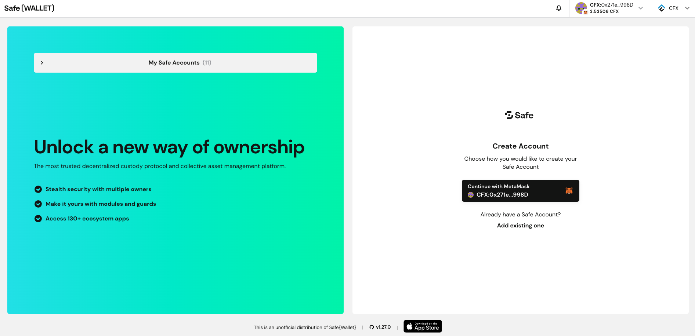

[Gnosis Safe Wallet](https://safe.global/) is a renowned multisignature wallet service in the blockchain sector, offering secure fund management solutions. It is particularly popular among Ethereum and EVM (Ethereum Virtual Machine)-compatible blockchain ecosystems. The entire source code for Gnosis Safe, including its smart contracts and both the front-end and back-end code, is open source, ensuring transparency and community trust. In its commitment to innovation, Gnosis Safe has introduced features like account abstraction, further enhancing user experience and security.

Gnosis Safe Wallet is the chosen fund management tool for numerous DeFi (Decentralized Finance) projects, such as Uniswap, Chainlink, and MakerDAO, among others, highlighting its reliability and wide adoption within the industry.

### Integration with eSpace

To support developers and DeFi projects within the eSpace ecosystem, eSpace has incorporated the Gnosis Safe Wallet into its infrastructure. [Versions 1.3.0](https://github.com/safe-global/safe-smart-account/blob/main/CHANGELOG.md#version-130-libs0) and [1.4.1](https://github.com/safe-global/safe-smart-account/blob/main/CHANGELOG.md#version-141) of the Safe contract have been deployed on both the eSpace mainnet and testnet, with their address can be found in the changelog. For mainnet users, a dedicated [Safe-Wallet-Web frontend](https://safe.conflux123.xyz/) is available, enabling the creation and management of multisignature accounts for CFX and ERC20 tokens.

## FAQs

### What is the URL for the Safe-Wallet-Web?

The URL for accessing the Safe-Wallet-Web is [https://safe.conflux123.xyz/](https://safe.conflux123.xyz/).

### Which version of the Safe contract is set as the default?

The default version of the Safe contract currently deployed and in use on both eSpace's mainnet and testnet is version 1.3.0.

### Is there a Safe-Wallet-Web available for the testnet?

As of now, a Safe-Wallet-Web frontend specific for the testnet has not been deployed. However, interactions with the testnet contracts can still be conducted using the [Safe-SDK](https://github.com/safe-global/safe-core-sdk) or [Safe CLI](https://github.com/safe-global/safe-cli).

### Can the official Safe Web Wallet or App be used with eSpace?

The official Safe Web Wallet or App is not compatible with eSpace at this time.

### Is there a mobile version of the Safe App for eSpace?

Currently, there is no mobile version of the Safe App available for eSpace.

### What should I do if I can't trigger the wallet connection popup when clicking the "Connect" button on the Welcome page?

If you're experiencing issues with the wallet connection popup not appearing, follow these steps:

- Make sure the MetaMask wallet extension is installed on your browser.
- Ensure your computer's network connection is stable; using a VPN may be beneficial, especially in certain regions.
- If this is your first visit to the welcome page, click the downward arrow in the upper right corner and select the **CFX** network.
- Then, click the "Connect" button again. This should prompt the wallet selection popup to appear, where you can choose MetaMask to proceed.
