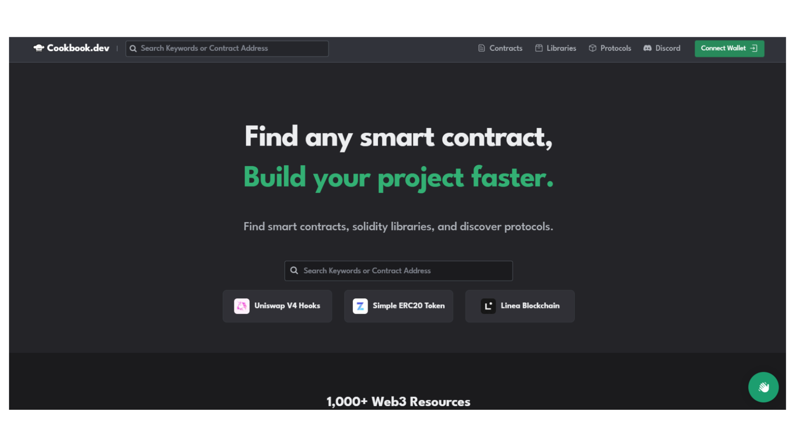
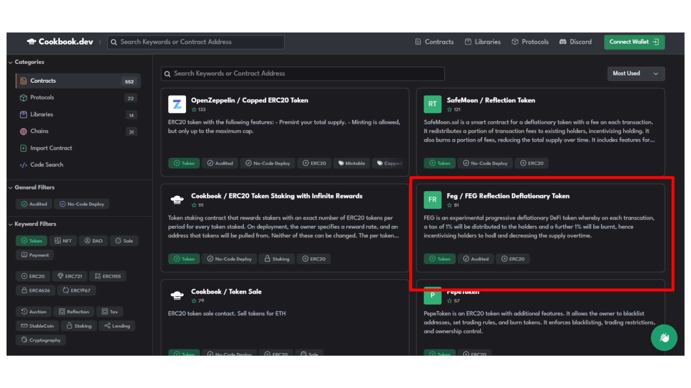
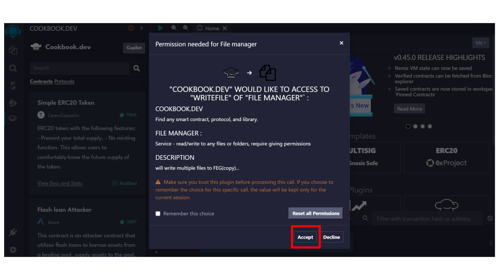
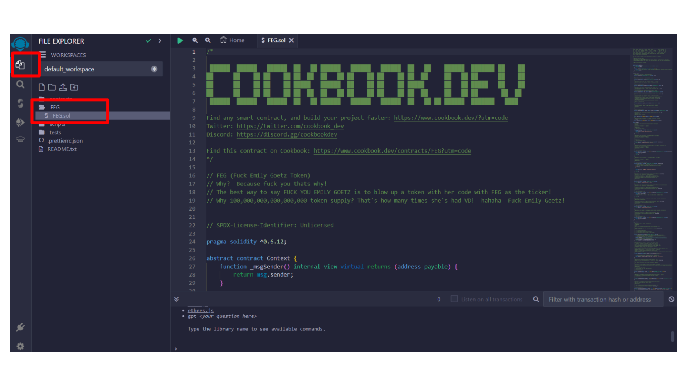

[**Cookbook**](https://www.cookbook.dev/) is an essential resource for developers working with Solidity on EVM-compatible blockchains. This guide offers an overview of what Cookbook is, who it's for, and how it can facilitate the development of smart contracts.

### What is Cookbook?

Cookbook is an open-source smart contract registry that provides developers access to Solidity primitives, libraries, and smart contracts for protocols across EVM-compatible blockchains. It integrates with a wide range of blockchain-native developer tooling, making it one of the quickest and easiest ways to start development work around smart contracts.

### Key Features

- **Search and Import:** Makes it easy to locate and open smart contracts in your preferred development environment, eliminating the need to sift through Github repositories.
- **Integrated Development Tools:** Includes plugins for Remix and VSCode, and allows downloading with boilerplate code templates.
- **ChefGPT:** An AI designed to assist in the development of smart contracts.
- **No-Code Deploy and Expanded View:** Offers options for deploying contracts without writing code and an expanded view for a better understanding of the code.

### Getting Started with Cookbook

To begin working with Cookbook, make sure you have a development environment set up for Solidity projects. Cookbook will significantly ease the development process, from searching to deploying smart contracts.

To start using Cookbook in your smart contract development projects, follow these preliminary steps:

- **Explore Cookbook Resources:** Visit [Cookbook's website](https://www.cookbook.dev/) to learn more about the available tools and resources.
- **Identify the Tools You Need:** Select the Solidity primitives, libraries, and smart contracts that are relevant to your project.
- **Integration with Your Development Environment:** Leverage Cookbook plugins to integrate directly into your favorite IDE, such as Remix or Visual Studio Code.

## Cookbook Tutorial

This tutorial guides you through deploying a DeFi Token, based on [FEG](https://fegtoken.com/), with Token Reflection Mechanism and Deflationary Tokenomics, on the eSpace Testnet using [Remix IDE](./deployContract/remix.md). This comprehensive walkthrough covers the entire deployment process, ensuring you can deploy the contract efficiently from beginning to end.

Before initiating the deployment, confirm you have test tokens from an eSpace faucet to cover any necessary deployment fees.

### Deployment Process with Remix IDE

#### 1. Accessing the Deployment Interface

- **Open Cookbook webpage**: Visit [cookbook.dev](https://www.cookbook.dev/) to explore various deployment options for your contract.
  
  
- **Navigate to Deployment section**: In the "Get Cookin'" section, sift through to find the deployment method using Remix IDE. Select this option to proceed.
  

#### 2. Remix IDE Set Up

- **Open Remix IDE:** After choosing the Remix option on Cookbook.dev, Remix Ethereum IDE will open in a new tab. Wait for the interface to load completely.
- **Grant Permission:** Remix might request permission for proper operation. Click "Accept" to proceed.
  
- **Locate the Smart Contract File:** In Remix's "FILE EXPLORER" panel, find the FEG.sol file, typically located within a folder named FEG on the workspace's left side.
  

#### 3. Modifying the Contract

- **Update Token Details:** Within the FEG/FEG.sol contract, locate the lines defining the token's name and symbol, initially set to 'FEGtoken' and 'FEG'. Update these to your chosen values, for example, 'MyDeFiToken' and 'MDT', and save the changes.
  
  

#### 4. Compiling and Deploying the Contract using Remix IDE

For this step, you can following the process already described in the [Remix IDE Tutorial](./deployContract/remix.md)

For an on-hands demonstration of how to deploy a smart contract using Remix IDE, you can also refer to the following video:

import Tabs from '@theme/Tabs';
import TabItem from '@theme/TabItem';

<Tabs>
  <TabItem value="youtube" label="Remix IDE Video Tutorial">
<iframe width="560" height="315" src="https://www.youtube.com/embed/WLbUXQ1FS8M?si=kJD-6-QN3ZqFf0_v" title="YouTube video player" frameborder="0" allow="accelerometer; autoplay; clipboard-write; encrypted-media; gyroscope; picture-in-picture; web-share" allowfullscreen></iframe>
  </TabItem>
</Tabs>

### Additional Resources

- [Cookbook Website](https://www.cookbook.dev/)
- [Cookbook Docs](https://docs.cookbook.dev/)
- [Remix IDE Website](https://remix.ethereum.org/)

