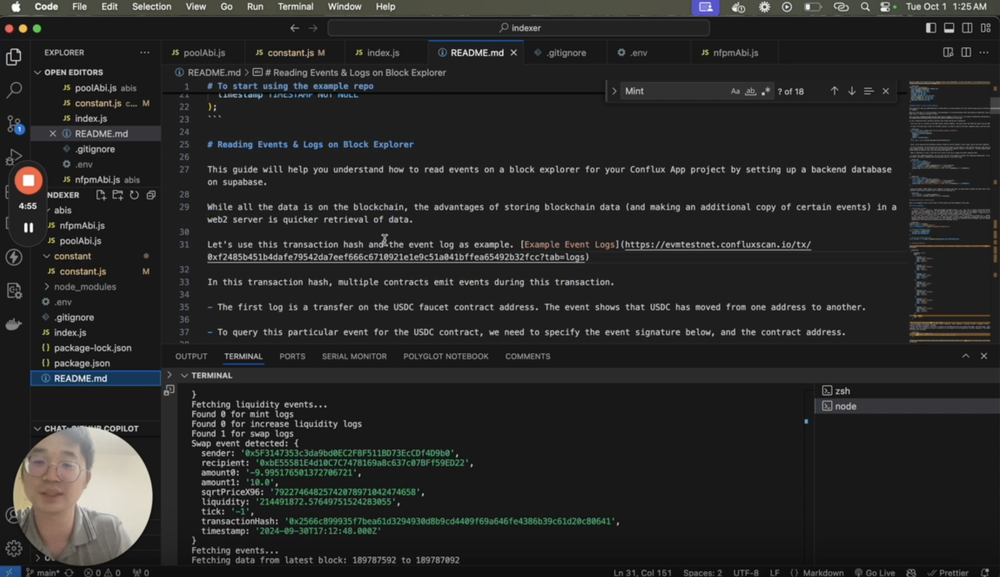

# Creating an Indexer for Conflux Contracts

This tutorial will guide you through the process of creating an indexer for Conflux contracts. We'll use a sample project that demonstrates how to read logs and events emitted by the blockchain and store them in a database for quick retrieval.

## Overview

The example repository we'll be using is available at [https://github.com/intrepidcanadian/eventindex](https://github.com/intrepidcanadian/eventindex). This project showcases how to:

1. Connect to the Conflux eSpace network
2. Read events from smart contracts
3. Decode event data
4. Store the decoded data in a Supabase database

You can watch a video tutorial of this process [here](https://www.loom.com/share/859bf23a98c7467292f52c0ce949e4e1).



## Prerequisites

Before starting, make sure you have:

- Node.js installed
- A Supabase account
- Access to a Conflux eSpace RPC URL

## Getting Started

1. Clone the repository:
   ```bash
   git clone https://github.com/intrepidcanadian/eventindex
   cd eventindex
   ```

2. Install dependencies:
   ```bash
   npm install
   ```

3. Set up your environment variables:
   Create a `.env` file in the root directory and add the following:
   ```
   SUPABASE_URL=your_supabase_url
   SUPABASE_KEY=your_supabase_key
   CONFLUXRPC_URL=your_conflux_rpc_url
   ```

4. Set up your Supabase database:
   Create a table in your Supabase project to store the event data. Here's an example schema:

   ```sql
   CREATE TABLE lp_positions (
     transactionHash VARCHAR(66) PRIMARY KEY,
     owner VARCHAR(42) NOT NULL,
     sender VARCHAR(42) NOT NULL,
     tickLower INT NOT NULL,
     tickUpper INT NOT NULL,
     liquidity DECIMAL(38, 18) NOT NULL,
     amount0 DECIMAL(38, 18) NOT NULL,
     amount1 DECIMAL(38, 18) NOT NULL,
     timestamp TIMESTAMP NOT NULL
   );
   ```

## Understanding the Code

The main script connects to the Conflux network, listens for specific events, decodes the event data, and stores it in the Supabase database.

Let's break down the key components of the indexer script:

1. **Environment Setup**:

   ```javascript
   require("dotenv").config();
   const { ethers } = require("ethers");
   const { createClient } = require("@supabase/supabase-js");

   const supabase = createClient(process.env.SUPABASE_URL, process.env.SUPABASE_KEY);
   const provider = new ethers.JsonRpcProvider(process.env.CONFLUXRPC_URL);
   ```

   This section sets up the necessary dependencies and connections:

   - `dotenv` is used to load environment variables from a `.env` file.
   - `ethers` is a popular library for interacting with Ethereum-compatible blockchains.
   - `@supabase/supabase-js` is the client library for Supabase.
   - We create a Supabase client using the URL and key from environment variables.
   - We set up an ethers provider using the Conflux RPC URL, allowing us to interact with the Conflux eSpace network.

2. **Fetching Events**:

   ```javascript
   const mintTopic = ethers.id("Mint(address,address,int24,int24,uint128,uint256,uint256)");
   const filter = {
     address: poolContractAddress,
     fromBlock,
     toBlock,
     topics: [mintTopic],
   };
   const logs = await provider.getLogs(filter);
   ```

   This code prepares and executes the event query:

   - We create the event topic hash for the Mint event using `ethers.id()`.
   - We set up a filter object specifying:
     - The contract address to monitor
     - The block range to search (fromBlock to toBlock)
     - The event topic to filter for (in this case, the Mint event)
   - We use the provider's `getLogs()` method to fetch all matching event logs.

3. **Decoding Event Data**:

   ```javascript
   for (const log of logs) {
     const [ownerTopic, tickLowerTopic, tickUpperTopic] = log.topics.slice(1);
     const owner = ethers.getAddress("0x" + ownerTopic.slice(26));
     const tickLower = ethers.AbiCoder.defaultAbiCoder().decode(["int24"], tickLowerTopic)[0];
     const tickUpper = ethers.AbiCoder.defaultAbiCoder().decode(["int24"], tickUpperTopic)[0];

     const abiCoder = new ethers.AbiCoder();
     const [sender, amount, amount0, amount1] = abiCoder.decode(
       ["address", "uint128", "uint256", "uint256"],
       log.data
     );
   }
   ```

   This section decodes the raw event data:

   - We iterate through each log entry.
   - The first three topics after the event signature contain the owner, tickLower, and tickUpper values.
   - We extract the owner address by slicing the topic and converting it to a proper address format.
   - tickLower and tickUpper are decoded from their respective topics using the ABI coder.
   - The remaining data (sender, amount, amount0, amount1) is decoded from the log's data field using the ABI coder.

4. **Storing Data in Supabase**:

   ```javascript
   const { data, error } = await supabase.from("lp_positions").insert([
     {
       position_id: log.transactionHash,
       sender: sender,
       owner: owner,
       tick_lower: tickLower.toString(),
       tick_upper: tickUpper.toString(),
       liquidity: amount.toString(),
       amount0: amount0.toString(),
       amount1: amount1.toString(),
       timestamp: new Date(block.timestamp * 1000),
     },
   ]);
   ```

   Finally, we store the decoded event data in Supabase:

   - We use the Supabase client to insert a new row into the "lp_positions" table.
   - Each field is mapped to the corresponding decoded value from the event.
   - We use the transaction hash as a unique position_id.
   - Numeric values are converted to strings to ensure precision is maintained.
   - The timestamp is converted from Unix time (seconds) to a JavaScript Date object.

By following this process for each event log, the indexer builds up a database of all Mint events, allowing for quick and easy querying of liquidity positions without needing to interact with the blockchain for every request.

## Running the Indexer

To start the indexer:

1. Adjust the `fromBlock` and `toBlock` values in the script to specify the range of blocks you want to index.
2. Run the script:
   ```bash
   node index.js
   ```

The script will fetch events from the specified block range, decode them, and store the data in your Supabase database.

## Conclusion

This tutorial has shown you how to create a basic indexer for Conflux contracts. By storing blockchain data in a web2 database, you can achieve faster data retrieval for your dApp. Remember to adjust the contract addresses, event signatures, and data schemas according to your specific use case.
