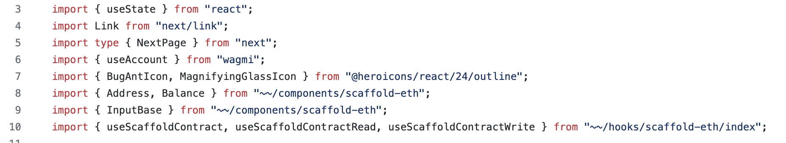

[Scaffold Conflux](https://github.com/conflux-fans/conflux-scaffold) is an adaptation of Scaffold-ETH-2 (https://scaffoldeth.io/) whereby we have adjusted the template to allow you to deploy the contract on Conflux eSpace and leverage the components, integration of hardhat, and the quick deployment of Scaffold-ETH-2. In this tutorial, we will show you how to set-up Scaffold Conflux to better understand your smart contract and to leverage some of the beautiful react components available to quickly make your app on Conflux eSpace.

Watch this [video](https://youtu.be/33S0IjGGsQg) for full tutorial on how to create an app from scratch and deploy it live on Conflux eSpace.

[](https://www.youtube.com/watch?v=33S0IjGGsQg)

## Clone Scaffold Conflux

In your visual studio terminal, run the following to clone the repo and install the dependencies.

```bash
git clone https://github.com/conflux-fans/conflux-scaffold
yarn install
```

In the folder directory of `conflux-scaffold` you will have the following:


The repository contains two main sections. The first section is for hardhat.

- You can adjust your smart contract solidity files in /conflux-scaffold/packages/hardhat/contracts
- For example, the current sample solidity file is "YourContract.sol"
- Start up your blockchain for testing purposes. We do this to easily create accounts and interact with the smart contract without deploying it on testnet (i.e. RPC limits) and Conflux eSpace (i.e. gas fees)

```bash
yarn chain
```

Once the chain is set up, open up a new terminal. You can test your smart contract and then deploy it

```bash
yarn hardhat:test
yarn deploy
```

There are several files that are relevant when deploying.

- One is the deployment script in /conflux-scaffold/packages/hardhat/deploy
- The other is the configuration of which networks you are deploying on. /conflux-scaffold/packages/hardhat/hardhat.config.ts
- The default deployment network is hardhat but you can change it to Conflux eSpace or Conflux Testnet by doing the following

```bash
yarn deploy --network confluxESpace
```

```bash
yarn deploy --network confluxESpaceTestnet
```

:::note
The deployer of the contract and thereby the owner of the contract can be changed by re-labelling the `./packages/hardhat/.env.example` to `./packages/hardhat/.env` and putting your private key in DEPLOYER_PRIVATE_KEY=. However, the default uses a default "public" private key for hardhat testing purposes.
:::

Once you have deployed the contract, you can start up your front-end to see how it interacts with the contracts. You should be able to see an interface like the following. The Contract Debug page is similar to other web deployment applications like Remix.


What is powerful about Conflux Scaffold is that you can quickly deploy your contract in Hardhat and be able to see both the transactions on a block explorer and interact with the read/write functions of the contract


## Front-End

Once you have your front-end up and running, the fun begins on connecting your front-end with the contract. You can leverage beautiful react components.

- Navigate to conflux-scaffold/packages/nextjs/app/page.tsx



- You can see here that components can be quickly imported from /components/scaffold-eth
- For example, there is an Address, Balance, AddressInput component, etc. all which can be used quickly to add to your app. In the video tutorial, there is an example of how an AddressInput is quickly imported and rendered.
- Additional components can be seen in the documentation https://docs.scaffoldeth.io/components/
- There are other hooks which are extremely important for reading and writing the contract (as well as setting up event subscription). These are the useScaffoldContractRead, useScaffoldContractWrite, etc. which are imported from "~~/hooks/scaffold-eth/index"
- The arguments requirement for the hooks are all in the [documentation](https://docs.scaffoldeth.io/components/) but here are two examples of how easy it is to create a contract instance, read a function from the contract, and write into a function.


## Deployment of Conflux Contracts

In order to deploy a conflux app, we need to first deploy the contract into Conflux eSpace and allow our wallet to connect to Conflux eSpace. In conflux-scaffold/packages/hardhat/.env.example, we need to change this to packages/hardhat/.env and include our private key in DEPLOYER_PRIVATE_KEY. This makes our private key as the deployer of the contract. In the solidity contract, we have also assigned the deployer as the owner of the contract.

```bash
yarn deploy --network confluxESpace
```

or

```bash
yarn deploy --network confluxESpaceTestnet
```

## Remove Hardhat Wallet and Burner Wallet Connection to eSpace Wallet Connection

Once the contract is deployed, we need to remove the wallet functionality to connect to hardhat and include Conflux eSpace. You can specify the networks that you deployed into in conflux-scaffold/packages/nextjs/scaffold.config.ts by changing targetNetworks to

```javascript
targetNetworks: [chains.confluxESpace]
```

or

```javascript
targetNetworks: [chains.confluxESpaceTestnet]
```

## Deploy App on Vercel

And that's it! You are ready to deploy your app once you are happy with your smart contract and the front-end.

```bash
yarn vercel
```

Follow the instructions for deployment on vercel.

If you have any questions, please refer to the video for full tutorial [video](https://youtu.be/33S0IjGGsQg). It includes how to verify your contract on confluxscan and the command for hardhat testing.
