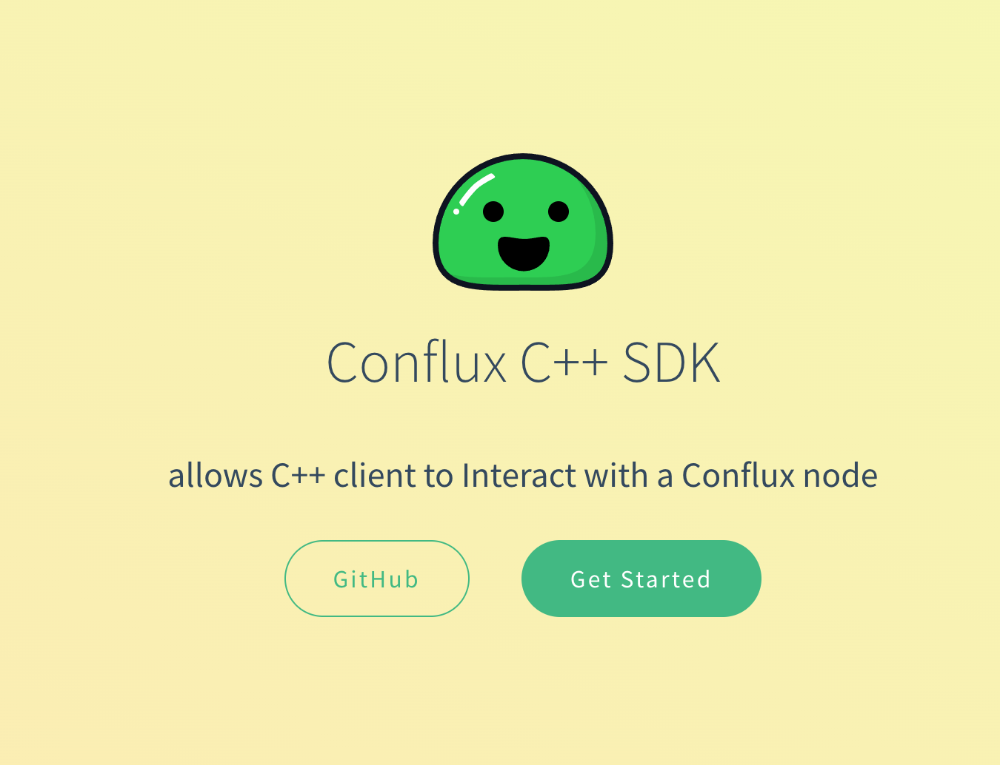

Conflux 拥有主流编程语言的SDK，包括`JavaScript`, `Golang`, `Java` 和 `Python`。 这只是SDK的简要介绍，详细的使用信息请查阅各自的文档。

## 官方SDK

### [js-conflux-sdk](https://confluxnetwork.gitbook.io/js-conflux-sdk/)

如果您熟悉 JavaScript 或 Node.js，或者想要构建一个与您的合约交互的网站，那么 `js-conflux-sdk` 是适合您的工具。 它具有许多有用的功能。

```js
const { Conflux } = require("js-conflux-sdk");

async function main() {
  let conflux = new Conflux({
    url: "https://test.confluxrpc.com",
    networkId: 1,
  });

  let balance = await conflux.cfx.getBalance(
    "cfxtest:aakkfzezns4h8ymx1cgmcnd4x3aev6e2he38nnu8sv"
  );
  console.log("balance: ", balance);
}

main().catch(console.log);
```

### [go-conflux-sdk](https://github.com/conflux-chain/go-conflux-sdk)

Go 语言是一种很棒的编程语言：它运行速度快，易于使用，且非常稳定。 在区块链领域，许多项目正在使用 Go 进行开发。 如果您想要开发一个需要与 Conflux 网络通信的后端服务，那么 `go-conflux-sdk` 是适合您的工具。

```go
package main

import (
    "fmt"

    conflux "github.com/Conflux-Chain/go-conflux-sdk"
)

func main() {
    client, err := conflux.NewClient("https://test.confluxrpc.com")
    if err != nil {
        fmt.Println("failed to create client:", err)
        return
    }
    defer client.Close()

    epoch, err := client.GetEpochNumber()
    if err != nil {
        fmt.Println("failed to get epoch number:", err)
        return
    }

    fmt.Println("Current epoch number:", epoch)
}

```

### [java-conflux-sdk](https://github.com/conflux-chain/java-conflux-sdk)

Java 是一个经久不衰的编程语言。 `java-conflux-sdk` 可以用于与 Conflux 节点进行通信。 它是从 [web3j](https://docs.web3j.io/) 库进化而来的。 web3j 的一些工具函数同样也适用于 Conflux network。

```java
package conflux.sdk.examples;
import java.math.BigInteger;
import conflux.web3j.Cfx;

public class App {
  public static void main(String[] args) throws Exception {
    int retry = 3;
    int intervalMills = 1000;  // interval(milliseconds) between retry
    Cfx cfx = Cfx.create("https://test.confluxrpc.com", retry, intervalMills);
    BigInteger epoch = cfx.getEpochNumber().sendAndGet();
    System.out.println("Current epoch: " + epoch);
  }
}
```

### [python-conflux-sdk](https://github.com/conflux-chain/python-conflux-sdk)

`python-conflux-sdk` (也称为`conflux_web3`)是Conflux Core Space的官方Python SDK。 它基于[web3.py v6](https://github.com/ethereum/web3.py) 构建, 其大部分API与`web3.py`一致，为希望将其Python代码从Ethereum迁移的开发人员提供了便利。 例如：

```python
# modified from https://web3py.readthedocs.io/en/stable/middleware.html#signing
from conflux_web3 import Web3
w3 = Web3("https://test.confluxrpc.com")
from conflux_web3.middleware import construct_sign_and_send_raw_middleware
from cfx_account import Account
acct = Account.create('KEYSMASH FJAFJKLDSKF7JKFDJ 1530')
w3.middleware_onion.add(construct_sign_and_send_raw_middleware(acct))
w3.cfx.default_account = acct.address

transaction = {
    'to': w3.address.zero_address(),
    'value': 22,
}
w3.cfx.send_transaction(transaction)
```

[SDK文档](https://python-conflux-sdk.readthedocs.io/en/latest/README.html)提供了在线可运行的示例（由[Binder](https://mybinder.org/)提供），支持英文和中文两种语言。

## Solidity SDKs

### [thirdweb Solidity SDK](https://portal.thirdweb.com/solidity)

该SDK通过提供一组预构建的基础合约和一组可重用的组件或扩展，为构建自定义智能合约提供了所需的工具，从而能够高效地构建自定义智能合约。

### [Conflux-contracts](https://github.com/conflux-fans/conflux-contracts)

这是一个Solidity包，包含了 Conflux DAPP 开发中常用的有用合约。 这个包类似于 OpenZeppelin。 目前最常用的是 `Conflux InternalContracts`。

### [OpenZeppelin](https://docs.openzeppelin.com/contracts/4.x/)

这是一个著名的安全智能合约开发库。 该库构建在社区审查的代码基础上，基础坚实可靠。

- 实现了 ERC20 和 ERC721 等标准
- 具有灵活的基于角色的权限控制方案。
- 提供可重用的 Solidity 组件，可用于构建自定义合约和复杂的分布式系统。

## 社区开发的 SDK

### [Cive](https://cive.zyx.ee/)

Cive is a **Typescript** interface for the Conflux Core Space. It is built on [`viem`](https://viem.sh/). It inherits all the advantages of Viem, such as being `lightweight`, `modular`, `high-performance`, and `type-safe`, making it suitable for developing applications and various tools.

### [thirdweb SDK](https://portal.thirdweb.com/sdk)

SDK覆盖了Web3开发堆栈的各个方面，包括连接用户钱包、与区块链和智能合约交互、去中心化存储、身份验证等，使您能够在任何EVM兼容的区块链上构建可扩展且高性能的Web3应用程序。

### [cpp-conflux-sdk](https://csyangbinbin.github.io/cpp-conflux-sdk/)

Conflux C++ API 允许任何 C++ 客户端基于 JSON-RPC 2.0 协议与本地或远程的 Conflux 节点进行交互。 使用 Conflux C++ API，用户可以轻松管理账户、发送交易、部署智能合约和查询区块链信息。



### [.NET SDK](https://github.com/Nconflux/Conflux.net.SDK)

Nconflux 是 Conflux 的 .Net 集成库，简化了与 Conflux 节点的访问和智能合约交互。

Nconflux 是针对 netcore 3.1 和 .net 5 开发的，因此与所有操作系统（Windows、Linux、MacOS、Android 和 OSX）兼容，并已在云、移动设备、桌面、Xbox、Hololens 和 Windows IoT 上进行了测试。

### [Swift SDK](https://github.com/Conflux-Chain/swift-conflux-wallet-sdk)
