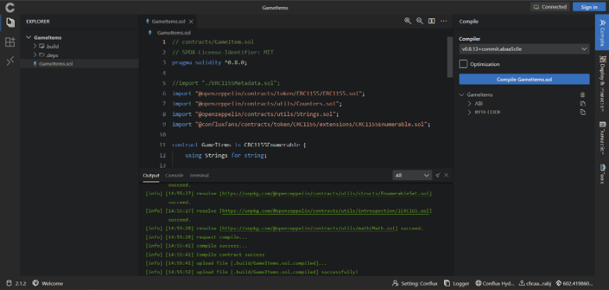

import useBaseUrl from '@docusaurus/useBaseUrl';

Conflux 提供的工具可以帮助开发者快速构建 dapp。

## [hardhat-conflux](https://github.com/conflux-chain/hardhat-conflux)

Hardhat 是现代化的 Solidity 开发工具包，也可以使用 [hardhat-conflux](https://github.com/conflux-chain/hardhat-conflux) 插件在 ConfluxNetwork 上开发合约。 该插件为 Hardhat 带来了 `js-conflux-sdk`，使您可以以简单的方式与 Conflux 区块链进行交互。

## [Conflux-Truffle](https://github.com/Conflux-Chain/conflux-truffle)

Truffle 是一个顶级的开发环境、测试框架和资产管道，适用于使用以太坊虚拟机（EVM）的区块链，旨在使开发者的生活更轻松。 我们已将其移植到 Conflux-Truffle，它将与 Conflux 网络一起工作，并具有相同的功能和使用体验。

要了解如何使用它，您可以阅读 [Truffle 的文档](https://www.trufflesuite.com/docs/truffle/overview)。 此外，还可以参考 `conflux-truffle` 的 [设置指南](https://github.com/Conflux-Chain/conflux-truffle/blob/conflux/ultimate-guide.md)。

## [Conflux ChainIDE](https://chainide.com/s/createTempProject/conflux)

ChainIDE 是基于云的多链 IDE。 在开发智能合约时，开发人员无需安装额外的工具。 ChainIDE 支持包括 Conflux（Core）、Conflux（eSpace）、以太坊、BNB Chain、Polygon、Dfinity、Nervos、Flow 等多条链的开发环境，同时还支持联盟链，例如 Chain33 和 FiscoBcos。 有关如何使用 ChainIDE 的更多信息，请查看[此页面](https://chainide.gitbook.io/chainide-english-1/ethereum-ide-1/4.-conflux-ide)。

## [Conflux studio](https://github.com/ObsidianLabs/ConfluxStudio/blob/master/README-EN.md)

Conflux Studio 是一款集成开发环境（IDE），由 [ObsidianLabs](https://www.obsidians.io/) 开发，可以加速和简化 Conflux 智能合约的开发。

您可以从其[GitHub 发布页面](https://github.com/ObsidianLabs/ConfluxStudio/releases)下载 Conflux Studio。 Conflux Studio 支持 Windows、Mac 和 Linux 系统。

您可以在 Conflux Studio 的 [readme](https://github.com/ObsidianLabs/ConfluxStudio) 中找到它的文档，还有一个关于如何使用它开发 Dapp 的 [教程](https://github.com/ObsidianLabs/conflux-dapp-tutorial)。

## [Conflux Studio Web](https://conflux.ide.black/)

Conflux Studio的Web版本可以让用户在浏览器中使用FluentWallet开发智能合约。
