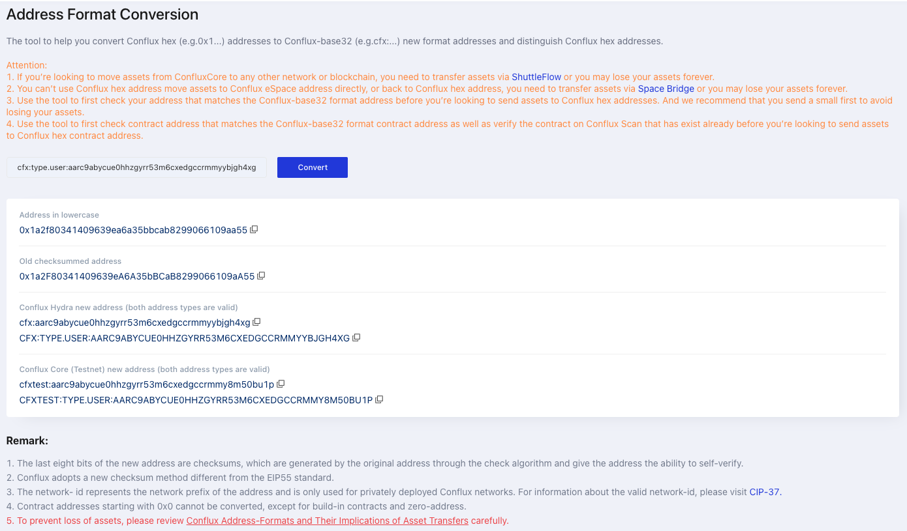

In Conflux, every [account](../../general/conflux-basics/accounts.md) is associated with a pair of public and private keys, and is identified by an address. 本页面介绍地址在core space中的表示和计算方式。

:::info

Refer to [General-address](../../general/conflux-basics/accounts.md#address) for the basic concepts about addresses.

:::

## Hex地址 和 Base32 地址

在 `Conflux-rust v1.1.1`发布之前，Conflux 地址完全以十六进制编码字符串形式呈现，例如 `0x1292d4955b47f5153b88c12c7a94048f09839` 此格式与Etherum和其他兼容的EVM区块链使用的地址非常相似。 However, Conflux employs a unique method to compute EOA addresses, which means that **the address strings generated from the same private key will usually differ between Conflux and Ethereum.** This similarity in appearance, combined with the difference in computation, makes it all too easy for users to confuse Conflux addresses with Ethereum addresses, potentially leading to the loss of assets.

为了解决这个问题，Conflux在 [CIP-37](https://github.com/Conflux-Chain/CIPs/blob/master/CIPs/cip-37.md) 中引入了一个新的基于 base32 编码地址格式。 The new format is **derived directly from the original hex-encoded addresses** including a **distinctive prefix** (such as "cfx"), an optional **address type**, and a **checksum**. 因此，上文提到的Hex编码地址可以转换成更容易识别的base32地址。例如 `cfx:aakkfzezns4h8ymx1cgmcnd4x3aev6e2hexz250ym5`, 可选的，也可以表示为详细格式地址，详细格式包含了非必须的地址类型信息, 例如 `CFX:TYPE .USER：AAKKFZEZNS4H8YMX1CGMCN4X3AEV6E2HEXZ250YM5`. 这种新格式最大限度地减少了Conflux 和 Etherum地址之间混淆的风险，提供了更安全和更方便的用户体验。

:::caution

Base32 addresses are utilized throughout the Conflux Core ecosystem, with the exception of smart contract `.sol` source code. 在`.sol`文件中需要硬编码[EIP-55](https://eips.ethereum.org/EIPS/eip-55) 校验和地址的情况下，开发人员应该选择使用Conflux的十六进制编码地址，而不是Base32格式。

:::

## 地址计算

:::info

本节内容仅供信息参考。 用户或开发者通常不需要自己计算十六进制地址。 建议基于 SDK 或 RPC 的返回值来获取 EOA / 合约地址，使用 SDK 或 [在线地址转换器](https://www.confluxscan.net/address-converter) 来转换十六进制和 base32 地址格式。

:::

### 十六进制地址计算

Base32地址直接由原始的十六进制编码地址派生而来。 因此，我们需要理解十六进制地址的计算方法。

Conflux 十六进制地址是一个20字节的十六进制值，以“0x”开头的包括42个字符的字符串表示。 十六进制编码地址以一个1(3)字符“类型标识”开头，表示地址类型。 目前有三种类型的标识：

- `(0x)1`: 代表一个EOA 帐户的地址
- `(0x)8`: 代表一个合约的地址
- `(0x)0`: 表示一个在链上实现硬编码逻辑 [内置合约](../core-space-basics/internal-contracts/internal-contracts.mdx), 或一个空地址 (`0x0000000000000000000000000000000000000000000000000000`)。

#### EOA 十六进制地址计算

The computation of EOA hex address is specified in [Conflux protocol specification](https://www.confluxnetwork.org/files/Conflux_Protocol_Specification.pdf) `3.1: Accounts`. 将账户公钥进行Keccak运算得到摘要，账户地址由4位类型标识和该摘要的最右侧156位串联而成。

#### 合约地址计算

可选的，合约可以通过 `create2` 操作码进行部署。

:::note

合约地址的计算方式与以太坊有很大不同。

:::

如果使用 `create2` ，可以使用以下Python代码计算部署地址：

```python
# using web3.py is also viable
# from web3 import Web3
from conflux_web3 import Web3

# ensure salt is a bytes32 to avoid unmatched result caused by encoding approach
def compute_address_using_salt(salt: bytes, bytecode_hash: bytes, hex_deployer_address: str):
    core_part = Web3.solidityKeccak(
        ["bytes1", "address", "bytes32", "bytes32"],
        ["0xff", hex_deployer_address, salt, bytecode_hash]
    )
    return "0x8"+ core_part.hex()[-39:]
```

如果 `create2` 未被使用：

```python
# using web3.py is also viable
# from web3 import Web3
from conflux_web3 import Web3

def compute_address_using_nonce(nonce: int, bytecode_hash: bytes, hex_deployer_address: str):
    core_part = Web3.solidityKeccak(
        ["bytes1", "address", "bytes32", "bytes32"],
        ["0x00", hex_deployer_address, nonce.to_bytes(32, "little"), bytecode_hash]
    )
    return "0x8"+ core_part.hex()[-39:]
```

### Base32地址计算

Conflux的 base32 地址指由 [CIP-37](https://github.com/Conflux-Chain/CIPs/blob/master/CIPs/cip-37.md) 定义的具有网络前缀的Conflux Base32校验和地址。 该地址由表示该地址有效的网络的网络前缀、一个冒号(`":"`) 和一个 Base32 编码的载荷组成，并包含一个校验和，例如`cfx:aarc9abycue0hzgyr53m6cxedgccrmybjgh4xg`。 可选的，地址可以在网络前缀和载荷之间包含一组键值对，格式为`key.value`，以冒号分隔，例如`cfx:type.user:aarc9abycue0hhzgyrr53m6cxedgccrmmyybjgh4xg`。

#### 网络前缀（Network Prefix）

`网络前缀` 是以下值之一： `"cfx"` (代表主网, 对应于网络 ID 1029)， `"cfxtest"` (测试网, 相对应网络ID 1), `"net[n]"` `n !=1，1029` (代表私有Conflux网络)

有效的网络前缀示例： `"cfx"`, `"cfxtest"`, `"net17"`

无效的网络前缀示例： `"bch"`, `"conflux"`, `"net1"`, `"net1029"`

#### 地址类型（Address Type）

地址类型是一个可选字段，为地址类型提供可读的信息。 对于空地址 (`0x000000000000000000000000000000000000000000`), 地址类型必须是 `type. null`。 其他为：

- `0x0`: `type.builtin`
- `0x1`: `type.user`
- `0x8`: `type.contract`

#### 载荷 (Payload)

1. 拼接 `版本字节（version-byte）`:将 `版本字节`(`0x00`) 与十六进制地址拼接起来，得到一个21字节数组。
2. Base32 编码：将以上结果从左到右编码，将每5位序列映射到对应的 ASCII 字符(见下文字母表)。 在结尾补零位（应为2个零位），以完成未完成的任何块。
    ```
    0x00 => a    0x08 => j    0x10 => u    0x18 => 2
    0x01 => b    0x09 => k    0x11 => v    0x19 => 3
    0x02 => c    0x0a => m    0x12 => w    0x1a => 4
    0x03 => d    0x0b => n    0x13 => x    0x1b => 5
    0x04 => e    0x0c => p    0x14 => y    0x1c => 6
    0x05 => f    0x0d => r    0x15 => z    0x1d => 7
    0x06 => g    0x0e => s    0x16 => 0    0x1e => 8
    0x07 => h    0x0f => t    0x17 => 1    0x1f => 9
    ```

#### 校验和(Checksum)

1. 准备输入校验和输入： `data` 被用作校验和函数的输入。 It contains:
   - The lower 5 bits of each character of the `network-prefix`, e.g. `"cfx..."` becomes `0x03, 0x06, 0x18, ...`
   - 分隔符（5比特0）。
   - 5位一组将载荷分块。 如果需要，使用0在载荷的最右侧进行填充，以便恰好将载荷分为5位1组。
   - 八个零作为校验和的"模板"。
2. 计算校验和：使用[比特币现金校验和算法](https://github.com/bitcoincashorg/bitcoincash.org/blob/master/spec/cashaddr.md#checksum)计算`data`的校验和。
3. Base32编码：根据 [Payload-Base32](#payload)编码中的相同步骤编码返回的 40位校验和。

#### 最终结果和示例

连接这些部分就能获得最终地址： `[network-prefix]`, `":"`, `[payload]`, `[checksum]`
   - 可选的，可以在其中包含**address-type**：`[network-prefix]`, `":"`, `[address-type]`, `":"`, `[payload]`, `[checksum]`

下面是一个展示了编码各步骤的例子：

```
encode(0x1a2f80341409639ea6a35bbcab8299066109aa55, "cfx")

1. address-type: "type.user"
2. version-byte: 0x00
3. payload: [0x00, 0x1a, 0x2f, 0x80, 0x34, 0x14, 0x09, 0x63, 0x9e, 0xa6, 0xa3, 0x5b, 0xbc, 0xab, 0x82, 0x99, 0x06, 0x61, 0x09, 0xaa, 0x55]
   5-bit parts: [0x00, 0x00, 0x0d, 0x02, 0x1f, 0x00, 0x01, 0x14, 0x02, 0x10, 0x04, 0x16, 0x07, 0x07, 0x15, 0x06, 0x14, 0x0d, 0x0d, 0x1b, 0x19, 0x0a, 0x1c, 0x02, 0x13, 0x04, 0x03, 0x06, 0x02, 0x02, 0x0d, 0x0a, 0x0a, 0x14]
   base32-encoded: "aarc9abycue0hhzgyrr53m6cxedgccrmmy"
4. checksum input: [0x03, 0x06, 0x18, 0x00, 0x00, 0x00, 0x0d, 0x02, 0x1f, 0x00, 0x01, 0x14, 0x02, 0x10, 0x04, 0x16, 0x07, 0x07, 0x15, 0x06, 0x14, 0x0d, 0x0d, 0x1b, 0x19, 0x0a, 0x1c, 0x02, 0x13, 0x04, 0x03, 0x06, 0x02, 0x02, 0x0d, 0x0a, 0x0a, 0x14, 0x00, 0x00, 0x00, 0x00, 0x00, 0x00, 0x00, 0x00]
   checksum output: 688543492710
   checksum string: "ybjgh4xg"
5. concatenated result: "cfx:type.user:aarc9abycue0hhzgyrr53m6cxedgccrmmyybjgh4xg"
```

## Use Cases for Base32 and Hex Addresses

The Conflux Core RPC methods only accept base32 address, so Conflux Core SDKs and wallets also use base32 address. Base32 is the most common address format in the Core Space.

For Conflux Core Space contract development, Ethereum toolchains are used to compile contracts. So in Solidity smart contract `.sol` files, base32 format addresses would bring about compilation errors. If a specific address needs to be hardcoded in the contract code, it should be in hex format. **This is the only situation that hex address is used in the Core Space.**

## Address Format Convert Tool

ConfluxScan provide a [Online Address Converter](https://www.confluxscan.io/address-converter) which is very useful.



## 常见问题解答

### How to convert between base32 and hex addresses?

Use the [Online Address Converter](https://www.confluxscan.io/address-converter) or the SDKs to convert between base32 and hex addresses.

### When should I use hex addresses?

In the Core Space, hex addresses are only used in Solidity smart contract `.sol` files. In other cases, base32 addresses are used.

### Can I use Ethereum EOA addresses in Conflux Core Space?

No. Ethereum EOA addresses are not all compatible with Conflux addresses. It's recommend use Conflux Wallet or SDKs to generate Conflux base32 addresses.

### What's the [BIP-44 Coin Type](https://github.com/satoshilabs/slips/blob/master/slip-0044.md) for Conflux Core Space?

The BIP-44 coin type for Conflux Core Space is `503`.