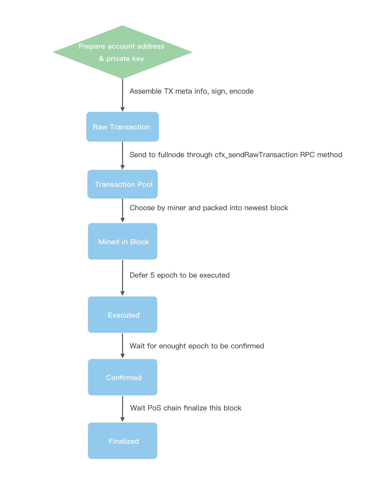

交易从构建时到最终在链上确认之前会经历几个阶段。 对这些阶段的深刻理解将有助于用户和开发人员更好地识别发送交易过程中的问题，最终确保交易成功确认甚至最终化。

以下是从构建到最终化的主要阶段：

## 交易阶段

### 1. **交易构建**

这是用户或开发人员创建交易的阶段，包括所有必要的字段和参数，并对其进行签名。 交易对象可以使用各种工具或库创建，例如[Fluent Wallet](../../getting-started/installing-a-wallet.md), [Conflux SDK](../../build/sdks-and-tools/sdks.md)等。 在发送交易之前，交易将被编码为十六进制字符串作为“rawTransaction”。

### 2. **发送到交易池**

这是用户或开发人员[将已签名的交易通过RPC发送到Conflux的节点](../../build/json-rpc/cfx-namespace.md#cfx_sendrawtransaction)的阶段。 如果交易通过验证，节点将验证交易并将其广播到网络中的其他节点。 节点还将返回一个交易哈希（这是一个唯一标识符）给发送者以进行跟踪。

交易将被放入节点的交易池中，等待矿工将其打包进区块。

### 3. **打包进区块 -> 挖矿**

这是矿工从其内存池 (一个包含待处理交易的池) 中选择交易并将其包含在他们区块中的阶段。 矿工将优先处理具有较高gasPrice的交易。 一旦包含交易的区块被挖出，它将被传播到网络中的其他节点。

一旦交易被包含在区块中，它将被分配一个区块编号和在区块中的交易索引。

:::note

如果交易池已满并收到了具有较高gasPrice的其他交易，交易也可能会从交易池中被丢弃。

:::

### 4. **延迟5个epochs -> 执行**

这是交易被推迟了5个epoch(约5秒)后由节点执行的阶段。 这意味着节点将运行交易的逻辑并相应地更新其状态。 每个交易的执行结果将记录在[收据](./receipt.md)中,其中包括诸如状态 (成功或失败)、已使用的gas、智能合约发出的日志或事件等信息并可以使用交易哈希检索。

执行后，账户的 [nonce](./nonce.md)将增加一，交易收据将可用。

### 5. **等待约50个epochs -> 确认**

这是交易在执行了50个epoch(约50秒)后被节点确认的阶段。 执行一个交易并不意味着交易的状态不会再次改变。 由于Conflux区块链的结构，区块链可能会由于新区块的到来或创建而出现分叉或转移主链，这可能会导致某些交易被回滚。 确认的交易意味着它已经被包含在足够深的区块中，并且几乎不可能回滚。

### 6. **等待PoS链最终化 -> 已最终化**

这是在Conflux's [PoS链](../../../general/conflux-basics/consensus-mechanisms/proof-of-stake/pos_overview.md)引用的特定PoW块后交易被最终确定的最终阶段。 Conflux 的 PoS 链会定期引用一个稳定的 PoW 区块，以为交易提供最终性。 一个已经最终化的交易意味着它几乎没有被回滚的可能性，除非攻击者拥有 PoS 中超过 67% 的 CFX。 大约需要400个Epochs(6-8 分钟) 来最终确定一个交易，因为它被包含在一个区块内 (在 [CIP-113](https://github.com/Conflux-Chain/CIPs/blob/master/CIPs/cip-113.md) 激活后)。

## 常见问题解答

### 交易已成功发送，但无法通过 getTransactionByHash检索交易？

在网络拥堵的情况下，交易可能会从交易池中移除，导致无法通过getTransactionByHash检索交易。

### 交易执行后，是否意味着交易状态不会再改变？

不一定。 由于区块链的结构，因为新区块的到来或创建可能会出现分叉或主链的转移，从而导致某些交易可能被回滚。 当交易得到确认时，意味着该交易已经包含在一个足够深度的区块中，回滚的可能性极低。

### 交易确认后，是否意味着交易状态不会再改变？

通常情况下，确认后交易的状态不会再改变。 然而，在极为罕见的情况下，交易可能会被回滚。 但这种情况发生的概率极低。
