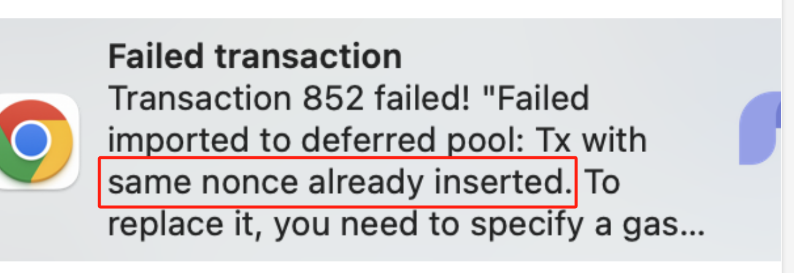

当使用 SDK 或 Fluent 钱包发送交易时，可能会遇到一些错误。 本文概述了一些常见错误及其解决方案。

## RPC端点错误

### 估算时出错

在构建交易时，需要使用`estimateGas`方法估算gas费用。 如果与合约进行交互，`estimateGas`方法可能因以下各种原因而失败，比如：

- 不正确的合约方法调用参数，调用不存在的方法
- 调用者没有权限
- 调用者余额不足
- 合约方法内部发生异常错误，例如除零，数组越界，溢出等。

如果'estimatteGas'方法失败，它会返回一个错误，例如：

```json
{
    "code": -32015,
    "message": "Can not estimate: transaction execution failed, all gas will be charged (execution error: NotEnoughCash { required: 18014398509481983999023437515000000, got: 0, actual_gas_cost: 0, max_storage_limit_cost: 18014398509481983999023437500000000 })",
    "data": "0x0000xxxx"
}  
```

有时，错误消息中包含明显错误信息，可以很容易确定错误原因。 但在某些情况下，错误消息可能只显示`Vm reverted`。 在这种情况下，你可能需要通过多次代码验证和尝试，或者使用跟踪数据来协助查找错误。

### `cfx_sendRawTransaction`失败

在组装交易之后，需要使用[`cfx_sendRawTransaction`](/docs/core/build/json-rpc/cfx-namespace#cfx_sendrawtransaction)方法发送，但由于各种原因，可能会导致发送失败。

#### 余额不足

如果发送方余额不足，将返回错误 (可以在RPC响应的`error.data`字段中找到):

```json
"\"Transaction 0xtxhashxxxx is discarded due to out of balance, needs 9000000000420000000000000 but account balance is 90095849479680000000000\""
```

#### 随机数错误（Nonce Error）

如果随机数（nonce）设置得过大，过小或重复使用，都会导致交易发送失败。 具体的失败情况可以在[随机数管理](./nonce.md)中看到。

#### gasPrice错误

`gasPrice`不能设置为0或者太小；否则, 你可能会遇到如下错误:

```json
"\"transaction gas price 1 less than the minimum value 20000000000\""
```

目前，Core Space中`gasPrice`最低为1 Gdrip，相当于0.0000001 CFX。 在eSpace中，最低为20 Gdrip，相当于0.00000002 CFX。

#### gas错误

如果`Gas`设置得过低, 可能会导致 OutOfGas 问题, 从而导致交易失败，例如：

```json
"VmError(OutOfGas)"
```

在这种情况下，你可以通过增加gas来解决这个问题。

`Gas`值也不能设置过高；允许的最大值是1,500万。 超出此值将导致如下错误：

```json
"\"transaction gas 20000000 exceeds the maximum value 15000000, the half of pivot block gas limit\""
```

#### 交易池已满

如果交易池已满，并且发送交易的gasPrice低于交易池中的最低gasPrice，你可能会遇到如下错误：

```json
"Failed imported to deferred pool: Transaction Pool is full"
```

或者

```json
"txpool is full"
```

在这种情况下，你可以通过增加gasPrice来解决这个问题。 你可以在ConfluxScan页面右上角检查当前网络的gasPrice。

## Fluent钱包错误

当用户使用Fluent钱包发送交易时，本质上也是通过调用[`cfx_sendRawTransaction`](/docs/core/build/json-rpc/cfx-namespace/#cfx_sendrawtransaction) 方法来发送交易。 因此，他们可能会遇到上述的错误，例如：



在这种情况下，请按照相应的处理方法进行操作。

此外，在Fluent钱包中使用不可用的RPC节点也可能导致交易发送失败，例如：

```json
"failed after 0 retries: timeout"
```

在这种情况下，您可以尝试切换RPC节点或等待RPC节点恢复后再重新发送交易。

## 总结

如果遇到网络问题，请等待网络恢复或在重新提交交易之前切换到不同的RPC节点。 如果遇到交易池已满的情况，请在发送交易时增加gasPrice。 对于其他错误，很可能是某些交易字段的设置存在问题。 请按照之前介绍的方法正确设置字段并重新发送交易。

## 参考

- [cfx_sendRawTransaction 错误列表](../../build/json-rpc/rpc-behaviour/cfx_sendTransaction-errors.md)
