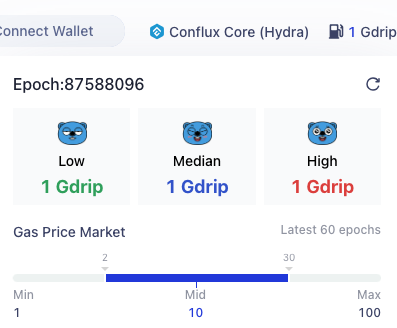

在Conflux网络的核心空间中，交易由矿工处理，矿工为其服务收费。 这个费用激励矿工参与网络并保持其顺畅运行。 这些费用是用CFX支付的，并由交易发起者通过交易中的`gas`, `gasPrice` and `storageLimit` 字段指定。

## 交易中的燃气费

在Conflux中，交易的燃气费由两个关键字段确定：`gas` and `gasPrice`。

- **`gas`**: 该字段指定了交易可以消耗的最大计算能力。
- **`gasPrice`**:表示您愿意支付的每单位计算能力。

实际的燃气成本计算为 `gasCharged`乘以`gasPrice`。 需要注意，`gasCharged`不会超过 `gas` 字段设定的限制。

有关Conflux中燃气及其计算的更详细信息，请访问我们的 [关于燃气的详细文档](/docs/general/conflux-basics/gas.md).。

### 如何设置`gasPrice`字段

Conflux 共识不会为交易燃气价格设定限制，最低燃气价格取决于矿工的设置。 以下是由 Conflux 基金会支持的 Confura 公共 RPC 端点的最低燃气价格设置：

- Core space: 1 GDrip
- eSpace: 20 GDrip

此外，建议根据 Core space / eSpace RPC 返回值来设置燃气价格：

- core space: [`cfx_gasPrice`](/docs/core/build/json-rpc/cfx-namespace#cfx_gasprice)
- eSpace: `eth_gasPrice`

#### 提升交易速度

`gasPrice` 影响交易被包含在区块中的速度。 一般来说，`gasPrice`越高, 交易被挖矿的速度就越快。 然而, 更高的`gasPrice`也意味着更高的交易费用。

在网络拥堵的情况下，交易可能会在被挖矿并添加到区块链中时受到延迟。 在这种情况下，建议提高`gasPrice`以加快交易速度。 Scan右上角的燃气站可以查看网络上目前的gas价格情况。

将`gasPrice`设置为 **High** 将获得最快的交易处理速度。 对于已发送的交易，可以增加`gasPrice`并重新发送交易以替换先前的交易。

### 如何设置 `gas` 字段

对于常规的CFX转账，将gas设置为21,000即可。

对于合约交互，建议根据core space / espace RPC的返回值设置gas：

- Core space： [`cfx_estimateGasAndCollateral`](/docs/core/build/json-rpc/cfx-namespace/#cfx_estimategasandcollateral)的`gasLimit`字段
- eSpace：`eth_estimateGas`

这些方法仿真执行交易，并返回了交易所使用的燃气的估计值。 事实上, 在大多数情况下, [`cfx_estimateGasAndCollateral`](/docs/core/build/json-rpc/cfx-namespace/#cfx_estimategasandcollateral)返回值`gasUsed`是准确的, 但是不建议使用`gasUsed`，有以下两个原因：

1. 由于 [EIP-150](https://eips.ethereum.org/EIPS/eip-150) ，将 gas 设置为实际的 gas 消耗量往往会导致交易失败。
2. 该结果是基于仿真过程中的当前区块链状态，但实际执行状态可能会有所不同。

`gasLimit`字段通常等于`1.3 * gasUsed`。 这样可以确保交易的燃气上限足够，而任何多余的燃气费用都会被退还。

## 存储抵押

除了交易费用外，Conflux 网络还要求在交易过程中为占用新的存储空间或修改已有的存储空间的质押 CFX。 质押的 CFX 产生 4% 的年利息，这部分利息支付给矿工，以补贴他们的存储成本。 当占用的空间被释放或被他人修改时，质押的 CFX 将被返还。

`storageLimit`字段描述了交易可以占用的存储空间的上限。 建议使用 [`cfx_estimateGasAndCollateral`](../../build/json-rpc/cfx-namespace.md#cfx_estimategasandcollateral) 返回值的`storageCollaterized`字段作为 `storageLimit` 字段。

:::info

更多信息请参阅 [存储](../storage.md)。

:::

发送交易时,发送方必须确保有足够的余额来支付 `value + storageLimit * (10^18/1024) + gas * gasPrice`。 如果余额不足，交易将被节点拒绝。

如果指定的`storageLimit` 超过了交易实际占用的存储空间, **将不会产生额外费用**,超出的部分将被退还。

如果交易是[被赞助的](../internal-contracts/sponsor-whitelist-control.md), 发送方只需要确保有足够的资金支付价值成本即可。

当前的SDK提供了`gas`, `storageLimit`，和`gasPrice`自动设置合理值的方法，但用户也可以手动指定这些数值。

## 常见问题解答

### 如果设置的`gas`值过低会发生什么?

如果设置的gas值过低，交易可能无法执行成功。

### 如果设置的`gas`值过高，会额外收取燃气费吗？

如果设置的 gas 值过高，多余的燃气将会被退还，但最多只能退还燃气限制的四分之一。 例如，如果交易的燃气限制为100,000，但实际执行期间只消耗了50,000，那么只会退还25,000的燃气费用。

### 如果`storageLimit`设置太低会出现什么情况呢?

这将会导致交易执行失败。

### 如果设置的 storageLimit 过高，是否会产生额外费用？

不会，多余的费用将被退还。

### `gas`和`storageLimit`之间的关系是什么？

两者之间没有任何关系。

### 尽管使用了从`cfx_estimateGasAndCollateral`返回的 `gas`，交易仍然失败的原因是什么？

在根据`cfx_estimateGasAndCollateral`的估算设置交易的`gas`金额时，关注一些重要事项可以防止失败：

1. **正确的字段用法**: 确保使用`cfx_estimateGasAndCollateral`提供的`gasLimit`, 而不是`gasUsed` 字段。

2. **动态执行环境**：该估算方法是基于调用时区块链的状态进行仿真执行的。 然而，实际执行环境可能发生变化，可能需要比预计更多的gas。 为了减少这些变量导致的失败风险， 你可以设置比预估量更高的`gas`。

### 交易中的 gas 和存储成本是多少？

当发送交易时，你会产生燃气费和存储费用。 燃气费是用于交易处理的必须费用，按以下公式计算: `gasFee` = `gasPrice` \* `gasCharged`。 这笔费用用于支付矿工验证和执行交易的报酬。

除了燃气费，交易可能会利用新的储存空间。 虽然对这种存储的使用没有直接收费，但需要抵押一定数量的CFX。 一旦不再需要这些存储空间，这些与所使用的存储空间成比例的抵押CFX将被释放。 返还率是每1024字节存储空间对应1 CFX。

### 如何计算交易中实际使用的燃气费用？

在ConfluxScan上，用户可以通过`cfx_getTransactionReceipt`查询到交易的燃气费使用量、燃气价格、燃气费用以及其他相关信息: `gasFee = gasCharged * gasPrice`,但是gasCharged不一定等于gasUsed。
在Conflux中有一个规则：`gas`用于设置交易中可使用的燃气的上限。 在 Conflux 中，交易中的 <code>gas</code> 必须大于实际使用的燃气量（gasUsed）的值。
对于超出实际使用的部分，最多只会退还 1/4 的 gas 费用：如果超出部分小于 gasLimit 的 1/4，将全部退还；但如果超出部分大于 gasLimit 的 1/4，只有 1/4 的 gas 费用会被返还。 因此，在发送交易时，尽量给出准确的 gas 值是很重要的。

### 如何知道交易使用了多少 gas 和存储？

RPC中[`cfx_estimateGasAndCollateral`](/docs/core/build/json-rpc/cfx-namespace/#cfx_estimategasandcollateral)可用于估算交易所需的燃气和存储空间，但是这种估算并不是100%准确的。
因此，返回的燃气可以手动调整，比如乘以`1.3`。

### 为什么与合约进行交互后余额没有改变，但交易燃气费已被支付？

Conflux 网络具有赞助机制。 如果一个合约有代付方，该合约与其他账户之间的交互所产生的燃气费用和存储费用将由代付方支付。
