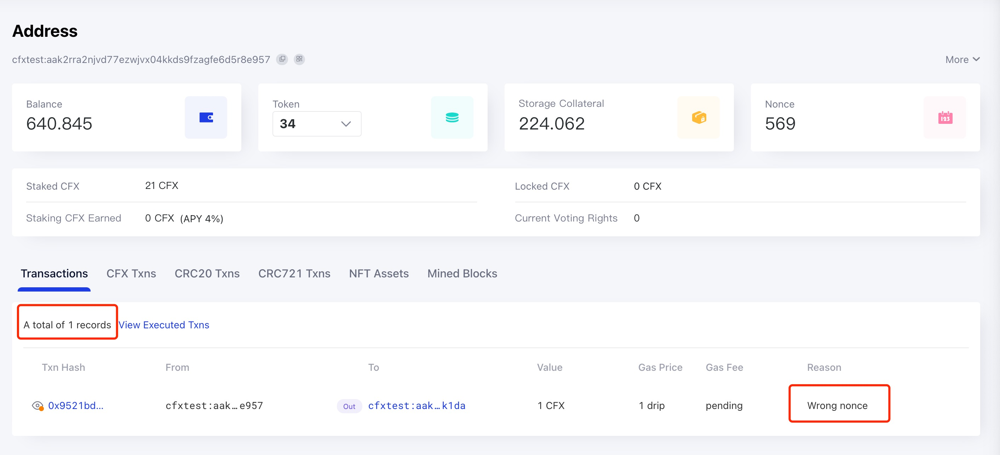

由于当前的区块链系统可能存在吞吐量低和准入门槛高等问题，因此通过区块链发送的某些交易可能无法被打包确认。 以 Conflux 为例，Conflux 网络通常每秒可以产生两个区块。 在交易` 成功发送后 `，它应该在约` 20 秒 `内被打包并执行，具体时间取决于网络拥塞程度。 如果交易长时间未被打包，很可能出现了问题，需要发送者进行手动干预。

## 如何查找待处理交易的原因？

If the pending transaction is successfully inserted into the transaction pool of the node used by [Scan](https://www.confluxscan.org/), the transaction can be searched by hash on Scan, and the status of the transaction can be seen as `Pending` on the transaction details page.

 此时，我们可以进入交易发送者的` 账户详情页面 `，并通过账户页面上的` View Pending Txns `选项卡查看用户的待处理交易。

在这个选项卡中，您可以看到该用户的待处理交易总数以及最早的待处理交易（最多 10 笔）。 最重要的是，你还可以看到**第一个待处理交易的挂起原因**。

该页面使用 RPC 方法 [`cfx_getAccountPendingTransactions`](../../../core/build/json-rpc/cfx-namespace.md#cfx_getaccountpendingtransactions) 来获取一个账户的当前待处理交易信息。

## 交易被挂起的可能原因

有四个可能的原因：

* 错误的 nonce
* 过时的纪元高度
* 内部错误
* 准备打包

### 错误的 nonce

这种错误意味着发送的交易使用了错误的 nonce。 通常情况下，交易需要按照 nonce 的顺序依次执行。 如果队列中有 nonce 更小的交易处于待处理状态或缺失，该交易将等待直到所有之前的交易都成功执行。

如果在发送交易时使用了不连续的 nonce，或者在网络拥堵期间，交易池中的某些交易被垃圾回收（GC）清除，将导致一些交易在交易池中挂起，无法在较长的时间内被打包。

在这种情况下，我们需要 **用正确的nonce重新发送交易**。 需要注意的是，在所有先前的交易都执行完成之后（并且余额充足的情况下），待处理交易将自动执行。

### 过时的 Epoch 高度

错误信息表明`第一个交易的 epoch 高度过旧，无法打包。 发送者需要提交新的交易以更新交易池。` 更新相应交易的正确的 `epochHeight 参数`（例如使用 `cfx_epochNumber`）将解决此问题。

### 内部错误

错误信息表明`全节点内部错误。 发送者需要提交新的交易以更新交易池。` 这通常是由某些复杂的余额设置触发的。 确保您的账户有足够的余额，然后提交新的交易可以解决这个问题。

### 准备打包

这种情况意味着交易本身已经达到可以被打包的条件，但由于整个网络相对拥堵或其他原因，尚未被打包。

如果交易长时间处于这种状态，可以适当提高交易的 gasPrice 以重新发送交易，这可以提高交易的打包和执行速度。

## 解决方法如下：

首先确保您的账户余额足够，然后，如果因为跳过了 nonce 而导致交易挂起，您应该使用**正确的 nonce** 重新发送交易。 如果交易因其他原因挂起，您可以 **使用更高的燃气费** 和相同的 nonce 重新发送交易。

### 如何正确设置 gasPrice？

交易的打包和执行速度主要受交易的 gasPrice 影响。 gasPrice 越高，交易被矿工打包的速度就越快，因此正确设置 gasPrice 非常重要。

您可以使用全节点的 [`cfx_gasPrice RPC`](/docs/core/build/json-rpc/cfx-namespace#cfx_gasprice) 方法来获取建议的燃气费值。 该方法会根据最新几个块的 gas 使用情况和其中交易的 gasPrice 给出建议的值。

在网络拥堵的情况下，您可以在 Scan 的 gasPrice 面板上检查当前的燃气费情况。 使用最高的燃气费可以让您达到最快的交易处理速度。

