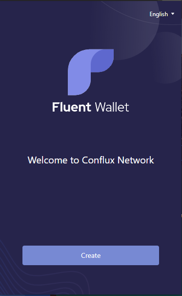
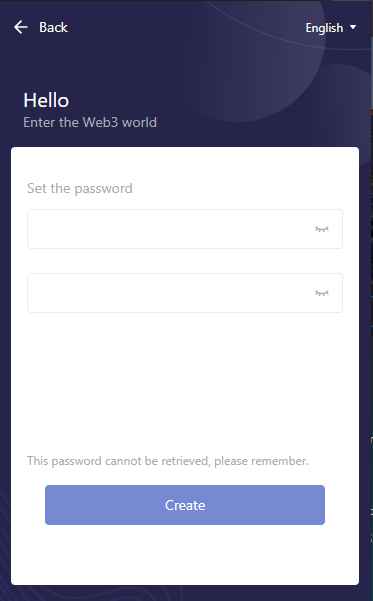
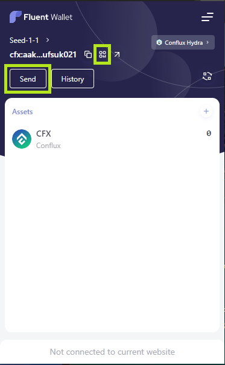

与 Conflux Core Space 互动之前，您首先需要创建一个账户。 通常情况下，在Conflux Core Space中创建和管理账户需要使用Fluent钱包。

### 安装 [Fluent Wallet](https://fluentwallet.com/)

Fluent 是一个浏览器插件钱包，类似于Etherum的 MetaMask 钱包。 它当前支持 Chrome，火狐与 Edge 浏览器。 用户可以直接在浏览器插件市场中搜索 `Fluent Wallet`，选择并安装它。 或者在[Fluent官网](https://fluentwallet.com/)上找到它。

安装 Fluent 钱包后，首先要做的是设置密码：

下一步是创建或导入账户助记词。 账户种子短语可以用于生成或恢复账户，因此非常重要，需要妥善保管。

创建种子短语后，Fluent会自动通过种子短语创建一个账户，您可以看到该账户的名称、地址、余额等信息。 您还可以看到 CFX 的`Send`和`Deposit`按钮，点击以发送或接收 CFX。

