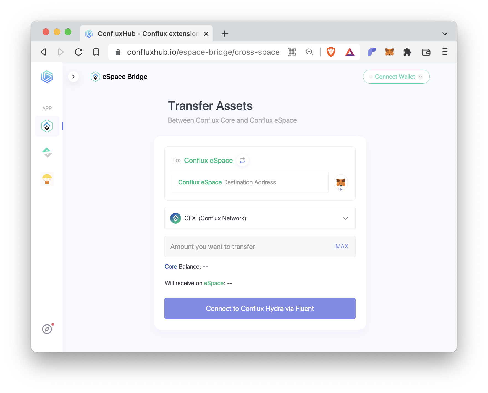

# 跨空间转账

## 概览

2022年Hydra硬分叉之后，Conflux中存在两个空间：Core Space 和 eSpace。 两个空间都使用CFX作为它们的原生代币，并且运行在同一条区块链上。 欲了解更多详情，请参阅 [文档](https://hackmd.io/@thegaram/S15_VAwh5) 或 [这篇文章](https://medium.com/conflux-network/conflux-espace-a-high-level-overview-cdca29bc422a)。

用户可以在Conflux的Core Space和eSpace之间转移CFX或ERC20代币。 这个操作被称为跨空间转账。 在下一节中，我们将解释如何进行这种转账。

## ConfluxHub

使用[ConfluxHub](https://confluxhub.io/espace-bridge/cross-space)是在Core Space和eSpace之间转移资产最简单的方式。 我们建议您设置两个钱包：用于Core Space的[Fluent](https://fluentwallet.com/)和用于eSpace的[MetaMask](https://metamask.io/)。




按照这些步骤进行跨空间转账：

- 点击 `连接钱包` 来将您的Fluent和MetaMask钱包连接到 ConfluxHub。
- `To: Conflux eSpace` 顶部显示了您正在从Core Space转账到eSpace。 如果您想要在另一个方向进行传输，请点击此文本旁边的箭头。
- 在 `Conflux eSpace Destination Address` 字段中输入您的eSpace地址，或点击右边的 MetaMask图标自动填写此字段。
- 接下来，选择您想要转移的代币，输入转移数量。
- 如果底部的按钮显示为`Approve`，则需要点击该按钮先提交一个ERC20代币的授权。
- 一旦底部的按钮显示 `Transfer`，点击它进行转账。

将资产从 eSpace 转移到 Core Space 的跨空间转账也是一个类似的过程，但包含两个主要步骤：首先，将代币转移到 eSpace 上的桥接合约。 第二步，从 Core Space 上的桥接合约中提取代币。 请按照网站的说明进行操作。

**⚠️ 当进行跨空间转账时，请始终仔细检查地址，以避免意外的资产损失。**

## 开发者的跨空间转账

以下我们将讨论如何通过编程方式进行跨空间转账。

### 内置合约

[CIP-90](https://github.com/Conflux-Chain/CIPs/blob/master/CIPs/cip-90.md)是引入在同一条区块链上运行两个空间概念的提案，定义了一个新的[内置合约](https://hackmd.io/@thegaram/S15_VAwh5)来连接这两个空间。 这个合约在Core Space上的地址是 [`cfx:aaejuaaaaaaaaaaaaaaaaaaaaaaaaaaaa2sn102vjv`](https://confluxscan.io/address/cfx:aaejuaaaaaaaaaaaaaaaaaaaaaaaaaaaa2sn102vjv) (hex: `0x0888000000000000000000000000000000000006`)。

```js
interface CrossSpace {
    /* methods for cross-space CFX transfers */

    function transferEVM(bytes20 to) external payable returns (bytes memory output);

    function withdrawFromMapped(uint256 value) external;

    function mappedBalance(address addr) external view returns (uint256);

    /* methods for other cross-space operations */

    function callEVM(bytes20 to, bytes calldata data) external payable returns (bytes memory output);

    function staticCallEVM(bytes20 to, bytes calldata data) external view returns (bytes memory output);

    // ...
}

```
