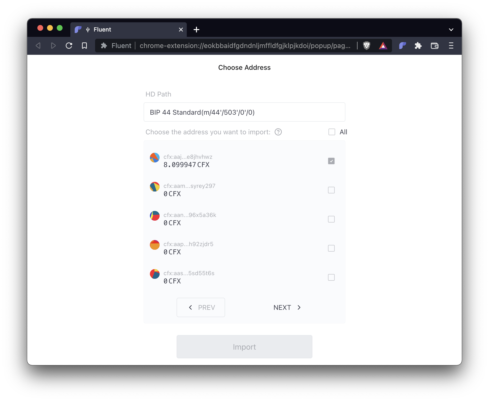

## 简介

[Conflux](https://confluxnetwork.org)是基于树图共识协议的高性能分布式账本。 Conflux支持Conflux原生代币CFX以及许多其他加密资产，包括[CRC20](https://confluxscan.io/tokens/crc20)和[NFT](https://confluxscan.io/tokens/crc721)通证。 您现在可以使用您的 **Ledger Nano S** 或者 **Ledger Nano X** 硬件钱包来安全地将您的资产存储在Conflux上。 在本指南中，我们将向您展示如何在您的Ledger设备上安装Conflux应用， 如何导入您的账户到Fluent钱包，以及如何在Conflux上转移资产。

:::note
本指南是 Conflux Core的指南。 如果您想在与以太坊虚拟机兼容的Conflux eSpace中使用您的Ledger设备，请点击这里。
:::

## 开始前的准备工作：

在您开始之前，请确保您已经做了以下工作：

**-**  初始化了您的 [Nano S](https://support.ledger.com/hc/en-us/articles/360000613793-Set-up-your-Ledger-Nano-S?docs=true) 或 [Nano X](https://support.ledger.com/hc/en-us/articles/360018784134-Set-up-your-Ledger-Nano-X?docs=true) 设备。

**-**  更新您的 [Nano S](https://support.ledger.com/hc/en-us/articles/360002731113-Update-Ledger-Nano-S-firmware?docs=true) 或 [Nano X](https://support.ledger.com/hc/en-us/articles/360013349800-Update-Ledger-Nano-X-firmware?docs=true) 设备到最新的固件版本。

**-**  安装 [Ledger Live](https://www.ledger.com/ledger-live) 并将其更新到最新版本。

**-**  在兼容的桌面浏览器上安装[Fluent Wallet](https://fluentwallet.com/)。

如果你遇到任何问题，可以在 [Discord](https://discord.com/invite/aCZkf2C) 或 [Telegram](https://t.me/Conflux_English)上找到我们。我们很乐意帮助。

## 安装

:::note
Conflux的Ledger应用程序目前只提供 **未经审核的开发者版本**。 请自行承担使用风险。
:::

您可以通过以下步骤在您的Ledger设备上安装 **Conflux应用程序**：

**1.** 通过 USB 将您的Ledger Nano S 或 Ledger Nano X 设备连接到您的计算机。

**2.**  输入您的 PIN 码解锁您的设备。

**3.**  打开Ledger Live.

**4.**  点击右上角的齿轮图标来打开设置。

**5.**  转到“Experimental features”并启用"Developer mode"。

**6.**  在左边的菜单中，点击“Manager”打开Ledger Live 应用程序管理器。

**7.**  当您的Ledger设备显示“Allow Ledger manager”时，同时按两个按钮以继续。

**8.**  回到Ledger Live, 在“App catalog”选项卡下，在搜索字段中输入“Conflux”。

**9.**  一旦Ledger Live显示Conflux 应用程序，请按“安装”。

Conflux 应用就安装成功了。

## 连接您的Ledger设备到Fluent

您可以通过以下步骤从您的Ledger设备导入账户到您的Fluent wallet：

**1.** 如果当前打开了Ledger Live，请退出。

**2.** 通过 USB 将您的Ledger Nano S 或 Ledger Nano X 设备连接到您的计算机。

**3.** 输入您的 PIN 码解锁您的设备。

**4.** 在您的设备上找到到Conflux应用，并按下两个按钮打开它。

**5.** 在Fluent中，在右上角打开菜单并选择“帐户管理”。

**6.** 点击"添加"并选择"硬件钱包"。 仔细阅读说明并点击"开始连接"。

**7.** 在“连接你的Ledger”页面上，点击"连接"。

**8.** 一个浏览器弹出窗口将会说"Fluent Wallet想要进行连接"。 从列表中选择您的Ledger设备，然后点击“连接”。

**9.** 几秒后，“选择地址”页面会在Fluent Wallet显示。 选择一个或多个您想要导入到 Fluent 的账户，然后点击“导入”。

您的账户现在已经可在 Fluent 中使用，名称为 "LedgerNanoS-1"（或类似名称）。

## 使用Ledger：加密资产转账

假设您在Ledger设备上的账户中有一些CFX代币，则以下步骤说明如何在Conflux上进行CFX转账。

:::note
如果您没有CFX，可以在列在[这里](https://123cfx.com/#Exchanges)的交易所之一购买。
:::

请确保您已经将您的Ledger账户已经导入到您的Fluent 钱包，方法和上一节的步骤相同。 如果当前打开了Ledger Live，请退出。

**1.** 通过 USB 将您的Ledger Nano S 或 Ledger Nano X 设备连接到您的计算机。

**2.** 输入您的 PIN 码解锁您的设备。

**3.** 在您的设备上找到到**Conflux应用**，并按下两个按钮打开它。

**4.** 在 Fluent钱包中, 中选择您的 Ledger 账户(例如，"LedgerNanoS-1")。

**5.** Click "Send" and enter the recipient address.

**6.** 在“代币和数量”下，输入CFX的转账金额，然后点击“下一步”。

**7.** 仔细检查交易细节，然后点击“确认”。

**8.** 您的Ledger设备将显示“审核交易”。 **仔细检查交易金额和收款地址**，可以通过多次按下设备上的右按钮来完成。

**9.** 如果一切看起来正确，请在"接受并发送"界面上同时按下两个按钮以批准交易。 否则，按“拒绝”界面上的两个按钮来拒绝交易。

交易被批准后，它现在已被签名并发送到Conflux网络。 您可以在 Fluent 中看到交易状态。 如果您在“历史记录”中点击交易右上角的箭头图标， 您可以在 [Conflux Scan](https://confluxscan.io) 上看到更多交易细节。

## 后续步骤

你可以在 [confluxnetwork.org](https://confluxnetwork.org) 了解更多关于Conflux的信息。 您可以在 [Conflux Scan](https://confluxscan.io) 上检查交易和帐户细节。

如果你遇到任何问题，可以在 [Discord](https://discord.com/invite/aCZkf2C) 或 [Telegram](https://t.me/Conflux_English)上找到我们。我们很乐意帮助。
