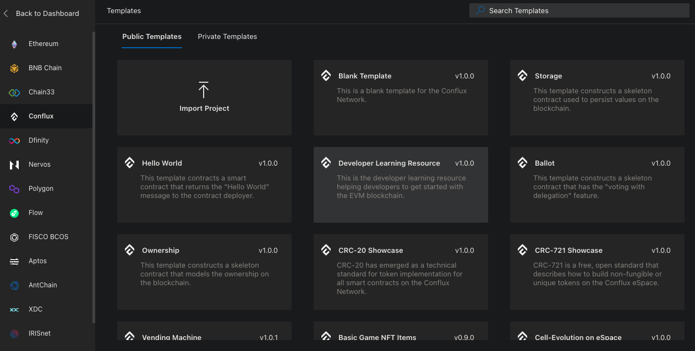
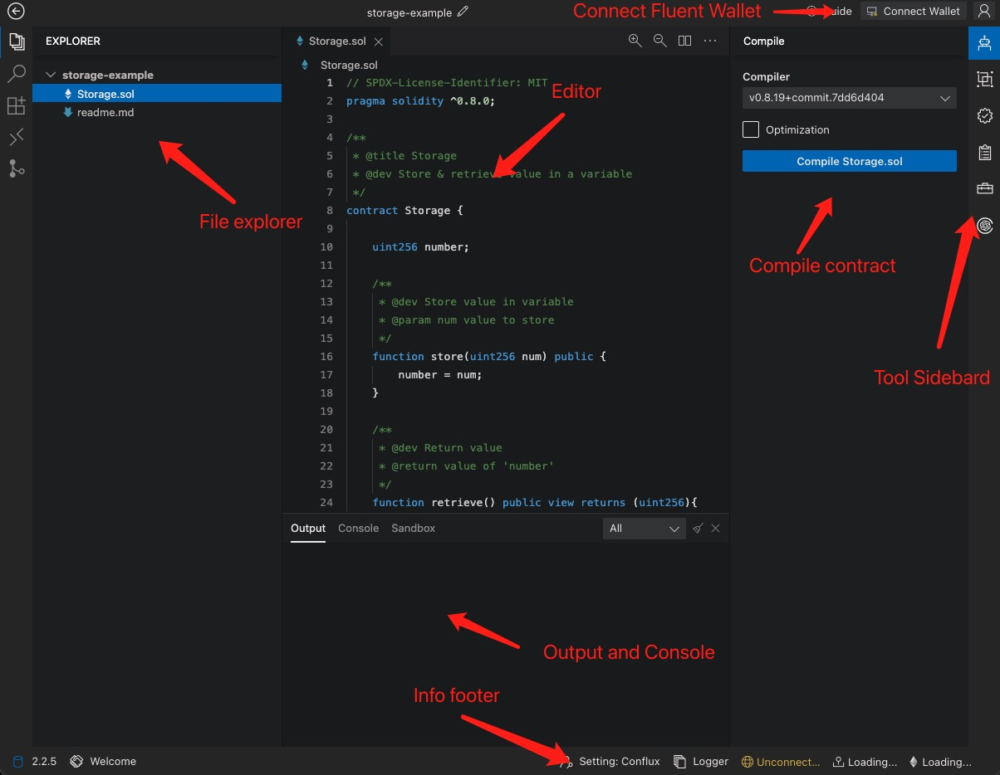
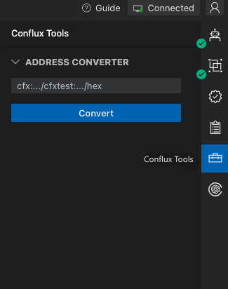

[ChainIDE]](https://chainide.com/) 是一个针对区块链智能合约开发定制的基于 Web 的集成开发环境（IDE）。 它为智能合约的开发、测试、调试和部署提供了全面的解决方案。 与以太坊的 Remix 相比，ChainIDE 功能更强大，支持包括 Conflux Core Space 在内的多个区块链。


这个教程将教您如何使用 ChainIDE 在 Core Space 上开发和部署智能合约。

## 创建项目

首先，在 ChainIDE 上创建一个项目。 在左侧的链列表里选中 `Conflux`，然后从右侧选择一个模板。 在本教程中，我们将使用 **Storage** 模板。



## 工作区概览

创建项目后，您会看到 ChainIDE 的工作区，由此可以联想到 VSCode。 左侧是文件资源管理器，右侧是编辑器，底部是终端。



Solidity 示例代码如下：

```solidity
// SPDX-License-Identifier: MIT
pragma solidity ^0.8.0;

/**
 * @title Storage
 * @dev Store & retrieve values in a variable
 */
contract Storage {

    uint256 number;

    /**
     * @dev Store value in variable
     * @param num value to store
     */
    function store(uint256 num) public {
        number = num;
    }

    /**
     * @dev Return value 
     * @return value of 'number'
     */
    function retrieve() public view returns (uint256){
        return number;
    }
}

```

## 编译合约

右侧工具箱中的第一个选项是 **Solidity 编译器**。 您可以在这里选择编译器版本，然后点击“编译”按钮来编译您的合约。

编译完成后，您将获得 `ABI` 和 `BYTECODE`。


## 连接 Fluent 钱包

在将此合约部署到 Core Space 测试网之前，需要先连接您的 Fluent 钱包。 点击窗口右上角的**连接钱包**按钮。

然后，在弹出窗口中选择**连接到自定义节点**。


接下来选择 Fluent 钱包，因为我们的目标是将合约部署到 Core Space。


最后，在钱包弹出窗口中点击**批准**。 然后您将在右上角看到钱包连接状态为**已连接**，以及右下角的已连接账户的地址和余额。

记得要在 Fluent 中切换到 Conflux 测试网。

## 部署合约

在右侧工具箱中点击**部署与交互**，选择一个合约，然后点击**部署**按钮。 随后将出现一个部署确认弹窗；点击**确认**。 这个操作将向 Core Space 测试网发送一笔交易，并在执行交易时部署该合约。


**输出区域**将显示合约部署的进度，包括交易哈希。

部署完成后，新合约将出现在“交互”区域。


## 与合约交互

交互工具中列出了合约的所有公共函数。 对于只读函数，可以点击**获取**按钮。 如果函数需要输入参数，请在输入框中进行输入。

对于状态改变的函数，点击**提交**按钮向 Core Space 测试网发送交易。 交易执行后，结果将出现在**输出区域**。


## 其它工具

右侧工具箱中的其他工具包括：

1. 合约验证器：在 ConfluxScan 上验证合约的源代码。
2. 地址转换器




## 总结

ChainIDE 是一个强大的智能合约开发 IDE，为初学者提供了便利和适用性。 它是在 Core Space 测试网上开发和部署智能合约的绝佳工具。
