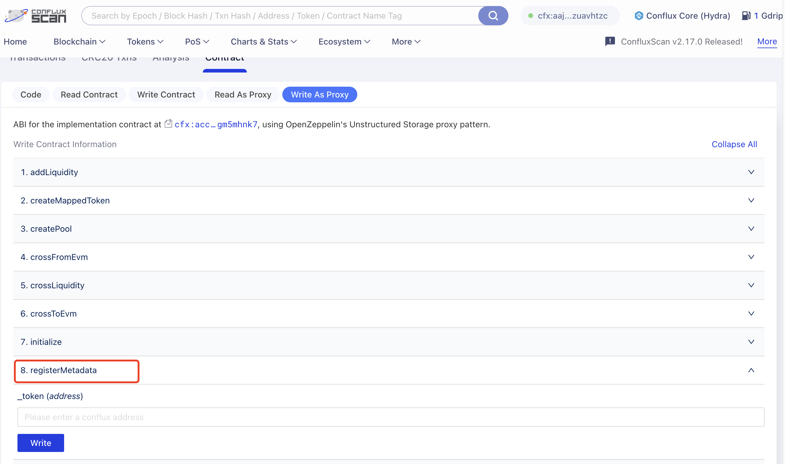
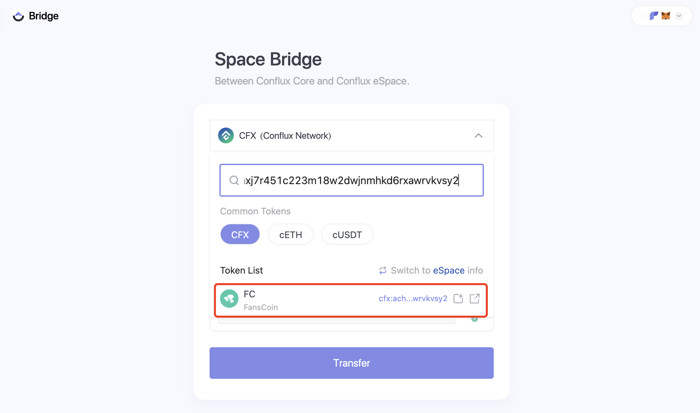
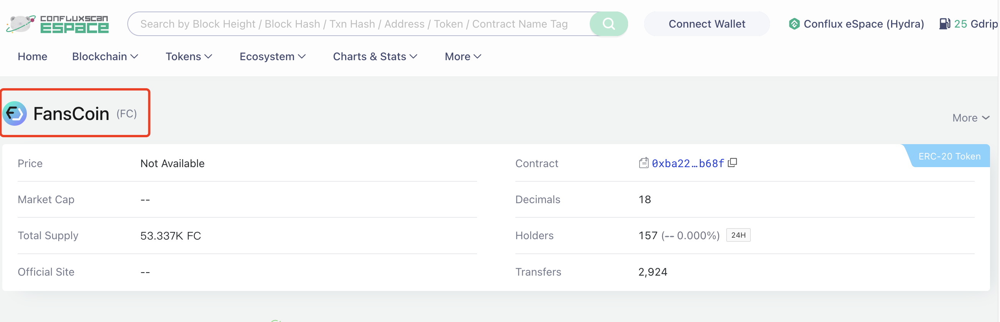

This tutorial guides developers on transferring any CRC20 token from Core Space to eSpace, The goal is to transfer a CRC20 token (A) issued on coreSpace to become an ERC20 token (eA) in eSpace. Currently, if there is no corresponding token in eSpace, it's not possible to use the official [cross-space bridge](https://confluxhub.io/espace-bridge/cross-space) directly.

Before initiating cross-space operations, let's review several key contracts associated with the cross-space bridge:

**coreSpace 上的合约：**

- BeaconProxy 代理合约: `cfx:acfcrckktgx99scxwr6jtjx81yhm4ggsfatprwzb3x`
- BeaconProxy 逻辑合约 - Conflux 端: `cfx:acc7gpd3380pv6v112s5c2y3g3g6jvm32egm5mhnk7`

**eSpace 上的合约：**

- BeaconProxy 代理合约: `0x4f9e3186513224cf152016ccd86019e7b9a3c809`
- BeaconProxy 逻辑合约 - Evm 端: `0x4fa28072bd5b551dde70213aa02cb05bd022e34b`

## 跨空间转移代币的方法(Cross-Space Methods)

### 第 1 步：在 eSpace 注册 coreSpace 的 ERC20 代币

首先，在 coreSpace 上的 BeaconProxy 代理合约中调用 `registerMetadata` 方法(写成 Proxy 的形式)，并指定代币地址 `Address_A`。 这个函数调用了 crossSpaceCall 合约以执行跨空间操作，将 A 合约在 EVM 空间中进行注册。 代码如下所示：

注册完成后，在 eSpace 的 BeaconProxy 合约中的 `crc20Metadata` 函数可以用来检索 eSpace 中的 CRC20 代币的元数据，这些元数据包括 `name(字符串)、symbol(字符串)、decimals(无符号8位整数)、registered(布尔值)`。

### 第 2 步：创建代币映射

在 eSpace's BeaconProxy 合约中，调用 `createMappedToken` 方法，指定 CRC20 代币地址。

此操作创建了一个新的 `BeaconProxy` 合约，同时通过部署一个 `UpgradeableERC20` 合约，将新的 `BeaconProxy` 合约地址设置为 CRC20 代币对应的 `mappedToken`。

此时，在 coreSpace 和 eSpace 上的 CRC20 和 ERC20 代币已经建立了完整的映射关系。

### 第 3 步：使用官方 Cross Space 桥接功能

现在，您可以通过官方的 [Cross Space 桥接功能](https://confluxhub.io/espace-bridge/cross-space)执行跨空间代币转移的操作，其中包含 coreSpace 的 BeaconProxy 合约中调用 `crossToEVM` 函数(在此操作之前，需要先授权BeaconProxy 合约调用 CRC20 代币)的操作。

### 第 4 步：更新 Logo 以及代币标签

转移到 eSpace 后，代币会缺少 logo 以及标签信息。 这可能需要通过公告合约(Announcement contract)进行正式的广播。

### 第 5 步：在 Cross-Space Bridge 列出代币

要在官方跨链桥接上显示，您需要修改 `native_token_list_mainnet.json` 文件，并向[conflux-evm-bridge](https://github.com/Conflux-Chain/conflux-evm-bridge)仓库提交一个 Pr，请求将代币添加到默认的显示列表中。

ConfluxHub 的前端代码托管在 [conflux-dapps](https://github.com/Conflux-Chain/conflux-dapps) 仓库中。 您可以通过修改位于 (dapps/cross-space/src/components/TokenList/tokenListStore.ts)中 [innerTokenListUrl] 参数的来自定义您自己的代币列表版本，然后进行部署。

