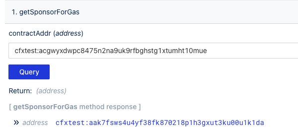
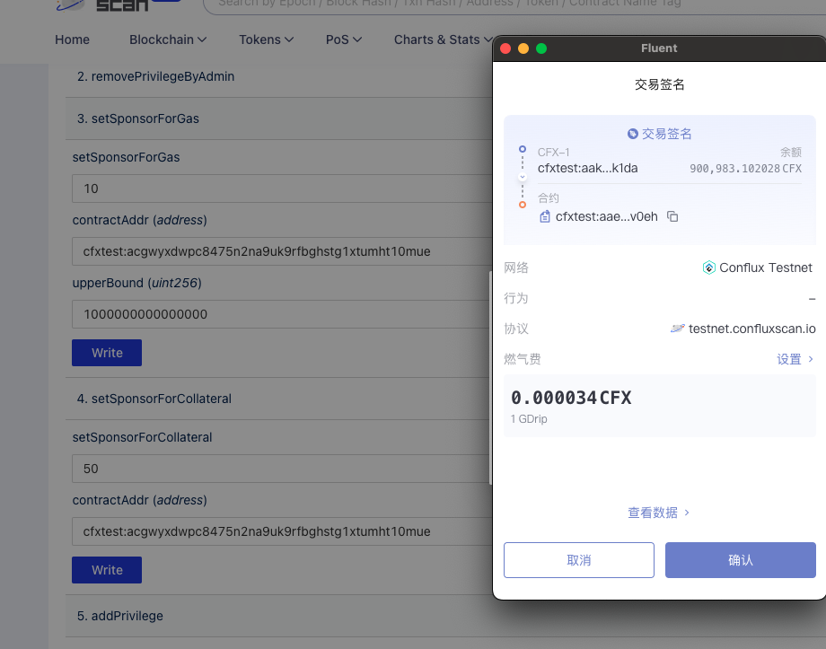
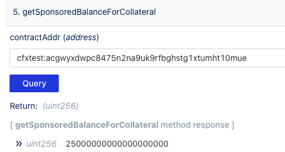

Conflux Core [赞助](../core-space-basics/sponsor-mechanism.md)提供了一个方便的功能给刚接触区块链的用户。 This tutorial will guide you on how to use the [ConfluxScan Read&Write Tool](https://www.confluxscan.org/address/cfx:aaejuaaaaaaaaaaaaaaaaaaaaaaaaaaaaegg2r16ar?tab=contract-viewer) to sponsor a contract.

合约读写工具允许用户与智能合约进行交互。 任何在 ConfluxScan 上验证过的合约都可以使用这个工具来读取或写入数据。

- [Mainnet SponsorWhitelistControl Read&Write Tool](https://www.confluxscan.org/address/cfx:aaejuaaaaaaaaaaaaaaaaaaaaaaaaaaaaegg2r16ar?tab=contract-viewer)
- [Testnet SponsorWhitelistControl Read&Write Tool](https://testnet.confluxscan.org/address/cfxtest:aaejuaaaaaaaaaaaaaaaaaaaaaaaaaaaaeprn7v0eh?tab=contract-viewer)

## 准备工作

1. 安装 [Fluent](https://fluentwallet.com/) 钱包并切换到 Conflux 测试网络。
2. 从 [Conflux 测试网水龙头](https://faucet.confluxnetwork.org/) 获取一些测试代币。
3. 准备一个合约地址，例如：`cfxtest:acgwyxdwpc8475n2na9uk9rfbghstg1xtumht10mue`。

## 查询赞助信息

在**读取合约**标签页中列出了所有的合约查看方法 打开其中任意一个合约，输入参数（如果有的话），然后点击**查询**按钮以获取结果。

例如，使用 `getSponsorForGas`：

如果返回**零地址**，这意味着合约未被赞助。

## 赞助存储

在**写入合约**标签页中列出了所有的合约写入方法。 在使用之前需要先连接您的钱包。

如果写入方法包含 **payable 修饰符**，第一个输入框可用于在调用方法时，设置要转移到合约的 CFX 数量。

例如，输入 50 意味着向合约转移 50 CFX。

然后点击**写入**按钮 随后将出现一个弹窗；点击**确认**以批准交易。

交易执行后，您可以再次查询合约的赞助信息。

一半的 CFX 将转换为存储点。

## 赞助 Gas

我们将 gas 的赞助余额设置为 10 CFX，上限为 **1000000000000000** Drip（`**1000000000000000** ` Drip）。

交易执行后，您可以再次查询合约的赞助信息。

## 白名单

最后，将零地址添加到白名单中，以便在不支付 gas 费的情况下使用合约。

对于第二个参数（即数组），传递 ["0x0000000000000000000000000000000000000000"]。

## 在 ConfluxScan 上检查合约存储的使用信息

您可以在 ConfluxScan 的合约详情页面上，检查合约的存储使用以及赞助余额信息。

## 在 ConfluxScan 上检查有关赞助的交易

设置了赞助后，您可以在不支付 gas 费的情况下与合约互交互 交易将在 ConfluxScan 的详情页面上被标记为赞助。

## 其他的赞助方法

开发者可以使用 SDK 来调用 `SponsorWhitelistControl` 方法来赞助合约。 相关示例请点击[此处](../core-space-basics/internal-contracts/sponsor-whitelist-control.md#how-to-sponsor-a-contract)进行查看。

## 常见问题解答

### 我赞助了一个合约，为什么交易仍然失败了？ 我赞助了一个合约，为什么交易仍然失败了？

可能导致交易失败的几个原因：

1. gas 上限设置得太低。
2. 赞助余额不足。
3. 白名单设置得不正确。
