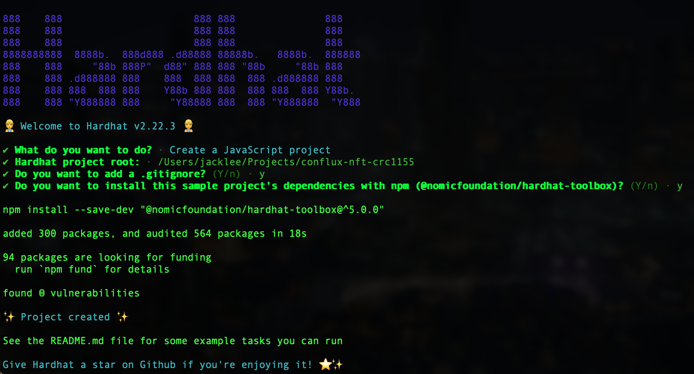
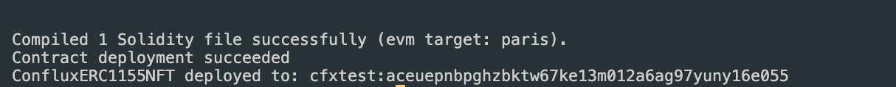
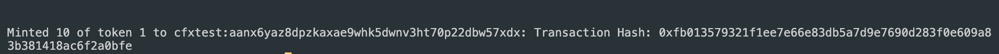
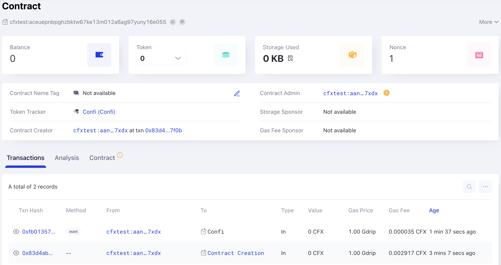

# 在Conflux上使用Hardhat创建和部署ERC1155 NFT

本教程将指导您逐步完成在Conflux CoreSpace上使用Hardhat创建、编写和部署ERC1155 NFT智能合约的过程。 此外还将向您展示如何在ConfluxScan上查看您的合约。 您可以在[Conflux-NFT-CRC1155](https://github.com/ConfluxDAO/Conflux-NFT-CRC1155) 仓库中找到一个实际的例子。

如果您不熟悉 Hardhat，请参考 [Hardhat 文档](https://hardhat.org/getting-started/)。

## 前提条件

在开始之前，请确保您已经具备以下条件：

- 您的电脑上已经安装了Node.js。
- 拥有一个文本编辑器，比如Visual Studio Code。
- 基本了解智能合约开发和Solidity编程语言。

## 第1步：设置您的环境

首先设置您的开发环境：

```bash
mkdir conflux-nft-crc1155
cd conflux-nft-crc1155
npm init -y
npm install --save-dev hardhat
```

然后，创建一个Hardhat项目：

```bash
npx hardhat
```

对所有选项按回车键以选择默认项目设置。 这将生成一个包含所有必要配置的基本 Hardhat 项目设置。 现在，您的项目目录应该包含Hardhat配置文件。
[](../imgs/nft-tutorials/crc1155-hardhat-create-project.png)

## 步骤2: 安装相关程序

安装OpenZeppelin合约，以获得经过审计的安全的ERC1155代币实现，同时安装Hardhat-Conflux-Plugin，该插件基于js-conflux-sdk构建，因此在部署和交互方面与js-conflux-sdk非常类似：

```bash
npm install @openzeppelin/contracts hardhat-conflux js-conflux-sdk
```

更多信息请参阅[Hardhat Conflux Plugin教程](/docs/core/tutorials/hardhat-conflux-plugin)和[JS-Conflux-SDK文档](https://docs.confluxnetwork.org/js-conflux-sdk)。

## Step 3: Writing the Smart Contract

在`contracts`文件夹中创建一个名为`ConfluxERC1155NFT.sol`的新文件，并添加以下Solidity代码：

```solidity
// SPDX-License-Identifier: MIT
pragma solidity ^0.8.24;

import "@openzeppelin/contracts/token/ERC1155/ERC1155.sol";
import "@openzeppelin/contracts/access/Ownable.sol";

contract ConfluxERC1155NFT is ERC1155, Ownable {
    // Token name
    string public name;
    // Token symbol
    string public symbol;

    //  Replace the example tokenURI with the actual metadata URI for the NFT
    constructor(
        string memory name_,
        string memory symbol_
    )
        ERC1155(
            "https://raw.githubusercontent.com/conflux-fans/dual-space-nft-metadata/main/2023040104"
        )
        Ownable(msg.sender)
    {
        name = name_;
        symbol = symbol_;
    }

    function mint(
        address to,
        uint256 id,
        uint256 amount,
        bytes memory data
    ) public onlyOwner {
        _mint(to, id, amount, data);
    }

    function setURI(string memory newuri) public onlyOwner {
        _setURI(newuri);
    }
}
```

该合约使用了OpenZeppelin的ERC1155和Ownable合约，仅允许所有者铸造新代币：

## 第4步：配置Hardhat

修改`hardhat.config.js`文件，添加Conflux网络配置：

```javascript
require("@nomicfoundation/hardhat-toolbox");
require("hardhat-conflux");

const PRIVATE_KEY = "YOUR_PRIVATE_KEY_HERE";

module.exports = {
  solidity: "0.8.24",
  defaultNetwork: "cfxTestnet",
  networks: {
    cfx: {
      url: "https://main.confluxrpc.com",
      accounts: [PRIVATE_KEY],
      chainId: 1029,
    },
    cfxTestnet: {
      url: "https://test.confluxrpc.com",
      accounts: [PRIVATE_KEY],
      chainId: 1,
    },
  },
};
```

将`YOUR_PRIVATE_KEY_HERE`替换为您的私钥。

## 第5步：部署合约

在`scripts`文件夹中创建一个名为`deploy.js`的部署脚本：

```javascript
const hre = require("hardhat");

async function main() {
  const signers = await hre.conflux.getSigners();
  const defaultAccount = signers[0];

  const ConfluxERC1155NFT = await hre.conflux.getContractFactory(
    "ConfluxERC1155NFT"
  );
  const receipt = await ConfluxERC1155NFT.constructor("Confi", "Confi")
    .sendTransaction({
      from: defaultAccount.address,
    })
    .executed();

  console.log(
    `Contract deployment ${
      receipt.outcomeStatus === 0 ? "succeeded" : "failed"
    }`
  );
  console.log("ConfluxERC1155NFT deployed to:", receipt.contractCreated);
}

main()
  .then(() => process.exit(0))
  .catch((error) => {
    console.error(error);
    process.exit(1);
  });

```

通过运行以下命令部署合约：

```bash
npx hardhat run scripts/deploy.js --network cfxTestnet
```

部署成功后，您将看到以下信息：
[](../imgs/nft-tutorials/crc1155-deploy-success.png)

## 第6步：铸造NFT

在`scripts`文件夹中创建一个名为`mintNFT.js`的脚本，用于铸造NFT：

```javascript
const hre = require("hardhat");

async function main() {
  const signers = await hre.conflux.getSigners();
  const defaultAccount = signers[0];

  const contractAddress = "YOUR_CONTRACT_ADDRESS";
  const recipientAddress = "RECIPIENT_WALLET_ADDRESS";
  const tokenID = 1; // Example token ID
  const amount = 10; // Number of tokens to mint
  const data = "0x00"; // Data field for additional information (if necessary)

  const ConfluxERC1155NFT = await hre.conflux.getContractAt(
    "ConfluxERC1155NFT",
    contractAddress
  );

  const receipt = await ConfluxERC1155NFT.mint(
    recipientAddress,
    tokenID,
    amount,
    data
  )
    .sendTransaction({
      from: defaultAccount.address,
    })
    .executed();

  console.log(
    `Minted ${amount} of token ${tokenID} to ${recipientAddress}: Transaction Hash: ${receipt.transactionHash}`
  );
}

main().catch((error) => {
  console.error(error);
  process.exit(1);
});
```

将`YOUR_CONTRACT_ADDRESS`和`RECIPIENT_WALLET_ADDRESS`替换为合适的值。

通过运行以下命令来铸造一个NFT：

```bash
npx hardhat run scripts/mintNFT.js --network cfxTestnet
```

成功铸造后，您将看到以下信息：
[](../imgs/nft-tutorials/crc1155-mint-success.png)

## 第7步：在ConfluxScan上查看您的合约

请前往[ConfluxScan](https://testnet.confluxscan.io/)，在搜索栏中输入您的合约地址，查看有关您的合约的详细信息（包括交易）。

[](../imgs/nft-tutorials/crc1155-detail-on-confluxscan.png)

如果您希望使用Hardhat验证您的合约，请参考[该教程](/docs/core/tutorials/hardhat-conflux-plugin#verify-contract)。

## 第8步：赞助您的合约（可选）

Conflux实施了一种赞助机制，以代付智能合约的使用费用。 如果您想让您的合约获得赞助，请参考以下文章：

- [如何为合约提供代付](/docs/core/tutorials/how-to-sponsor-contract)
- [如何赞助合约示例](/docs/core/core-space-basics/internal-contracts/sponsor-whitelist-control#example)

## 结论

本指南提供了一个全面的流程，介绍了如何在Conflux CoreSpace上使用Hardhat创建、部署和管理ERC1155 NFT。 按照这些步骤操作，您可以在Conflux上顺利地启动您的NFT项目。
