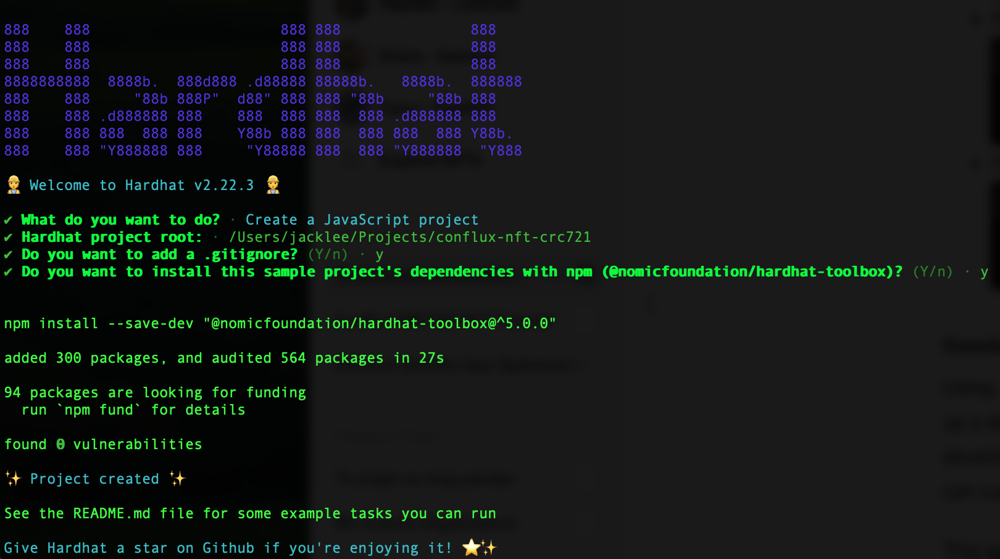
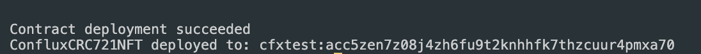
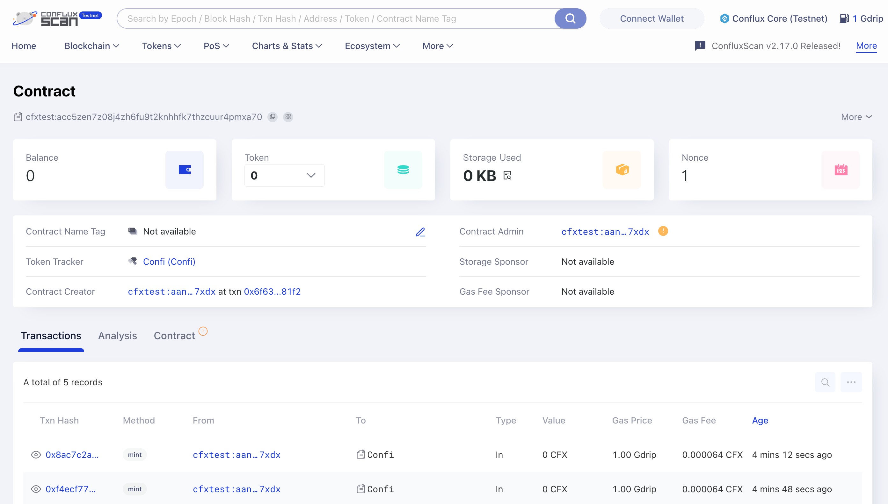

# 在Conflux上使用Hardhat创建和部署CRC721 NFT

本教程将指导您如何使用Hardhat在 Conflux CoreSpace 上创建、编写和部署一个 CRC721 NFT 智能合约 此外，它还将向您展示如何在ConfluxScan上查看您的合约。

如果您不熟悉 Hardhat，请参考 [Hardhat 文档](https://hardhat.org/getting-started/)。

## 前提条件

在开始之前，请确保您具备以下条件：

- 您的电脑上已经安装Node.js。
- 文本编辑器，比如Visual Studio Code。
- 对智能合约开发和Solidity编程语言有基本的了解。

## 第1步：设置您的环境

首先，您需要设置您的开发环境：

```bash
mkdir conflux-nft-crc721
cd conflux-nft-crc721
npm init -y
npm install --save-dev hardhat
```

现在，运行以下命令来创建一个Hardhat项目：

```bash
npx hardhat
```

在提示时，请在所有问题上按Enter键选择默认项目设置。 这将创建一个带有所有必要配置的基本Hardhat项目设置。 设置完成后，您的项目目录应该包括Hardhat配置文件。

[](../imgs/nft-tutorials/hardhat-create-project.png)

## 步骤2: 安装相关程序

安装OpenZeppelin合约，它提供了ERC721代币的安全、经审计的实现；安装Hardhat-Conflux-Plugin，该插件建立在js-conflux-sdk之上的，使得部署和交互用法与js-conflux-sdk非常相似：

```bash
npm install @openzeppelin/contracts hardhat-conflux js-conflux-sdk
```

有关Hardhat-Conflux-Plugin的更多信息，请参阅[Hardhat Conflux Plugin教程](/docs/core/tutorials/hardhat-conflux-plugin)。
要了解更多关于JS-Conflux-SDK的信息，请访问[JS-Conflux-SDK文档](https://docs.confluxnetwork.org/js-conflux-sdk)。

## Step 3: Writing the Smart Contract

在`contracts`文件夹中创建一个名为`ConfluxCRC721NFT.sol`的新文件，并添加以下Solidity代码：

```solidity
// SPDX-License-Identifier: MIT
pragma solidity ^0.8.24;

import "@openzeppelin/contracts/token/ERC721/extensions/ERC721URIStorage.sol";
import "@openzeppelin/contracts/access/Ownable.sol";

contract ConfluxCRC721NFT is ERC721URIStorage, Ownable {
    uint256 public nextTokenId;

    constructor(
        string memory name_,
        string memory symbol_
    ) ERC721(name_, symbol_) Ownable(msg.sender) {}

    function mint(address to, string memory uri) public onlyOwner {
        _safeMint(to, nextTokenId);
        _setTokenURI(nextTokenId, uri);
        nextTokenId++;
    }
}

```

这个合约使用了OpenZeppelin的ERC721URIStorage和Ownable合约，来创建一个只有合约所有者可以铸造的NFT。

## 第4步：配置Hardhat

编辑`hardhat.config.js`，添加Conflux网络配置：

```javascript
require("@nomicfoundation/hardhat-toolbox");
require("hardhat-conflux");

const PRIVATE_KEY = "YOUR_PRIVATE_KEY_HERE";

/** @type import('hardhat/config').HardhatUserConfig */
module.exports = {
  solidity: "0.8.24",
  defaultNetwork: "cfxTestnet",
  networks: {
    cfx: {
      url: "https://main.confluxrpc.com",
      accounts: [PRIVATE_KEY],
      chainId: 1029,
    },
    cfxTestnet: {
      url: "https://test.confluxrpc.com",
      accounts: [PRIVATE_KEY],
      chainId: 1,
    },
  },
};
```

将`YOUR_PRIVATE_KEY_HERE`替换为您的私钥。

## 第5步：部署合约

在`scripts`文件夹中创建一个名为`deploy.js`的部署脚本：

```javascript
const hre = require("hardhat");

async function main() {
  const signers = await hre.conflux.getSigners();
  const defaultAccount = signers[0];

  const ConfluxCRC721NFT = await hre.conflux.getContractFactory(
    "MerkleTreeNFT"
  );
  const receipt = await ConfluxCRC721NFT.constructor("Confi", "Confi")
    .sendTransaction({
      from: defaultAccount.address,
    })
    .executed();

  console.log(
    `Contract deployment ${
      receipt.outcomeStatus === 0 ? "succeeded" : "failed"
    }`
  );

  console.log("MerkleTreeNFT deployed to:", receipt.contractCreated);
}

main()
  .then(() => process.exit(0))
  .catch((error) => {
    console.error(error);
    process.exit(1);
  });

```

通过运行以下命令部署合约：

```bash
npx hardhat run scripts/deploy.js --network cfxTestnet
```

## Step 6: Minting an NFT

To mint an NFT, you can use a script that interacts directly with the `mint` function in your smart contract. This script will mint an NFT to a specified address.

Create another script in the `scripts` folder and name it `mintNFT.js`:

This script sets the URI of a specific token, where `YOUR_CONTRACT_ADDRESS` is the address of your deployed NFT contract and `NFT_RECEIVER_ADDRESS` is the address of the NFT you want mint to.

```javascript
const hre = require("hardhat");

async function main() {
  const signers = await hre.conflux.getSigners();
  const defaultAccount = signers[0];

  const contractAddress = "YOUR_CONTRACT_ADDRESS";
  const recipientAddress = "NFT_RECEIVER_ADDRESS"; // Address to receive the NFT
  const tokenURI =
    "https://raw.githubusercontent.com/conflux-fans/dual-space-nft-metadata/main/2023040104"; //  Replace the example tokenURI with the actual metadata URI for the NFT

  const ConfluxCRC721NFT = await hre.conflux.getContractAt(
    "ConfluxCRC721NFT",
    contractAddress
  );

  const receipt = await ConfluxCRC721NFT.mint(recipientAddress, tokenURI)
    .sendTransaction({
      from: defaultAccount.address,
    })
    .executed();

  console.log(
    `Minted NFT to ${recipientAddress}: Transaction Hash: ${receipt.transactionHash}`
  );
}

main().catch((error) => {
  console.error(error);
  process.exit(1);
});
```

Replace `YOUR_CONTRACT_ADDRESS` with your contract's address and `RECIPIENT_WALLET_ADDRESS` with the address of the wallet that should receive the NFT.

These steps and scripts allow you to manage the lifecycle of your NFT, from minting to setting metadata, directly through Hardhat scripts. Adjust the `tokenURI` in both scripts to match your NFT's metadata location.

You will see the following message after successful deployment
[](../imgs/nft-tutorials/deploy-success.png)

## 第7步：在ConfluxScan上查看您的合约

After deploying your contract, go to [ConfluxScan](https://testnet.confluxscan.io/), enter your contract address in the search bar, and you can view your contract's details, transactions, and more.

[](../imgs/nft-tutorials/deploy-success.png)

If you wish to verify your contract using Hardhat, please refer to this [article](/docs/core/tutorials/hardhat-conflux-plugin#verify-contract).

## 第8步：赞助您的合约（可选）

Conflux实现了赞助机制，来补贴智能合约的使用。 If you want to get your contract sponsored, please refer to the following articles:

- [如何为合约提供代付](/docs/core/tutorials/how-to-sponsor-contract)
- [How to Sponsor a Contract Example](/docs/core/core-space-basics/internal-contracts/sponsor-whitelist-control#example)

## 结论

This guide provided a step-by-step process for creating, deploying, and managing an CRC721 NFT on Conflux CoreSpace using Hardhat. By following these steps, you can launch your own NFT project on Conflux coreSpace.
