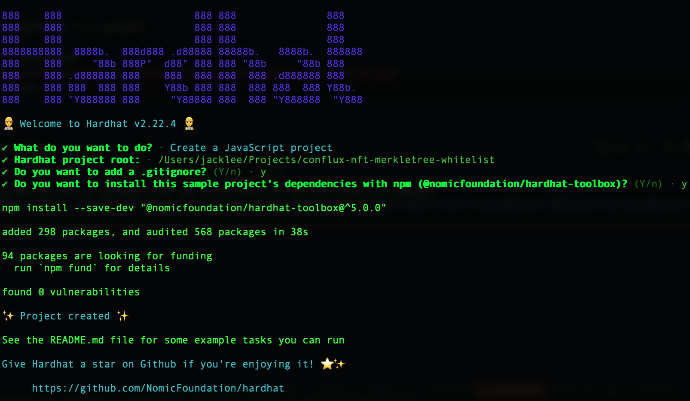
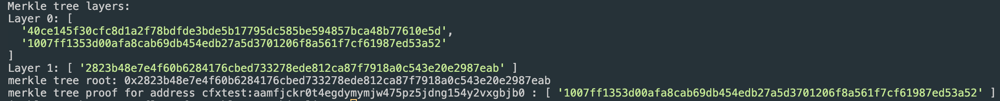
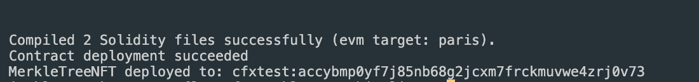
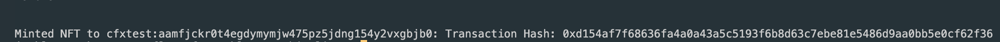

# 在CoreSpace使用Hardhat的默克尔树NFT白名单

使用默克尔树白名单提供了一种经济高效的方法，将 NFT分发给预定义的地址列表。 它确保只有白名单上的地址才能铸造 NFT，从而增强了安全性和效率。 直接在智能合约中写入数千个地址的白名单将导致大量的燃气费用，此外由于最大交易燃气限制，可能无法在单个交易中更新如此庞大的白名单。 However, since in the Merkle Tree verification process, leaf nodes and proofs can be stored off-chain while only the root value needs to be stored on-chain, this method significantly saves on gas costs and enables whitelist setup with only one transaction.

本教程将指导您如何使用 Hardhat 在Conflux CoreSpace 上创建、编写和部署带有默克尔树白名单的ERC721 NFT智能合约。 同时，还将向您展示如何使用 merkletreejs 创建默克尔树白名单。 For a practical example, please refer to the [Conflux-NFT-MerkleTree-Whitelist](https://github.com/ConfluxDAO/Conflux-NFT-MerkleTree-Whitelist) repository.

如果您不熟悉 Hardhat，请参考 [Hardhat 文档](https://hardhat.org/getting-started/)。

### 前提条件

在开始之前，请确保您已经具备以下条件：

- 在您的系统上安装了Node.js，并在您的计算机上设置了Hardhat。
- 拥有一个Conflux CoreSpace钱包。
- 对智能合约开发和Solidity编程语言有基本的了解。

## 第1步：设置您的环境

打开终端并运行以下命令：

```bash
mkdir conflux-nft-merkletree-whitelist
cd conflux-nft-merkletree-whitelist
npm init -y
npm install --save-dev hardhat
npx hardhat
```

在提示时，请在所有问题上按Enter键选择默认项目设置。 这将创建一个带有所有必要配置的基本Hardhat项目设置。

[](../imgs/nft-tutorials/whitelist-hardhat-create-project.png)

## 第2步: 安装相关程序

安装 OpenZeppelin 合约，以安全、经过审计地实施的 ERC721 代币。 接着，安装 Hardhat-Conflux-Plugin，它基于 js-conflux-sdk 构建，为部署和交互提供类似的接口。 最后，安装merkletreejs 和 keccak256 以从您的白名单地址创建一个默克尔树。

```bash
npm install @openzeppelin/contracts hardhat-conflux js-conflux-sdk keccak256 merkletreejs
```

## 第3步：配置Hardhat

更新`hardhat.config.js`以包括Conflux网络配置：

```javascript
require("@nomicfoundation/hardhat-toolbox");
require("hardhat-conflux");

const PRIVATE_KEY = "YOUR_PRIVATE_KEY_HERE";

/** @type import('hardhat/config').HardhatUserConfig */
module.exports = {
  solidity: "0.8.24",
  defaultNetwork: "cfxTestnet",
  networks: {
    cfx: {
      url: "https://main.confluxrpc.com",
      accounts: [PRIVATE_KEY],
      chainId: 1029,
    },
    cfxTestnet: {
      url: "https://test.confluxrpc.com",
      accounts: [PRIVATE_KEY],
      chainId: 1,
    },
  },
};
```

## 第4步：编写智能合约

在`contracts`目录中创建一个新文件`MerkleTreeNFT.sol`：

```solidity
// SPDX-License-Identifier: MIT
pragma solidity ^0.8.4;

import "@openzeppelin/contracts/token/ERC721/ERC721.sol";
import "./MerkleTreeProof.sol";

contract MerkleTreeNFT is ERC721 {
   bytes32 public immutable merkleRoot;
   mapping(address => bool) public hasMinted;

   constructor(string memory name, string memory symbol, bytes32 root)
   ERC721(name, symbol) {
       merkleRoot = root;
   }

   function mint(address account, uint256 tokenId, bytes32[] calldata proof) external {
       require(_verify(_leaf(account), proof), "Invalid merkle proof");
       require(!hasMinted[account], "Already minted!");
       _mint(account, tokenId);
       hasMinted[account] = true;
   }

   function _leaf(address account) internal pure returns (bytes32) {
       return keccak256(abi.encodePacked(account));
   }

   function _verify(bytes32 leaf, bytes32[] memory proof) internal view returns (bool) {
       return MerkleProof.verify(proof, merkleRoot, leaf);
   }
}
```

在`contracts`目录中创建一个新文件`MerkleTreeNFT.sol`：

```solidity
// SPDX-License-Identifier: MIT
pragma solidity ^0.8.4;

library MerkleProof {
    /**
     * @dev Returns `true` when a `root` reconstructed from a `proof` and `leaf` equals the given `root`, indicating valid data.
     * In the reconstruction, leaf pairs and element pairs are sorted.
     */
    function verify(
        bytes32[] memory proof,
        bytes32 root,
        bytes32 leaf
    ) internal pure returns (bool) {
        return processProof(proof, leaf) == root;
    }

    /**
     * @dev Returns the `root` computed from a Merkle tree using `leaf` and `proof`. The `proof` is only valid if the reconstructed `root` matches the given `root`.
     * In the reconstruction, leaf pairs and element pairs are sorted.
     */
    function processProof(bytes32[] memory proof, bytes32 leaf) internal pure returns (bytes32) {
        bytes32 computedHash = leaf;
        for (uint256 i = 0; i < proof.length; i++) {
            computedHash = _hashPair(computedHash, proof[i]);
        }
        return computedHash;
    }

    // Sorted Pair Hash
    function _hashPair(bytes32 a, bytes32 b) private pure returns (bytes32) {
        return a < b ? keccak256(abi.encodePacked(a, b)) : keccak256(abi.encodePacked(b, a));
    }
}

```

您需要创建或找到适合您需要的`MerkleProof`的实现。

在您的终端中运行 `npx hardhat compile` 。

## 第5步：生成一个默克尔树

在 `scripts` 目录中创建一个新脚本`generateTree.js`来部署您的合约。

使用 JavaScript 脚本从您的白名单地址创建一个默克尔树。 您可以使用像`merkletreejs`和`keccak256`这样的库。

```javascript
const { MerkleTree } = require("merkletreejs");
const keccak256 = require("keccak256");
const { format } = require("js-conflux-sdk");

// List of addresses
const whitelist = ["cfxtest:...", "cfxtest:..."];

// Helper function to encode the address as Solidity would
function solidityKeccak256(address) {
  // Convert Conflux address to hex format address (without "0x" prefix)
  const hexAddress = format.hexAddress(address).toLowerCase();
  // Encode the address and compute keccak256 hash
  return keccak256(Buffer.from(hexAddress.slice(2), "hex"));
}

// Convert addresses to hash (leaf nodes) using the helper function
const leaves = whitelist.map(solidityKeccak256);

// Create the Merkle tree
const tree = new MerkleTree(leaves, keccak256, {
  sortPairs: true,
});

// Get the Merkle tree root
const root = tree.getHexRoot();

// Get the proof for a specific address
const addressToProof = whitelist[0]; // Replace with the address you need the proof for
const leaf = solidityKeccak256(addressToProof);
const proof = tree.getProof(leaf).map((x) => x.data.toString("hex"));

// Display the complete Merkle tree
const layers = tree
  .getLayers()
  .map((layer) => layer.map((x) => x.toString("hex")));

console.log("Merkle tree layers:");
layers.forEach((layer, index) => {
  console.log(`Layer ${index}:`, layer);
});

console.log("merkle tree root:", root);
console.log("merkle tree proof for address", addressToProof, ":", proof);
```

您将会在成功部署后看到以下消息：
[](../imgs/nft-tutorials/generate-merkletree.png)请将这个根节点保存到你的智能合约部署脚本中。

## 第6步：部署合约

在`scripts`目录中创建一个新的脚本来部署您的合约。

```javascript
const hre = require("hardhat");

async function main() {
  const signers = await hre.conflux.getSigners();
  const defaultAccount = signers[0];

  const MerkleTreeNFT = await hre.conflux.getContractFactory("MerkleTreeNFT");

  const root = "YOUR_MERKLE_TREE_ROOT";

  const receipt = await MerkleTreeNFT.constructor(
    "Confi MerkleTree",
    "Confi",
    root
  )
    .sendTransaction({
      from: defaultAccount.address,
    })
    .executed();

  console.log(
    `Contract deployment ${
      receipt.outcomeStatus === 0 ? "succeeded" : "failed"
    }`
  );

  console.log("MerkleTreeNFT deployed to:", receipt.contractCreated);
}

main()
  .then(() => process.exit(0))
  .catch((error) => {
    console.error(error);
    process.exit(1);
  });
```

使用Hardhat 在 Conflux CoreSpace 测试网部署您的脚本：

```bash
npx hardhat run scripts/deploy.js --network cfxTestnet
```

您将会在成功部署后看到以下消息：
[](../imgs/nft-tutorials/whitelist-deploy-success.png)

## 第7步：使用白名单铸造 NFT

要铸造一个NFT，您可以使用一个直接与您的智能合约中的 `mint`函数交互的脚本。 此脚本将会向指定地址铸造一个NFT并附带证明。

在`scripts`文件夹中创建另一个脚本，命名为`mintNFT.js`：

此脚本将使用 tokenId 和特定的证明铸造 NFT，其中`YOUR_CONTRACT_ADDRESS`是您已部署的 NFT 合约地址，`NFT_RECEIVER_ADDRESS`是您想要铸造到的地址，`YOUR_PROOF`是针对您的`NFT_RECEIVER_ADDRESS`的默克尔树证明。

```javascript
const hre = require("hardhat");

async function main() {
  const signers = await hre.conflux.getSigners();
  const defaultAccount = signers[0];

  const contractAddress = "YOUR_CONTRACT_ADDRESS";
  const recipientAddress = "NFT_RECEIVER_ADDRESS"; // Address to receive the NFT
  const tokenId = 1;

  const MerkleTreeNFT = await hre.conflux.getContractAt(
    "MerkleTreeNFT",
    contractAddress
  );

  const proof = "YOUR_PROOF_HERE";

  const receipt = await MerkleTreeNFT.mint(recipientAddress, tokenId, proof)
    .sendTransaction({
      from: defaultAccount.address,
    })
    .executed();

  console.log(
    `Minted NFT to ${recipientAddress}: Transaction Hash: ${receipt.transactionHash}`
  );
}

main().catch((error) => {
  console.error(error);
  process.exit(1);
});
```

将`YOUR_CONTRACT_ADDRESS`替换为您的合约地址，`RECIPIENT_WALLET_ADDRESS`替换为应该接受NFT的钱包地址，`YOUR_PROOF`替换为`NFT_RECEIVER_ADDRESS` 地址的默克尔树证明。

```bash
npx hardhat run scripts/mintNFT.js --network cfxTestnet
```

您将会在部署成功后看到以下信息：
[](../imgs/nft-tutorials/whitelist-mint-success.png)

## 结论

此设置提供了一种经济高效的方式，使用默克尔树将 NFT分发到白名单地址。 每个步对于确保您的 NFT 分发的安全性和效率都是必不可少的。 请务必在测试环境中彻底测试，然后再部署到主网。
