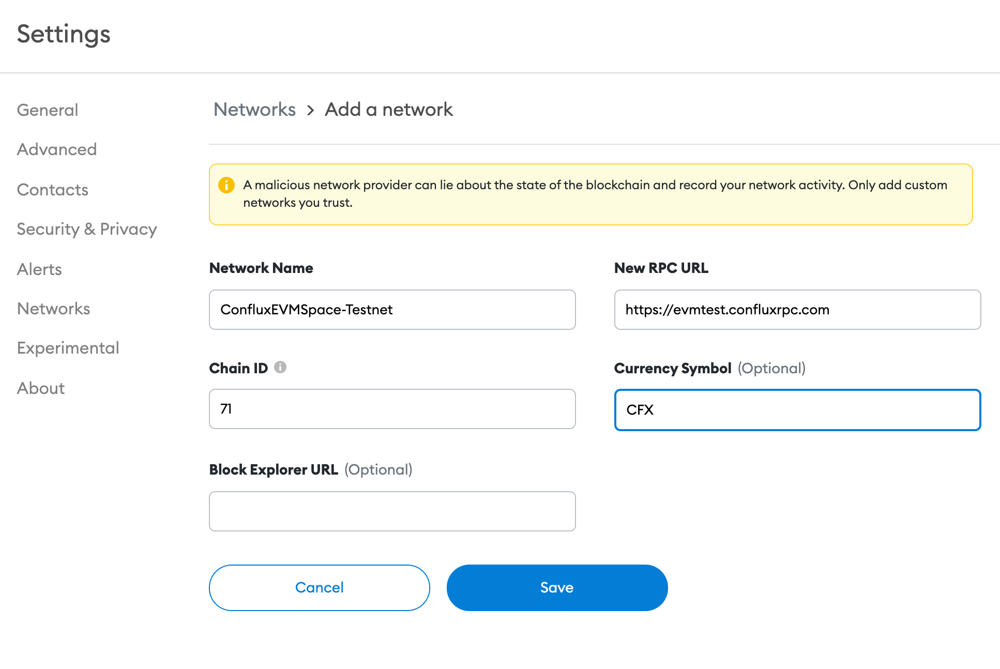

:::tip

This guide will help user connect their metamask  wallet to Conflux eSpace.

:::

## Introduction

[MetaMask](https://metamask.io/) 是一个具有用户界面的浏览器扩展，用于与兼容以太坊的区块链(例如 Conflux eSpace)进行交互。 For the purpose of this guide, we will assume you are already familiar with MetaMask and have it installed. If you need help getting started with MetaMask itself, [check out Metamask documentation](https://metamask.io/faqs.html) and [Ethereum documentation](https://ethereum.org/en/).

In this tutorial we will walk through connecting MetaMask to the Conflux eSpace Testnet.

:::note
本教程中的屏幕截图来自MetaMask 浏览器扩展版本 10.8.1。
:::

## 连接 MetaMask 到 Conflux eSpace。

### Add eSpace through Chainlist

您可以通过以下步骤添加 Conflux eSpace 网络到您的 MetaMask 钱包：

1. 打开您的浏览器，访问 https://chainlist.org。
2. 搜索“Conflux eSpace”
3. 在“Conflux eSpace”下点击“连接钱包”，以允许此站点向 MetaMask 发送请求。
4. 在“Conflux eSpace”下点击“添加到 MetaMask”。
5. 当 MetaMask 提示“允许此站点添加网络？”时，点击“批准”。
6. 当 MetaMask 提示“允许此站点切换网络？”时，点击“批准”。

您的 MetaMask 钱包现在已连接到 Conflux eSpace。 您可以随时通过Metamask中的网络选择菜单切换到其他网络。

### Add eSpace manually

或者，您可以通过在网络选择下拉菜单中选择“添加网络”(或“自定义 RPC”)手动将 Conflux eSpace 添加到 MetaMask：

 

对于eSpace **mainnet**, 请使用以下配置值：

- **Network Name**: Conflux eSpace
- **New RPC URL**: https://evm.confluxrpc.com
- **Chain ID**: 1030
- **Currency Symbol**: CFX
- **Block Explorer URL**: https://evm.confluxscan.io

对于 eSpace **testnet**，请使用以下配置值：

- **Network Name**: Conflux eSpace (Testnet)
- **New RPC URL**: https://evmtestnet.confluxrpc.com
- **Chain ID**: 71
- **Currency Symbol**: CFX
- **Block Explorer URL**: https://evmtestnet.confluxscan.io

:::note
所有Conflux eSpace RPC 端点URL 和 chain ID都可以在我们的网络页面上找到。
:::

点击 `保存`，然后您应该在 MetaMask 中看到 `Conflux eSpace` 是当前选择的网络。 为了让您体验 MetaMask操作情况，我们将把它连接到 Remix 并执行一些交易。 本指南的其余部分将假设您的 MetaMask 已连接到 `Conflux eSpace(Testnet)`。

## Faucet

To interact with our testnet, you first need to receive testnet CFX on eSpace Testnet. You can get testnet CFX from our [faucet](https://efaucet.confluxnetwork.org/). Paste your wallet address in the address input box solve the puzzle and click `Claim` to receive testnet CFX.