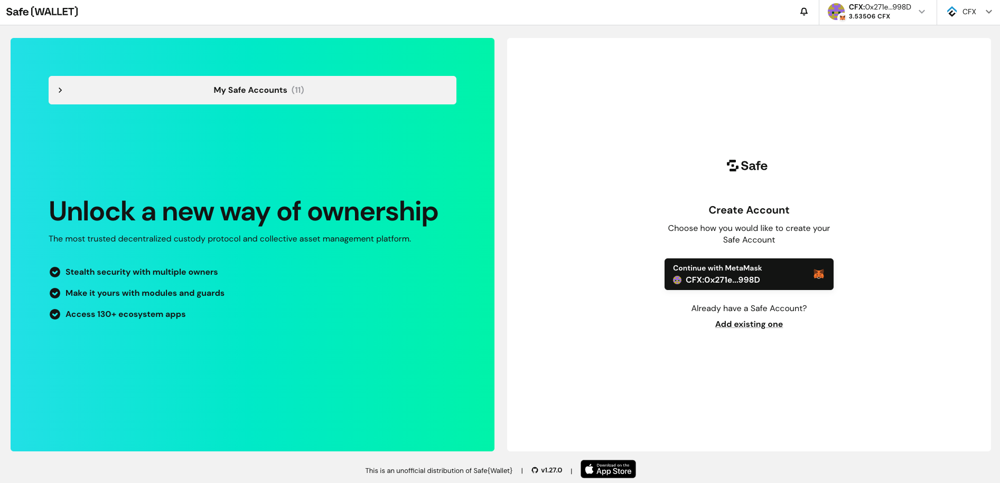

[Gnosis Safe Wallet](https://safe.global/) 是区块链领域著名的多重签名钱包服务，提供安全的资金管理解决方案。 它在以太坊和 EVM（以太坊虚拟机）兼容的区块链生态系统中特别受欢迎。 Gnosis Safe 的全部源代码，包括其智能合约、前端和后端代码，都是开源的，确保了透明性与社区信任度。 Gnosis Safe 致力于创新，它引入了像账户抽象化这样的功能，进一步增强了用户体验并提高了安全性。

Gnosis Safe Wallet 是许多 DeFi（去中心化金融）项目选择的资金管理工具，例如 Uniswap、Chainlink 和 MakerDAO 等，这凸显了其可靠性和在行业内被广泛采用的特点。

### 与 eSpace 集成

为了支持 eSpace 生态系统内的开发者和 DeFi 项目，eSpace 已将 Gnosis Safe Wallet 整合到了其基础设施中。 Safe 合约的 [1.3.0 版本](https://github.com/safe-global/safe-smart-account/blob/main/CHANGELOG.md#version-130-libs0) 和 [1.4.1 版本](https://github.com/safe-global/safe-smart-account/blob/main/CHANGELOG.md#version-141) 已在 eSpace 主网和测试网上部署，其地址可在变更日志中找到。 对于主网用户来说，提供专用的 [Safe-Wallet-Web frontend](https://safe.conflux123.xyz/) 前端，能够使用户创建并管理 CFX 和 ERC20 代币的多重签名账户。

## 常见问题解答

### 访问 Safe-Wallet-Web 的 URL 是什么？

访问 Safe-Wallet-Web 的 URL 是 [https://safe.conflux123.xyz/](https://safe.conflux123.xyz/)。

### Safe 合约的默认版本是？

当前在 eSpace 的主网和测试网上部署并使用的 Safe 合约的默认版本是 1.3.0。

### 是否为测试网提供了 Safe-Wallet-Web？

截至目前，尚未为测试网部署专用的 Safe-Wallet-Web 前端。 然而，仍然可以使用 [Safe-SDK](https://github.com/safe-global/safe-core-sdk) 或 [Safe CLI](https://github.com/safe-global/safe-cli) 与测试网合约进行交互。

### Safe Web Wallet 或 App 的官方版本能用于 eSpace 吗？

Safe Web Wallet 或 App 的官方版本目前与 eSpace 不兼容。

### 是否有支持 eSpace 的 Safe App 移动版本？

目前，没有支持 eSpace 的 Safe App 移动版本。

### 如果在点击“连接”按钮时无法触发钱包连接弹窗应该怎么办？

如果您遇到钱包连接弹窗未出现的问题，请按照以下步骤操作：

- 确保您的浏览器安装了 MetaMask 钱包扩展。
- 确保您的计算机网络连接稳定；在某些地区，可能需要使用 VPN。
- 如果这是您第一次访问欢迎页面，请点击右上角的向下箭头并选择 CFX 网络。
- 然后，再次点击“连接”按钮。 此时应该会出现钱包选择弹窗，您可以选择 MetaMask 并继续操作。
