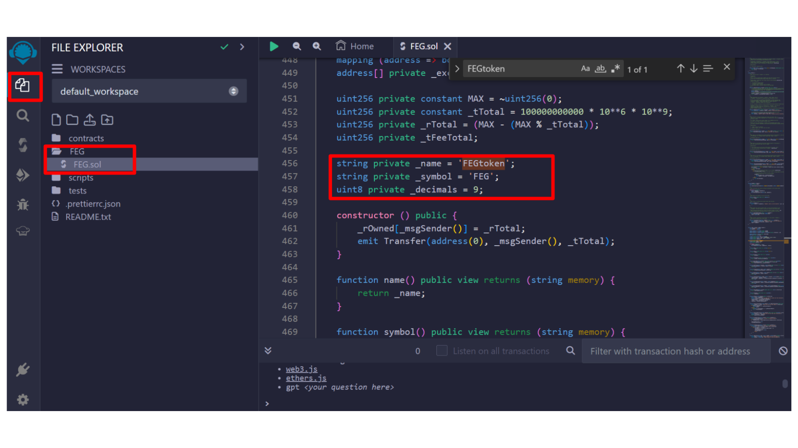

[**Cookbook**](https://www.cookbook.dev/) 是一个对在EVM兼容的区块链上使用Solidity的开发者来说至关重要的资源。 This guide offers an overview of what Cookbook is, who it's for, and how it can facilitate the development of smart contracts.

### Cookbook是什么？

Cookbook is an open-source smart contract registry that provides developers access to Solidity primitives, libraries, and smart contracts for protocols across EVM-compatible blockchains. It integrates with a wide range of blockchain-native developer tooling, making it one of the quickest and easiest ways to start development work around smart contracts.

### 主要特点

- **搜索和导入：** 轻松定位和打开您所选的开发环境中的智能合约，无需查阅Github仓库。
- \*\*集成开发工具：\*\*包括Remix和VSCode的插件，并允许下载带有样板代码模板。
- \*\*ChefGPT：\*\*一个旨在辅助智能合约开发的AI。
- **No-Code Deploy and Expanded View:** Offers options for deploying contracts without writing code and an expanded view for a better understanding of the code.

### 开始使用Cookbook

要开始使用Cookbook，请确保您已经为Solidity项目设置了开发环境。 Cookbook将大大简化从搜索到部署智能合约的开发过程。

To start using Cookbook in your smart contract development projects, follow these preliminary steps:

- **Explore Cookbook Resources:** Visit [Cookbook's website](https://www.cookbook.dev/) to learn more about the available tools and resources.
- **Identify the Tools You Need:** Select the Solidity primitives, libraries, and smart contracts that are relevant to your project.
- **Integration with Your Development Environment:** Leverage Cookbook plugins to integrate directly into your favorite IDE, such as Remix or Visual Studio Code.

## Cookbook教程

This tutorial guides you through deploying a DeFi Token, based on [FEG](https://fegtoken.com/), with Token Reflection Mechanism and Deflationary Tokenomics, on the eSpace Testnet using [Remix IDE](./deployContract/remix.md). This comprehensive walkthrough covers the entire deployment process, ensuring you can deploy the contract efficiently from beginning to end.

Before initiating the deployment, confirm you have test tokens from an eSpace faucet to cover any necessary deployment fees.

### 使用Remix IDE的部署过程

#### 1. 访问部署界面

- \*\*打开Cookbook网页：\*\*访问[cookbook.dev](https://www.cookbook.dev/) 以探索合约的各种部署选项。
  
  
- \*\*导航到部署部分：\*\*在“Get Cookin'”部分，查找使用Remix IDE的部署方法。 选择此选项继续。
  

#### 2. 设置Remix IDE

- \*\*打开Remix IDE：\*\*在Cookbook.dev上选择Remix选项后，Remix Ethereum IDE将在新标签页中打开。 等待界面完全加载。
- \*\*授予权限：\*\*Remix可能请求权限以正常运行。 点击“接受”以继续。
  
- **Locate the Smart Contract File:** In Remix's "FILE EXPLORER" panel, find the FEG.sol file, typically located within a folder named FEG on the workspace's left side.
  

#### 3. 修改合约

- **Update Token Details:** Within the FEG/FEG.sol contract, locate the lines defining the token's name and symbol, initially set to 'FEGtoken' and 'FEG'. 将这些更新为您选择的值，例如'MyDeFiToken'和'MDT'，并保存更改。
  
  

#### 4. 使用Remix IDE编译和部署合约

对于这一步，您可以按照Remix IDE教程中已描述的过程操作。

如果你想要亲自实践如何使用Remix IDE部署智能合约，你也可以参考以下视频：

import Tabs from '@theme/Tabs';
import TabItem from '@theme/TabItem';

<Tabs>
  <TabItem value="youtube" label="Remix IDE Video Tutorial">
<iframe width="560" height="315" src="https://www.youtube.com/embed/WLbUXQ1FS8M?si=kJD-6-QN3ZqFf0_v" title="YouTube video player" frameborder="0" allow="accelerometer; autoplay; clipboard-write; encrypted-media; gyroscope; picture-in-picture; web-share" allowfullscreen></iframe>
  </TabItem>
</Tabs>

### 其他资源

- [Cookbook 网站](https://www.cookbook.dev/)
- [Cookbook 文档](https://docs.cookbook.dev/)
- [Remix IDE 网站](https://remix.ethereum.org/)

