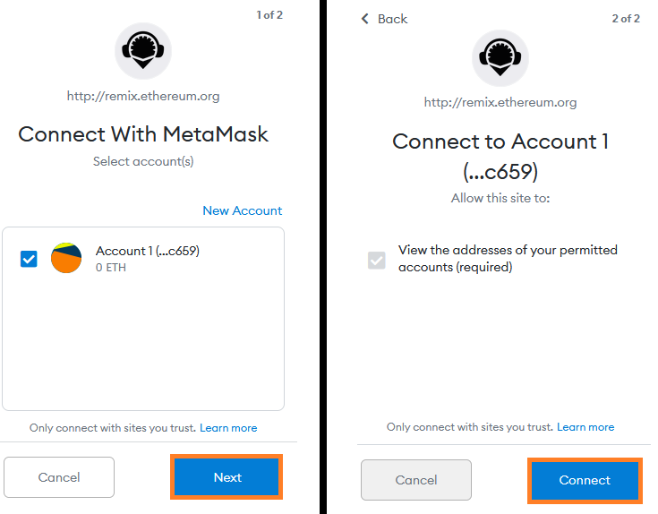
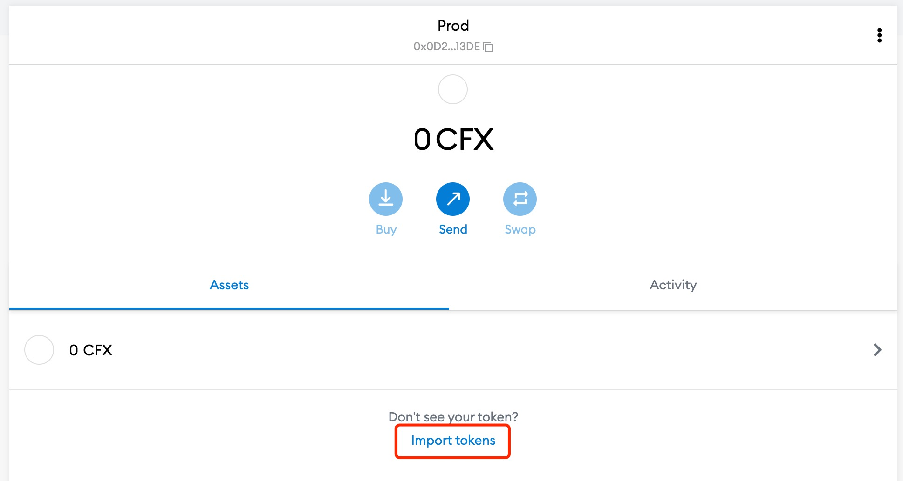
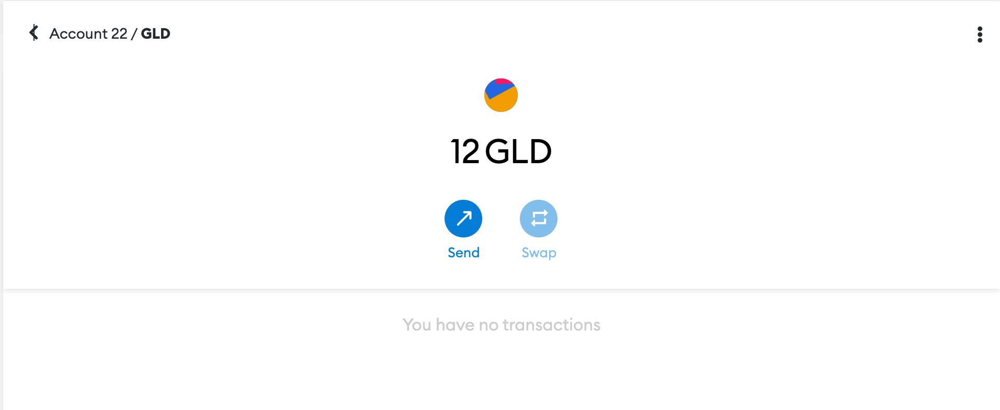

## 简介

Remix IDE is a powerful online development environment specifically designed for building, deploying, and debugging smart contracts for the Ethereum network and other EVM-compatible blockchains like Conflux eSpace. This tutorial will guide you through the process of deploying an ERC20 token smart contract on Conflux eSpace using Remix IDE. If you're looking to deploy a different smart contract, you can use [Cookbook](../cookbook.md) to access a comprehensive library of pre-written Solidity code, allowing you to find and utilize the specific smart contract functionalities you need.

## Deploying an ERC-20 Token on Conflux eSpace using Remix IDE
在一个新标签页中打开 Remix IDE，网址是[remix.ethereum.org](https://remix.ethereum.org)。 它可能需要一分钟才能加载，但一旦加载完成，请在左侧的工作区面板中创建一个名为 `ERC20Token.sol` 的新文件：


将以下代码复制并粘贴到中央的编辑器面板中：

```solidity
// SPDX-License-Identifier: MIT
pragma solidity ^0.8.0;

import "https://github.com/OpenZeppelin/openzeppelin-contracts/blob/v4.0.0/contracts/token/ERC20/ERC20.sol";

contract MyToken is ERC20 {
    constructor (string memory name, string memory symbol) ERC20(name, symbol) {
        // Mint 10000 tokens to msg.sender
        // Similar to how 1 dollar = 100 cents
        // 1 token = 1 * (10 ** decimals)
        _mint(msg.sender, 10000 * 10 ** uint(decimals()));
    }
}
```

点击左侧面板最左侧的`Solidity Compile`按钮(第二个向下的图标)； 确保您选择的Solidity编译器版本为0.8(0.8内的次要版本，例如0.8.4也可以)，然后点击`Compile ERC20Token.sol`。


一旦合约编译完成，点击最左侧面板上的`Deploy & run transactions`按钮(Solidity编译器下面的图标)。 在左侧面板的`ENVIRONMENT`下拉菜单中，选择 `Injected Web3`。


你将会看到一个 MetaMask 弹窗，请求你允许 Remix IDE 访问它。 点击 `Next` 然后 `Connect` 以授予访问权限。



在Remix界面中，点击左侧面板的`DEPLOY`部分旁边的箭头。 填写代币详情，可根据自己的喜好填写(在示例中为`GoldenToken`和`GLD`)，然后点击`transact`。


另一个 MetaMask 弹出窗口将会要求您确认交易。 点击 `确认`。


几分钟后，交易将由网络确认。 你将在底部面板看到一个成功的消息，以及左边面板下的`Deployed Contracts`列表下看到该合约。 点击复制按钮复制新部署合约的地址。


现在，合约已经部署到了Conflux eSpace，我们可以通过MetaMask与其进行交互。

## 添加ERC-20代币到MetaMask

在 MetaMask 界面中(确保选择的是 Conflux EVM Testnet 网络)，点击`Add Token`按钮：




将从上一步中从Remix中复制的代币地址粘贴到此处。 剩余的代币详细信息会自动填充，因为 MetaMask 在链上找到了该合约。 点击 `Next`:


在下一个界面上，您将看到余额(100个代币)，这是在我们的合约构造函数中创建的。 点击`Add Tokens`：


代币已经成功添加到了 MetaMask 中，我们可以使用 MetaMask 界面查看代币余额，并将代币转移到其他账户中。

## 使用 MetaMask 转移 ERC-20 代币

接着上一步，点击MetaMask界面的`Send`按钮：


选择一个接收者(如果你在 MetaMask 中有多个账户，可以选择另一个账户)，然后选择要发送的代币数量。 点击 `Next`:


:::note
同样地，燃气价格应该设置为零，但是这将会随着时间的推移而改变。
:::

点击 `Confirm` 发送交易到网络：


几分钟后，交易将由网络确认。 您可以在 MetaMask 界面中看到您的账户所持有的更新后的余额。


如果您将代币转移到您拥有的另一个 MetaMask 账户，则可以按照前面提到的将代币添加到 MetaMask 上的步骤，在其他账户上查看它的余额。





## 视频教程

您可以请参阅以下视频，观看如何使用 Remix IDE 部署智能合约的实操演示：

import Tabs from '@theme/Tabs';
import TabItem from '@theme/TabItem';

<Tabs>
  <TabItem value="youtube" label="Remix IDE Video Tutorial">
<iframe width="560" height="315" src="https://www.youtube.com/embed/WLbUXQ1FS8M?si=kJD-6-QN3ZqFf0_v" title="YouTube 视频播放器" frameborder="0" allow="accelerometer; autoplay; clipboard-write; encrypted-media; gyroscope; picture-in-picture; web-share" allowfullscreen></iframe>
  </TabItem>
</Tabs>
