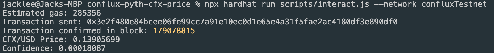

# 获取价格

本教程将引导您通过 Hardhat 在 Conflux eSpace 上构建项目，并通过 Pyth 预言机获取 CFX 价格。

## 前提条件

在开始之前，请确保您已经安装了以下软件：

1. Node.js 和 npm
2. Hardhat
3. Conflux 钱包扩展

## 第1步：创建一个Hardhat项目

First, create a new Hardhat project:

```bash
mkdir conflux-pyth-cfx-price
cd conflux-pyth-cfx-price
npx hardhat
```

按照提示创建一个基础的JavaScript项目。

## 第2步：安装必要的依赖项

Install the Pyth SDK and other required dependencies:

```bash
npm install @pythnetwork/pyth-sdk-solidity @pythnetwork/pyth-evm-js dotenv
```

## 第3步：配置Hardhat

更新`hardhat.config.js`文件，以包含Conflux eSpace测试网：

```javascript
require("@nomicfoundation/hardhat-toolbox");

/** @type import('hardhat/config').HardhatUserConfig */
module.exports = {
  solidity: "0.8.24",
  networks: {
    confluxTestnet: {
      url: "https://evmtestnet.confluxrpc.com",
      accounts: [process.env.PRIVATE_KEY], // Your private key here
    },
  },
};
```

Make sure to set your private key as an environment variable for security.

## 第4步：编写智能合约

在`contracts`目录中创建`CFXPrice.sol`：

```solidity
// SPDX-License-Identifier: MIT
pragma solidity ^0.8.18;

import "@pythnetwork/pyth-sdk-solidity/IPyth.sol";
import "@pythnetwork/pyth-sdk-solidity/PythStructs.sol";

contract CFXPrice {
    IPyth pyth;
    bytes32 constant CFX_USD_PRICE_ID = 0x8879170230c9603342f3837cf9a8e76c61791198fb1271bb2552c9af7b33c933;

    constructor(address pythContract) {
        pyth = IPyth(pythContract);
    }

    function getCFXPrice(bytes[] calldata priceUpdateData) public payable returns (int64, uint) {
        uint fee = pyth.getUpdateFee(priceUpdateData);
        pyth.updatePriceFeeds{value: fee}(priceUpdateData);

        PythStructs.Price memory price = pyth.getPriceNoOlderThan(CFX_USD_PRICE_ID,60);
        return (price.price, price.conf);
    }
}
```

## 第5步：部署智能合约

在`scripts`目录中创建`deploy.js`：

```javascript
const hre = require("hardhat");

async function main() {
  const pythContractAddress = "0xDd24F84d36BF92C65F92307595335bdFab5Bbd21"; // Pyth contract address on Conflux eSpace Testnet

  const CFXPrice = await hre.ethers.getContractFactory("CFXPrice");
  const cfxPrice = await CFXPrice.deploy(pythContractAddress);

  await cfxPrice.waitForDeployment();

  console.log("CFXPrice deployed to:", await cfxPrice.getAddress());
}

main().catch((error) => {
  console.error(error);
  process.exit(1);
});
```

## 第6步：运行部署脚本

使用以下命令部署合约：

```bash
npx hardhat run scripts/deploy.js --network confluxTestnet
```

## Step 7: Interact with the Contract

在`scripts`目录中创建`interact.js`：

```javascript
const hre = require("hardhat");
const { EvmPriceServiceConnection } = require("@pythnetwork/pyth-evm-js");

async function main() {
  const CFXPrice = await hre.ethers.getContractFactory("CFXPrice");
  const cfxPrice = await CFXPrice.attach("YOUR_DEPLOYED_CONTRACT_ADDRESS"); // Replace with your actual deployed address

  const connection = new EvmPriceServiceConnection(
    "https://hermes.pyth.network" // Use Hermes price service
  );

  const priceIds = [
    "0x8879170230c9603342f3837cf9a8e76c61791198fb1271bb2552c9af7b33c933", // CFX/USD price feed ID
  ];

  try {
    const priceUpdateData = await connection.getPriceFeedsUpdateData(priceIds);
    
    // Estimate gas
    const gasEstimate = await cfxPrice.getCFXPrice.estimateGas(priceUpdateData, {
      value: hre.ethers.parseEther("0.01"), // Send some CFX to pay for the update fee, adjust as needed
    });

    console.log("Estimated gas:", gasEstimate.toString());

    // Call getCFXPrice function
    const tx = await cfxPrice.getCFXPrice(priceUpdateData, {
      value: hre.ethers.parseEther("0.01"), // Send some CFX to pay for the update fee, adjust as needed
    });

    console.log("Transaction sent:", tx.hash);

    // Wait for transaction confirmation
    const receipt = await tx.wait();

    console.log("Transaction confirmed in block:", receipt.blockNumber);

    // Get the price directly using staticCall
    const [price, confidence] = await cfxPrice.getCFXPrice.staticCall(priceUpdateData, {
      value: hre.ethers.parseEther("0.01"),
    });

    console.log("CFX/USD Price:", hre.ethers.formatUnits(price, 8)); // Pyth prices are usually in 8 decimals
    console.log("Confidence:", hre.ethers.formatUnits(confidence, 8));

  } catch (error) {
    console.error("Error occurred:", error);
  }
}

main().catch((error) => {
  console.error(error);
  process.exit(1);
});
```

运行交互脚本：

```bash
npx hardhat run scripts/interact.js --network confluxTestnet
```



## 总结

This tutorial demonstrates how to deploy a smart contract on Conflux eSpace Testnet that fetches the CFX/USD price using Pyth Network. 关键要点：

1. We use the correct CFX/USD price feed ID for Pyth.
2. The contract is deployed on Conflux eSpace Testnet.
3. We use the Hermes price service for fetching update data.
4. The interaction script estimates gas, sends a transaction to update the price, and then retrieves the latest price.

Remember to always use testnet tokens and addresses when testing. For production use, you'd switch to mainnet addresses and endpoints.

For more information, refer to the [Pyth Network documentation](https://docs.pyth.network/)
