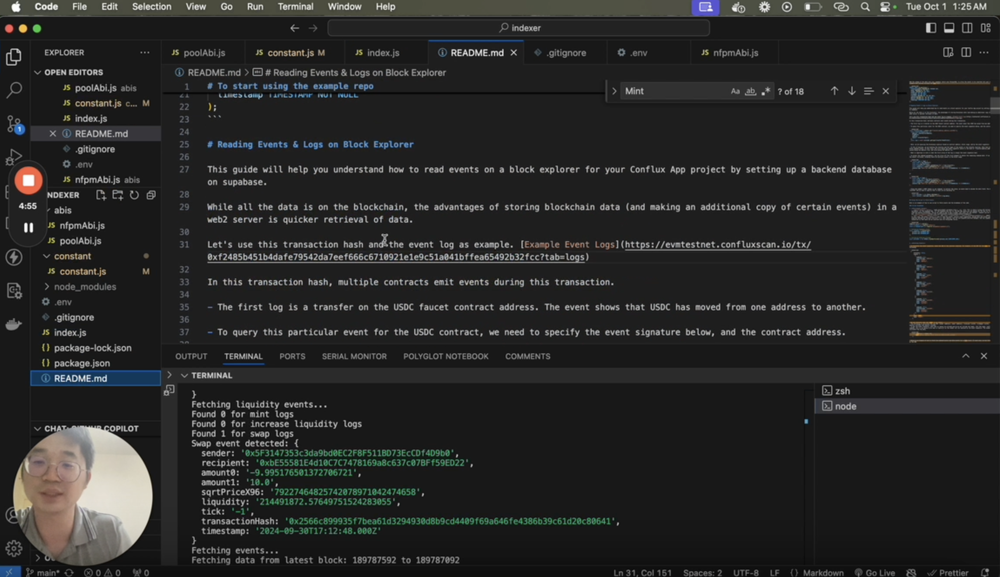

# Creating an Indexer for Conflux Contracts

本教程将指导您创建一个Conflux合约的索引器。 我们将使用一个示例项目，演示如何读取区块链发出的日志和事件，并将其存储在数据库中以便快速检索。

## 概览

我们将使用的示例库可在此处找到：[https://github.com/intrepidcanadian/eventindex](https://github.com/intrepidcanadian/eventindex). 该项目展示了如何：

1. 连接到Conflux eSpace网络
2. 从智能合约读取事件
3. 解码事件数据
4. 将解码后的数据存储在Supabase数据库

您可以在[这里]观看该过程的视频教程。(https://www.loom.com/share/859bf23a98c7467292f52c0ce949e4e1).



## 前提条件

Before starting, make sure you have:

- 已安装Node.js
- 拥有Supabase账户
- 可以访问Conflux eSpace RPC URL

## 起步

1. Clone the repository:
  ```bash
  git clone https://github.com/intrepidcanadian/eventindex
  cd eventindex
  ```

2. Install dependencies:
  ```bash
  npm install
  ```

3. 设置环境变量：
  在根目录创建一个`.env`文件，并添加以下内容：
  ```
  SUPABASE_URL=your_supabase_url
  SUPABASE_KEY=your_supabase_key
  CONFLUXRPC_URL=your_conflux_rpc_url
  ```

4. Set up your Supabase database:
  Create a table in your Supabase project to store the event data. 以下是一个示例架构：

  ```sql
  CREATE TABLE lp_positions (
    transactionHash VARCHAR(66) PRIMARY KEY,
    owner VARCHAR(42) NOT NULL,
    sender VARCHAR(42) NOT NULL,
    tickLower INT NOT NULL,
    tickUpper INT NOT NULL,
    liquidity DECIMAL(38, 18) NOT NULL,
    amount0 DECIMAL(38, 18) NOT NULL,
    amount1 DECIMAL(38, 18) NOT NULL,
    timestamp TIMESTAMP NOT NULL
  );
  ```

## 理解代码

主脚本连接到Conflux网络，监听特定事件，解码事件数据，并将其存储在Supabase数据库中。

让我们来分析一下索引器脚本的关键组成部分：

1. **环境设置**:

  ```javascript
  require("dotenv").config();
  const { ethers } = require("ethers");
  const { createClient } = require("@supabase/supabase-js");

  const supabase = createClient(process.env.SUPABASE_URL, process.env.SUPABASE_KEY);
  const provider = new ethers.JsonRpcProvider(process.env.CONFLUXRPC_URL);
  ```

  This section sets up the necessary dependencies and connections:

  - `dotenv`用于从`.env`文件加载环境变量。
  - `ethers`是一个流行的库，用于与以太坊兼容的区块链进行交互。
  - `@supabase/supabase-js`是Supabase的客户端库。
  - 我们使用环境变量的 URL 和密钥创建一个 Supabase 客户端。
  - We set up an ethers provider using the Conflux RPC URL, allowing us to interact with the Conflux eSpace network.

2. **获取事件**：

  ```javascript
  const mintTopic = ethers.id("Mint(address,address,int24,int24,uint128,uint256,uint256)");
  const filter = {
    address: poolContractAddress,
    fromBlock,
    toBlock,
    topics: [mintTopic],
  };
  const logs = await provider.getLogs(filter);
  ```

  此代码准备并执行事件查询：

  - We create the event topic hash for the Mint event using `ethers.id()`.
  - 设置了一个过滤器对象，指定以下内容：
    - 要监控的合约地址
    - 要搜索的区块范围（fromBlock 到 toBlock）
    - The event topic to filter for (in this case, the Mint event)
  - We use the provider's `getLogs()` method to fetch all matching event logs.

3. **解码事件数据**:

  ```javascript
  for (const log of logs) {
    const [ownerTopic, tickLowerTopic, tickUpperTopic] = log.topics.slice(1);
    const owner = ethers.getAddress("0x" + ownerTopic.slice(26));
    const tickLower = ethers.AbiCoder.defaultAbiCoder().decode(["int24"], tickLowerTopic)[0];
    const tickUpper = ethers.AbiCoder.defaultAbiCoder().decode(["int24"], tickUpperTopic)[0];

    const abiCoder = new ethers.AbiCoder();
    const [sender, amount, amount0, amount1] = abiCoder.decode(
      ["address", "uint128", "uint256", "uint256"],
      log.data
    );
  }
  ```

  本节解码原始事件数据：

  - We iterate through each log entry.
  - The first three topics after the event signature contain the owner, tickLower, and tickUpper values.
  - We extract the owner address by slicing the topic and converting it to a proper address format.
  - tickLower 和 tickUpper 通过 ABI 编码器从各自的主题中解码。
  - 剩余的数据（sender、amount、amount0、amount1）通过 ABI 编码器从日志的数据字段中解码。

4. **在Supabase中存储数据**：

  ```javascript
  const { data, error } = await supabase.from("lp_positions").insert([
    {
      position_id: log.transactionHash,
      sender: sender,
      owner: owner,
      tick_lower: tickLower.toString(),
      tick_upper: tickUpper.toString(),
      liquidity: amount.toString(),
      amount0: amount0.toString(),
      amount1: amount1.toString(),
      timestamp: new Date(block.timestamp * 1000),
    },
  ]);
  ```

  最后，我们将解码后的事件数据存储在 Supabase 中：

  - 我们使用 Supabase 客户端向"lp_positions"表中插入一行新数据。
  - 每个字段映射到事件中的相应解码值。。
  - 我们使用交易哈希作为唯一的 position_id。
  - 数值被转换为字符串，以确保精度。
  - 时间戳从 Unix 时间（秒）转换为 JavaScript Date 对象。

By following this process for each event log, the indexer builds up a database of all Mint events, allowing for quick and easy querying of liquidity positions without needing to interact with the blockchain for every request.

## 运行索引器

启动索引器：

1. Adjust the `fromBlock` and `toBlock` values in the script to specify the range of blocks you want to index.
2. 运行脚本:
  ```bash
  node index.js
  ```

The script will fetch events from the specified block range, decode them, and store the data in your Supabase database.

## 结论

This tutorial has shown you how to create a basic indexer for Conflux contracts. By storing blockchain data in a web2 database, you can achieve faster data retrieval for your dApp. Remember to adjust the contract addresses, event signatures, and data schemas according to your specific use case.
