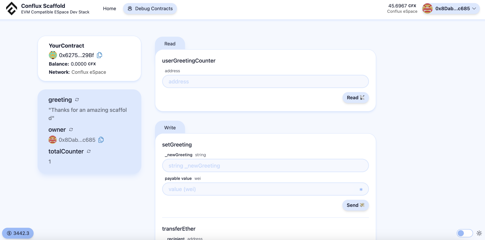

[Scaffold Conflux](https://github.com/conflux-fans/conflux-scaffold) 是 Scaffold-ETH-2 (https://scaffoldeth.io/) 的一个修改版本，我们调整了模板，允许您在 Conflux eSpace 上部署合约，并利用组件、集成 hardhat 和 Scaffold-ETH-2 的快速部署。 在本教程中，我们将向您展示如何设置 Scaffold Conflux，以更好地读取您的智能合约，并利用一些现成的 react 组件快速制作您的 Conflux eSpace 应用。

观看这个[视频](https://youtu.be/33S0IjGGsQg)，它完整地展示了如何从零开始创建一个应用并将其部署在 Conflux eSpace 上。

[](https://www.youtube.com/watch?v=33S0IjGGsQg)

## 克隆 Scaffold Conflux

在您的 visual studio 终端中，运行以下命令克隆仓库并安装依赖。

```bash
git clone https://github.com/conflux-fans/conflux-scaffold
yarn install
```

在 conflux-scaffold 的文件目录中，您将看到以下内容：


这个仓库包含两个主要部分。 第一部分是针对 hardhat 的。

- 您可以在 /conflux-scaffold/packages/hardhat/contracts 中调整您的智能合约Solidity文件
- 例如，当前的 Solidity 样本文件是 "YourContract.sol"
- 启动您的区块链以进行测试。 我们这样做是为了轻松创建账户并与智能合约进行交互，而不需要在测试网（即  RPC 限制）和 Conflux eSpace（即 Gas 费用）上部署

```bash
yarn chain
```

当区块链设置完成后，需要打开一个新的终端。 您可以测试您的智能合约然后部署它

```bash
yarn hardhat:test
yarn deploy
```

部署时有几个相关的文件。

- 一个是在 /conflux-scaffold/packages/hardhat/deploy 中的部署脚本
- 另一个是关于您部署在哪些网络的配置。 /conflux-scaffold/packages/hardhat/hardhat.config.ts
- 默认部署网络是 hardhat，但您可以通过以下方式更改为 Conflux eSpace 或 Conflux 测试网

```bash
yarn deploy --network confluxESpace
```

```bash
yarn deploy --network confluxESpaceTestnet
```

:::note
合约的部署者及所有者可以通过将 `./packages/hardhat/.env.example` 重命名为 `./packages/hardhat/.env` ，并在 DEPLOYER_PRIVATE_KEY= 中放入您的私钥来更改。 然而，默认使用一个默认的“公开”私钥用于 hardhat 测试目的。
:::

一旦您部署了合约，您可以启动您的前端来查看它是如何与合约进行交互的。 您应该能看到类似于以下的界面。 合约调试页面类似于其他网页端部署应用，如 Remix。


Conflux Scaffold 的强大之处在于，您可以快速在 Hardhat 中部署您的合约，并能够看到区块浏览器上的交易以及与合约的读/写功能进行交互



## 前端

一旦您的前端运行起来，您便可以将您的前端与合约进行连接，并享受在您的前端操控智能合约的乐趣。 您可以充分利用功能丰富的 react 组件。

- 跳转至 conflux-scaffold/packages/nextjs/app/page.tsx


- 您可以在这里了解到如何从 /components/scaffold-eth 快速导入组件
- 例如，有地址、余额、地址输入组件等，所有这些都可以快速添加到您的应用中。 视频教程展示了一个如何快速导入和提取一个地址类型的输入的例子。
- 更多组件可以在 https://docs.scaffoldeth.io/components/ 中看到
- 还有其他一些接口对于读取和写入合约（以及设置事件订阅）极其重要。 包括 useScaffoldContractRead, useScaffoldContractWrite 等，您可以从 "~~/hooks/scaffold-eth/index" 导入
- 更多接口相关的参数要求都在 [文档](https://docs.scaffoldeth.io/components/) 中可以查阅到，在这里的两个例子展示了创建智能合约、从合约中读取一个函数和写入一个函数是一件非常容易的事情。


## Conflux 合约的部署

为了部署一个 conflux 应用，我们需要首先将合约部署到 Conflux eSpace 上，并将我们的钱包连接至 Conflux eSpace。 在 conflux-scaffold/packages/hardhat/.env.example 中，我们需要将其更改为 packages/hardhat/.env 并在 DEPLOYER_PRIVATE_KEY 中包含我们的私钥。 这使我们的私钥成为合约的部署者。 在 solidity 合约中，我们也将部署者指定为合约的所有者。

```bash
yarn deploy --network confluxESpace
```

或者

```bash
yarn deploy --network confluxESpaceTestnet
```

## 移除 Hardhat 钱包、Burner 钱包和 eSpace 之间的连接

一旦合约部署完成，我们需要移除这钱包功能，以连接到 hardhat 并接入 Conflux eSpace。 您可以在 conflux-scaffold/packages/nextjs/scaffold.config.ts 中指定您想要部署到的网络，将 targetNetworks 更改为

```javascript
targetNetworks: [chains.confluxESpace]
```

或者

```javascript
targetNetworks: [chains.confluxESpaceTestnet]
```

## 在 Vercel 上部署应用

就是这样！ 一旦您已经准备好智能合约和前端，您就可以开始部署您的应用了。

```bash
yarn vercel
```

按照 vercel 上的指示进行部署。

如果您有任何问题，请参考完整的教程 [视频](https://youtu.be/33S0IjGGsQg)。 它包括如何在 confluxscan 上验证您的合约和在 hardhat 中进行测试的命令。
