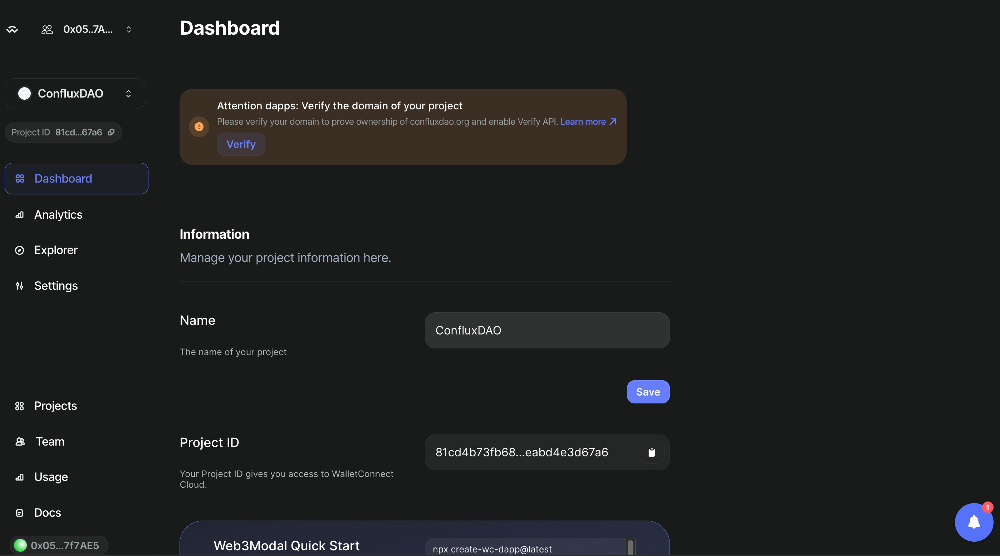

# 创建一个 WalletConnect 项目并获取`ProjectId`

### 第1步：访问 WalletConnect 官方网站

1. 打开您的网络浏览器，导航到 WalletConnect 的官方网站：[WalletConnect](https://walletconnect.com)。
2. 找到专为开发者准备的部分，通常标记为“开发者（Developers）”，然后点击“WalletConnect Cloud”。

### 第2步：注册或登录

1. 如果您还没有账户，您需要注册。 点击“注册（Sign Up）”按钮并按照提供的说明进行操作。
2. 如果您已经有账户，点击“登录（Log In）”按钮并输入您的凭据。

### 第3步：创建一个新项目

1. 登录后，导航到仪表板或您可以管理项目的区域。
2. 查找标有“创建项目（Create Project）”的按钮或链接，并点击它。
3. 输入关于您项目所需的细节：
  - **项目名称（Project Name）**：为您的项目分配一个名称。
  - \*\*类型（Type）：\*\*选择您的项目类型。
  - \*\*网站URL：\*\*如果有，请输入您项目网站的URL。

### 第4步：配置项目设置

1. 创建项目后，配置与您将如何使用 WalletConnect 相关的设置。
2. 设置可能包括回调URL、权限和其他与您项目需求特定的集成细节。

### 第5步：获取您的 `ProjectId`

1. 设置和配置您的项目后，导航到仪表板中标记为“仪表板（Dashboard"）”的部分。

2. 您的 `ProjectId`  将在这里显示。 这是您的应用程序与 WalletConnect 服务交互时需要的一个唯一标识符。

### 第6步：在您的 Dapp 中使用`ProjectId`

- 如果您正在使用 React.js 框架在 Conflux 上构建 Dapp，请参考以下指南： [React.js WalletConnect 集成](/docs/espace/tutorials/walletConnect/reactjs)
- 如果您正在使用 Vue.js 框架在 Conflux 上开发 Dapp，请参考这个教程：[Vue.js WalletConnect Integration](/docs/espace/tutorials/walletConnect/vuejs)
- 对于在Conflux上使用Next.js框架开发Dapp的开发者，请访问以下链接：[Next.js WalletConnect集成](/docs/espace/tutorials/walletConnect/nextjs)

此指南帮助开发者设置 WalletConnect 项目并获取 `ProjectId`，这对于将 WalletConnect 集成到 dapps 中是必要的。 确保您的设置和配置与您的应用程序需求相符，以确保用户体验流畅。
