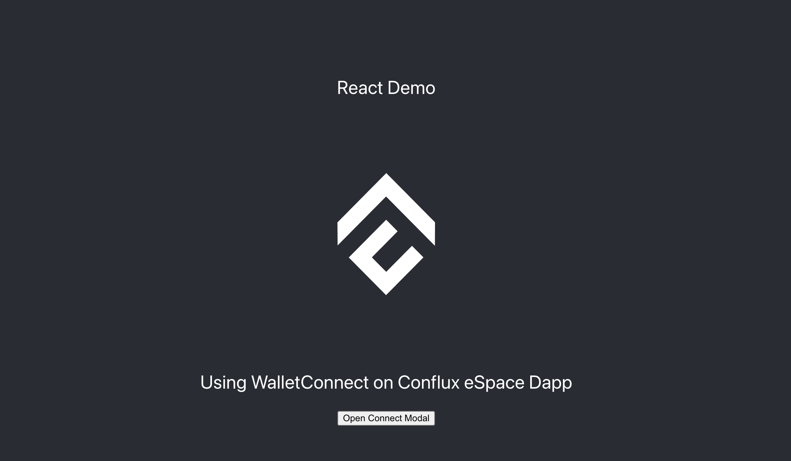

# 在Conflux链上将WalletConnect与您的React应用集成

本教程将指导你如何将WalletConnect无缝集成到您的React应用程序中，使用户能够与Conflux eSpace进行交互，从而为您的用户提供一种安全且直观的方式来，将他们的钱包连接到你在Conflux eSpace上的dApp上。

[](../img/walletconnect-react.png)

## 前提条件

- 在您的计算机上安装了Node.js
- 对React、JavaScript和TypeScript有基本的了解
- 一个与Conflux eSpace网络兼容的钱包(例如MetaMask)

## 第 1 步：设置你的React项目

如果你尚未创建React项目，请首先设置一个。 如果你已经有一个现有的项目，则可以跳过此步骤。

```bash
npx create-react-app web3modal-conflux-react
cd web3modal-conflux-react
```

## 第 2 步：安装必要的库

Web3Modal SDK支持Wagmi，这将帮助你与钱包和智能合约进行交互。

```bash
npm install @web3modal/wagmi wagmi viem @tanstack/react-query
```

## 第 3 步：设置WalletConnect

在你的项目中创建一个新文件 `Web3ModalConfig.tsx`，并导入设置 WalletConnect 所需的模块。

```typescript
import { createWeb3Modal } from "@web3modal/wagmi/react";

import { http, createConfig, WagmiProvider } from "wagmi";

// Import Conflux eSpace network config for wagmi
import { confluxESpace} from "wagmi/chains";
import { walletConnect, injected, coinbaseWallet } from "wagmi/connectors";

import { QueryClient, QueryClientProvider } from "@tanstack/react-query";
import { ReactNode } from "react";

// 0. Setup queryClient
const queryClient = new QueryClient();

// 1. Get projectId at https://cloud.walletconnect.com
const projectId = "YOUR_PROJECT_ID";

// 2. Create wagmiConfig
const metadata = {
  name: "Web3Modal",
  description: "Web3Modal Example",
  url: "https://web3modal.com", // origin must match your domain & subdomain
  icons: ["https://avatars.githubusercontent.com/u/37784886"],
};

const config =  (createConfig as any)({
  chains: [confluxESpace],
  transports: {
    [confluxESpace.id]: http(),
  },
  connectors: [
    walletConnect({ projectId, metadata, showQrModal: false }),
    injected({ shimDisconnect: true }),
    coinbaseWallet({
      appName: metadata.name,
      appLogoUrl: metadata.icons[0],
    }),
  ],
});

// 3. Create modal
createWeb3Modal({
  wagmiConfig: config,
  projectId,
  enableAnalytics: false, // Optional - defaults to your Cloud configuration
  enableOnramp: false, // Optional - false as default
});

export function Web3ModalProvider({ children }: { children: ReactNode }) {
  return (
    <WagmiProvider config={config}>
      <QueryClientProvider client={queryClient}>{children}</QueryClientProvider>
    </WagmiProvider>
  );
}

```

关于如何获取 `ProjectId` 的详细信息，请参考这篇[文章](/docs/espace/tutorials/walletConnect/project-creation)。

## 第 4 步：在你的应用程序中使用 Web3ModalProvider

在你的应用程序入口点，通常是index.tsx中，使用`Web3ModalProvider`组件来包装你的应用程序。

```typescript
import React from "react";
import ReactDOM from "react-dom/client";
import "./index.css";
import App from "./App";
import reportWebVitals from "./reportWebVitals";
import { Web3ModalProvider } from "./Web3ModalConfig";

const root = ReactDOM.createRoot(
  document.getElementById("root") as HTMLElement
);
root.render(
  <React.StrictMode>
    <Web3ModalProvider>
      <App />
    </Web3ModalProvider>
  </React.StrictMode>
);

```

## 第5步：连接Conflux eSpace 网络

你可以使用React状态钩子来管理已连接的状态并监听WalletConnect提供者事件。

在您的项目中创建一个新的组件 `ConnectWalletBtn.tsx`，用于打开 ConnectWallet 模态框。

```typescript
import { useWeb3Modal } from "@web3modal/wagmi/react";

export default function ConnectButton() {
  // Use modal hook
  const { open } = useWeb3Modal();

  return (
    <>
      <button onClick={() => open()}>Open Connect Modal</button>
    </>
  );
}

```

在 `App.tsx` 或者任何其它组件中，使用 `ConnectButton` 组件连接到Conflux eSpace上的钱包。

```typescript
import React from "react";
import logo from "./logo.png";
import "./App.css";
import { useWeb3Modal } from "@web3modal/wagmi/react";
import ConnectButton from "./ConnectWalletBtn";
function App() {
  return (
    <div className="App">
      <header className="App-header">
        
        <p>
          Using WalletConnect on Conflux eSpace Dapp
        </p>
        <ConnectButton/>
      </header>
    </div>
  );
}

export default App;

```

按照上面的步骤，你已经将 Web3Modal 集成到了你的React应用中。 这将使用户能够通过Web3Modal连接他们的钱包，并使用Wagmi和React查询与Conflux eSpace交互。 你现在可以继续开发你的应用程序，添加更多功能。
