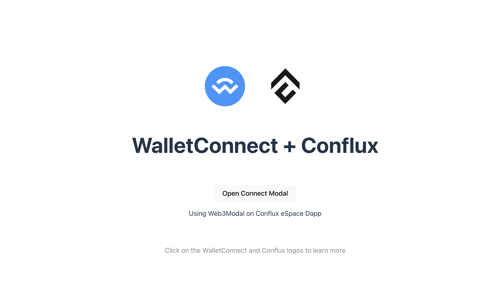

# 在Conflux eSpace的Vue.js项目中集成WalletConnect

本教程指导您在Vue.js项目中，如何使用Web3Modal集成WalletConnect，特别是针对Conflux eSpace网络。
如需实践，请查看 GitHub 仓库[Web3modal-Conflux-Vue](https://github.com/ConfluxDAO/web3modal-conflux-vue)。

[](../img/walletconnect-vue.png)

## 前提条件

- Node.js installed on your computer.
- 了解Vue.js和JavaScript的基础知识。

## 第 1 步：设置您的 Vue.js 项目

首先，使用 Vite 创建一个新的 Vue.js 项目。如果您已经有现成的项目，可以跳过此步骤。 打开终端并运行以下命令：

```bash
npm create vite@latest web3modal-conflux-vue -- --template vue
cd web3modal-conflux-vue
npm install
```

## 步骤 2: 安装 Web3Modal 和 WalletConnect

You need to install Web3Modal and the WalletConnect provider. 运行：

```bash
npm install @web3modal/wagmi @wagmi/core @wagmi/connectors viem
```

## Step 3: Setting Up Web3Modal

Create a new file named `Web3ModalSetup.js` in your project's `src` directory, and import the necessary modules to set up WalletConnect.

```javascript
import { createWeb3Modal } from "@web3modal/wagmi/vue";

import { reconnect, http, createConfig } from "@wagmi/core";
import { confluxESpace } from "@wagmi/core/chains";
import { walletConnect, injected } from "@wagmi/connectors";

// 1. Define constants
const projectId = "YOUR_PROJECT_ID";
const metadata = {
  name: "Web3Modal",
  description: "Web3Modal Example",
  url: "https://web3modal.com", // origin must match your domain & subdomain
  icons: ["https://avatars.githubusercontent.com/u/37784886"],
};

const config = createConfig({
  chains: [confluxESpace],
  transports: {
    [confluxESpace.id]: http(),
  },
  connectors: [
    walletConnect({ projectId, metadata, showQrModal: false }),
    injected({ shimDisconnect: true }),
  ],
});

reconnect(config);
// 3. Create modal
createWeb3Modal({
  wagmiConfig: config,
  projectId,
  enableAnalytics: true, // Optional - defaults to your Cloud configuration
  enableOnramp: true, // Optional - false as default
});
```

Replace `"YOUR_PROJECT_ID"` with your actual project ID.

关于如何获取 `ProjectId` 的详细信息，请参考这篇[文章](/docs/espace/tutorials/walletConnect/project-creation)。

确保metadata中的url与您的域名和子域名匹配。 This will later be used by the [Verify API](https://docs.walletconnect.com/cloud/verify) to tell wallets if your application has been verified or not.

## Step 4: Using `Web3ModalSetup` in your Application

In your `App.vue`, import the `web3ModalSetup` instance and use it to connect to the wallet. Here’s how you can do it in your `App.vue`:

```javascript
<script setup>
import HelloWorld from "./components/HelloWorld.vue";
import "./web3ModalSetup";
</script>

<template>
  <div>
    <a href="https://walletconnect.com" target="_blank">
      
    </a>
    <a href="https://confluxnetwork.org/" target="_blank">
      
    </a>
  </div>
  <HelloWorld msg="WalletConnect + Conflux" />
</template>

...

```

## 第5步：连接Conflux eSpace 网络

Create a new component, `ConnectWallet.vue`, in your project, to open ConnectWallet Modal

```javascript
<template>
  <div>
    <button @click="modal.open()">Open Connect Modal</button>
  </div>
</template>

<script setup>
import { useWeb3Modal } from "@web3modal/wagmi/vue";
// 4. Use modal composable
const modal = useWeb3Modal();
</script>

<style lang="scss" scoped>
</style>
```

In `HelloWorld.vue` or any other component, use the `ConnectWallet` component to connect to wallets on the Conflux eSpace

```javascript
<script setup>
import { ref } from "vue";

import ConnectWallet from "./ConnectWallet.vue";

defineProps({
  msg: String,
});
const count = ref(0);
</script>

<template>
  <h1>{{ msg }}</h1>

  <div class="card">
    <ConnectWallet />
    <p>Using Web3Modal on Conflux eSpace Dapp</p>
  </div>

  <p class="read-the-docs">
    Click on the WalletConnect and Conflux logos to learn more
  </p>
</template>

<style scoped>
.read-the-docs {
  color: #888;
}
</style>

```

现在，您已经在您的 Vue.js 项目中使用 Vite 基本设置了 Web3Modal 与 WalletConnect 的集成。 This setup allows users to connect their wallets from a Vue.js application, enabling interactions with Conflux eSpace.
