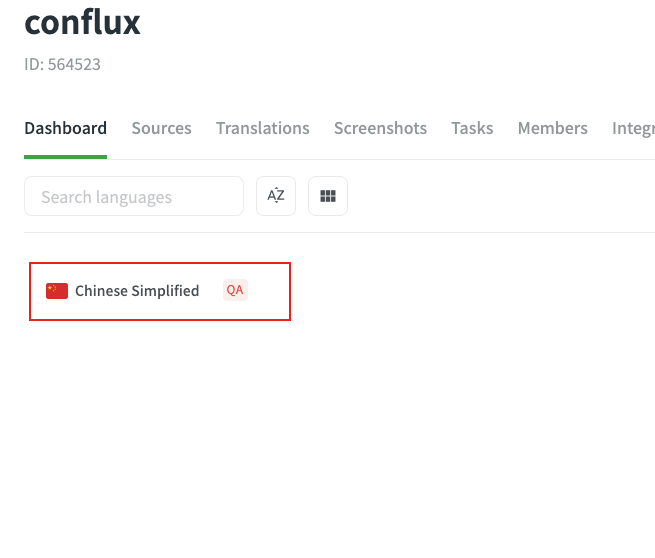
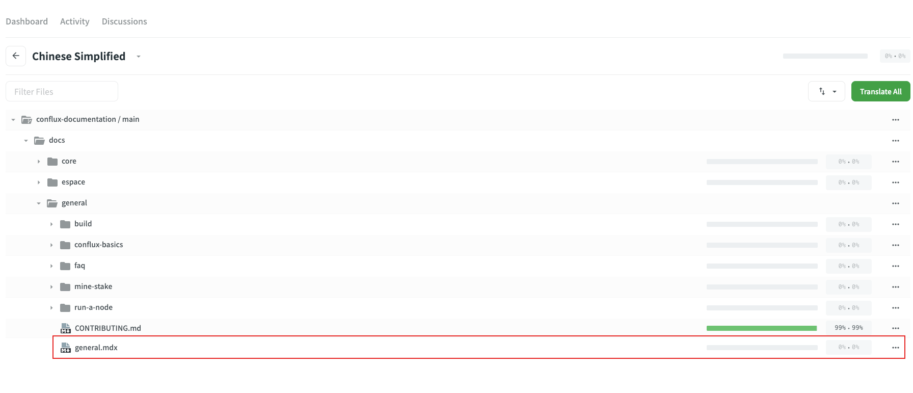

# 贡献

:::info
感谢您对我们文档站点的关注！ 我们非常珍视您的支持，并且很高兴能够听取社区的见解和专业知识。 本页面概述了贡献的指南、流程，以及您所付出的努力可能获得的奖励。
:::

## 如何贡献

我们欢迎各种形式的贡献，包括但不限于：

1. 指出（内容上的）错误/笔误，并（可选的）给出解决方案
2. 提供翻译
3. 添加或改进配图、表格或其他可视化内容
4. 对文档组织结构的建议
5. 编写或更新教程/指南
6. 添加/更新代码示例
7. 提高文档撰写的质量

要进行贡献，请参考以下建议操作：

### 创建 Issue

You can create an issue to

- report any mistake / typo
- or request new content / current content improvement


It would be wonderful if you are able to take the initiative and resolve the issue on your own!

```
// in BUG template
- [ ] I'd be willing to fix this issue myself.
// in Feature Request template
- [ ] I'd be willing to contribute this feature myself
```

### 创建 Pull Request

You can create a Pull Request to submit content changes **EXCEPT FOR [TRANSLATIONS](#provide-translation)**.

If you are not working on an issue created by yourself, it is suggested to follow these steps:

:::note
虽然这些步骤不是强制性的，但遵循它们可以降低您的 PR 被拒绝的风险。
:::

1. Make sure a relavent open issue with "ACCEPTED" label exists.
2. 在 Issue 中留下评论，防止多人同时处理同一个问题。
3. 在提交信息中提及该 Issue `#xx`。 例`fix: typo. Ref #123456`。


### 提供翻译

:::note

直接在 GitHub 仓库中提交的翻译 PR 将 **不会** 被接受。

:::

我们使用 [Crowdin](https://crowdin.com/project/conflux) 进行文档翻译集成。 Crowdin helps us to know whether translation strings are outdated after the source files are changed. Anyone can submit translation strings in Crowdin, and translation strings will be pushed to Github repo after they are reviewed.

#### Crowdin Tutorial

Visit our project page on Crowdin at either https://crowdin.com/project/conflux or https://zh.crowdin.com/project/conflux and select the language you wish to translate.



You will be able to select a file to begin translating.



In order to edit, you will need to be logged in. No need to fret though, you can easily log in with your Github account by clicking a few buttons.


Once you are in, you can start the translation process! Simply click on a source string on the left-hand panel and input the translation or edited string. Remember to click SAVE and wait for your translation to be reviewed.


Once reviewed, the translation string will be pushed to the Github repository and you can visit your translation on the official documentation site.

## 贡献者 POAP

Individuals who ever engage in contribution to the documentation site during a season will be able to mint a Contributor POAP. To qualify for minting the POAP, your contribution must also be "ACCEPTED" , meaning:

- any issue has been created with the "ACCEPTED" label added by admin
- any Pull Request has been successfully merged into the main branch
- or any translation string has been fully reviewed

### 特殊 POAP

除了常规的贡献者 POAP，我们还会铸造特殊 POAP 用于表彰和鼓励重要贡献。 重要贡献包括如：高质量的指南或对项目的持续、频繁的贡献。 特殊 POAP 的颁发由项目维护者根据具体情况决定。

### Poap 发行规则更新

请注意，POAP 发行规则每三个月进行审查并可能进行修改。 这将保证我们的本指导方针能足够有效地鼓励社区为文档建设作出贡献。

我们期待您的贡献，并感谢您帮助我们改进我们的文档网站！ 如果您有任何问题或需要帮助，欢迎随时在我们的 Github 仓库中创建Issue。
