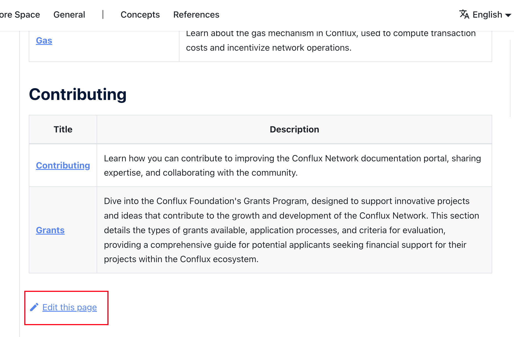

:::info

感谢您对在我们的文档网站作出贡献感兴趣！ 我们非常珍视您的支持，并且很高兴能够听取社区的见解和专业知识。 本页面概述了贡献的指南、流程，以及您所付出的努力可能获得的奖励。

如果您正在寻求 Conflux 基金会对您的项目进行资助，请参阅我们的[**资助**](../build/grants.md) 页面。

:::

我们欢迎各种形式的贡献，包括但不限于：

1. 指出（内容上的）错误/笔误，并（可选的）给出解决方案
2. 提供翻译
3. 添加或改进配图、表格或其他可视化内容
4. 对文档组织结构的建议
5. 编写或更新教程/指南
6. 添加/更新代码示例
7. 提高文档撰写的质量

如果您想做出贡献，您可以采取以下行动：

- **报告一个 Issue**：如果您发现了问题或希望提出改进建议，请 [创建一个 issue](#create-an-issue) 让我们知道。
- **提交更改**：如果您想要对错误内容直接进行修改，请创建一个 [pull request](#create-a-pull-request)。
- **提供翻译**：如果您想要为技术文档贡献翻译，请参阅我们的[翻译指南](#provide-translation)。

## Create an Issue

您可以为以下目的创建一个问题：

- 报告您发现的任何错误或打字/排版问题。
- 请求新内容或对当前内容进行改进。

您通常可以通过 [GitHub网页](https://github.com/Conflux-Chain/conflux-documentation/issues/new/choose) 直接创建一个问题。 在这里，您会找到各种模板来指导您的问题提交。


如果您能够自行解决这个问题，我们鼓励您主动采取行动。 在创建问题时，您可以表明您愿意解决它。 For bug reports, select the option “I'd be willing to fix this issue myself” in the BUG template. For feature requests, select “I'd be willing to contribute this feature myself” in the Feature Request template.

```md

// issue 的 BUG 模版
- [ ] I'd be willing to fix this issue myself.
// issue 的 Feature Request 模版
- [ ] I'd be willing to contribute this feature myself

```

另外，您也可以通过[ Conflux文档问题表单](https://forms.office.com/r/pKVBywZwLY) 提交您的问题。 如果您提交的问题被批准，它将在 GitHub 仓库中被创建。


## Create a Pull Request

通过创建拉取请求（PR）对项目作出贡献是改进现有文档或代码十分有价值的方式。 本指南将逐步引导您完成整个过程，确保清晰易懂，特别是对于那些对GitHub和git操作不熟悉的人。

For complex operations, you can also check the [closed pull requests](https://github.com/Conflux-Chain/conflux-documentation/pulls?q=is%3Apr+is%3Aclosed) for grammar reference. 例如，

- [Added Ecosystem Page + Video](https://github.com/Conflux-Chain/conflux-documentation/pull/392) shows how to add an article with video reference.
- [feat: template example](https://github.com/Conflux-Chain/conflux-documentation/pull/410) shows how to make use of mdx's feature to create similar pages using template.

:::note

此过程不适用于 [翻译](#provide-translation)。

:::

### Minor Changes via Github Web UI

对于简单的更正或完善，如拼写错误或句子改进：

1. 导航到页面：
   - 前往您希望编辑的页面的**英文版本**并点击“编辑此页面”。 它通常位于页面的顶部或底部。
     - 

2. 分叉仓库：
   - 您将被重定向到 GitHub，在那里您可能会看到一个提示，显示“您需要分叉这个仓库以提出更改”。 点击“分叉这个仓库”。
     - 

3. 进行编辑：
   - 一旦进入编辑模式，您便可以进行必要的更改。 编辑内容后，滚动到底部，您会找到“提交更改”部分。 填写对于您更改的简短描述，然后点击“提交更改”。

4. 提交拉取请求：
   - 提出更改后，您将被引导到一个新页面以发起拉取请求。 点击“创建拉取请求”。 仔细检查更改并填写任何必要的额外信息，然后再次点击“创建拉取请求”完成操作。
     - 记得通过添加 "x" 以进行预检查核对。
     - 

### Local Development for Substantial Changes

:::tip

如果您对 git 或 Github 的操作不熟悉，请参考[ Github 教程](https://docs.github.com/en/get-started/exploring-projects-on-github/contributing-to-a-project)。

:::

对于添加新页面或广泛的修订等更重大的贡献：

1. 设置：
   - 确保您安装了[node.js](https://nodejs.org/en)（版本 `>= 18`）和 [yarn](https://yarnpkg.com/getting-started/install)。
   - 分叉并克隆[文档仓库](https://github.com/Conflux-Chain/conflux-documentation)。 关于分叉和克隆的详细指南可在 GitHub 的帮助页面上找到。

2. 在本地进行更改：
   - 在您的终端运行 `yarn && yarn start` 以在 `http://localhost:3000` 预览站点。
   - 导航到您克隆仓库中的 `docs/**` 文件夹进行更改。 刷新您的本地服务器以查看更新。

3. 提交您的更改：
   - 进行更改后，运行 `yarn build` 确保一切正确编译。
   - 确保您的更改是有价值的，然后将它推送到您的分叉仓库。 在 GitHub 上发起一个拉取请求，将您的分支与原始仓库进行比较。

### 处理现有问题

为了避免工作重叠并精简贡献流程，我们建议您遵循以下步骤：

1. 检查已接受的问题：
   - 寻找标有类似于 “ACCEPTED” 等的表示准备好作出贡献的问题标签。 如果您对此不确定，您可以在问题评论中询问。

2. 宣布您的意图：
   - 对问题进行评论，说明您正在处理它。 这将有助于防止做出重复的努力。

3. （可选）链接您的贡献：
   - 提交更改时，在您的提交信息中引用问题号，例如，`修复：打字错误。 Ref #123456`。

## 提供翻译

:::note

在 Github 仓库中提交的翻译拉取请求将不会被接受。

:::

我们使用 [Crowdin](https://crowdin.com/project/conflux) 进行文档翻译集成。 Crowdin 能够帮助我们了解在源文件更改后已翻译内容是否需要变更。 任何人都可以在 Crowdin 中提交翻译，已翻译内容在审查后会被推送至文档的 Github 仓库。

### Crowdin 教程

访问我们在 Crowdin 上的项目页面，网址为 https://crowdin.com/project/conflux 或 https://zh.crowdin.com/project/conflux，并选择您想要翻译的语言。


您可以选择一个文件并开始翻译。


您需要登录才能编辑翻译。 不过不用担心，您只需要点击几个按钮，便可轻松地使用您的 Github 帐户登录。


一旦登录，您就可以开始翻译过程了！ 只需点击左侧面板上的源字符串，然后输入翻译或编辑后的字符串。 记得点击保存，并等待您的翻译被审核。


一经审核通过，翻译字符串将被推送到 Github 仓库，您可以在官方文档网站上访问您的翻译。
