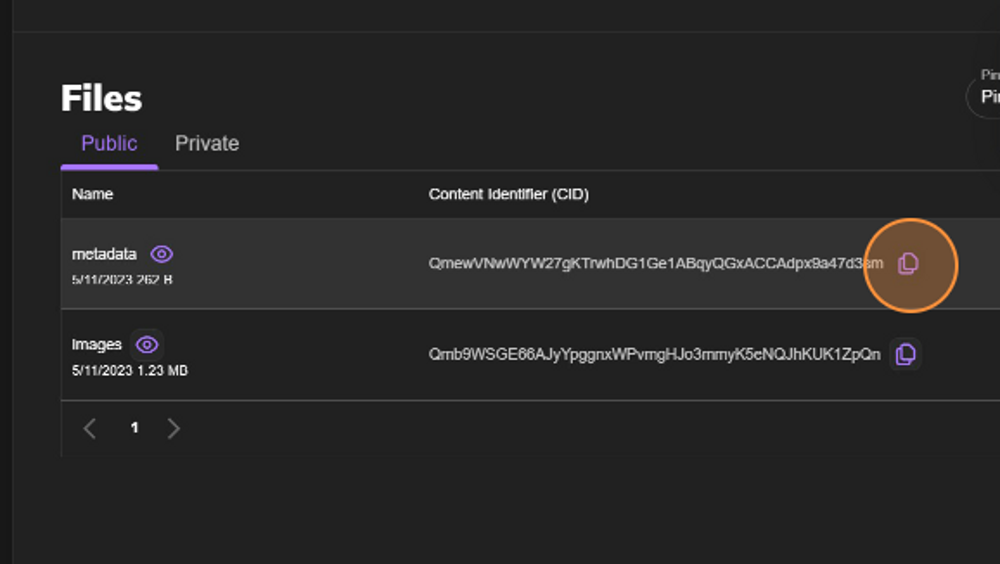

# 使用Pinata上传文件至IPFS

建立NFT智能合约的初始阶段涉及准备您的NFT文件。 在这个情况下，文件将被上传到**[Pinata](https://www.pinata.cloud/)**，这是一个允许您在IPFS上轻松管理和维护媒体文件的服务。 如果您还没有创建帐户，可以在[此处](https://t.sidekickopen86.com/Ctc/RJ+23284/d2q6Hj04/Jk82-6q7W5BW0B06lZ3kSN7N8wZqXqbPzW3TCKPf589Q6FW4CMm433Rb7jyW5KKmWM4jVWNSW1f4SqZ71c-GSW9j-gR-80Z4v9W3K4DpB1nb46WW1CMpy61tWQ0DN3tmTqJq-Wf5W31LKxg3_czldN84Hg68NYPpZW4cZKff1fgZnmW2cBYL08gsKw0W65_dds31pzQFVs9Cdk6Tv5lDW7rrBjl8gNbVJN6Z5JYxhfDJLW4MgBMz7S_jFzf743mLY04)注册。

## 什么是Pinata？

Pinata是一个web3媒体管理服务，允许用户在IPFS中托管、管理和共享文件。 作为一个IPFS的固定服务，Pinata致力于为技术和非技术创作者提供一种快速、简单、可靠的方式来无限制地分享内容。

对于开发者，Pinata是将内容固定到IPFS并构建web3应用程序的最简单的方法之一，无需构建和管理自己的IPFS节点。 它已为开发者完成了所有繁重的工作。

对于创作者，Pinata使得在不需要任何技术经验的情况下大规模提供内容变得简单。 Pinata让创作者无需立即担心web3或IPFS的技术问题即可开始创作。

## 什么是“固定（Pinning）”？

当您在一个IPFS节点上“固定”数据时，您告诉该节点这些数据是重要的，并且应该被保存。 节点是连接您到IPFS并存储文件的程序。

固定可以防止重要数据从您的节点中被删除。 只有您可以控制并在您的节点上固定数据 - 您不能强制IPFS网络上的其他节点为您固定内容。 因此，为了保证您的内容始终被固定，您必须运行自己的IPFS节点。

一旦您的文件被固定到IPFS，您可以完全控制分享、分发、变现和分享您的文件。

## 视频教程

关于如何使用 pinata 来存储您的 Web3 文件，您可以观看以下实操视频：

import Tabs from '@theme/Tabs';
import TabItem from '@theme/TabItem';


<Tabs>
  <TabItem value="youtube" label="Pinata Video Tutorial">
<iframe width="560" height="315" src="https://www.youtube.com/embed/9y2NK85Z6Hk?si=0TsnWNR40f9mz4Wo" title="YouTube 视频播放器" frameborder="0" allow="accelerometer; autoplay; clipboard-write; encrypted-media; gyroscope; picture-in-picture; web-share" allowfullscreen></iframe>
  </TabItem>
</Tabs>

## 准备好你的图片

本指南将专注于创建单个NFT，也可以用同样的方式为更多NFT准备图片。 如果您想使用，可以在此处找到正在使用的图像。

```mdx-code-block

import Image from '@theme/IdealImage';

<Image img={require('./img/0.png')} style={{width: 300}}/>

```

将图像文件保存在计算机上的文件夹中。 将此图像命名为**`0`**，使其成为智能合约检索的第一张图像。 这将是此系列中的第一个（也是唯一一个）NFT；但是，如果你要添加更多图片，请继续按照升序的数字顺序命名它们。 一旦你的图片整理和命名好了，就将这个文件夹上传到Pinata。

:::note
💡 注意：有些项目的文件名以**`0`**开始，有些以**`1`**开始。 确保你的命名方式与智能合约代码保持一致。 我们这里将文件命名为**`0`**。
:::


登录Pinata后，你会看到你的仪表板。 上传按钮位于左侧。 点击**`添加文件（Add Files）`**，然后选择**`文件夹（Folder）`**。


接下来，选择包含图片的文件夹。 你的浏览器可能会弹出一个窗口，要求你确认文件夹及其文件的上传。 如果是这样，点击**`上传（Upload）`**。


你需要为你上传的文件夹命名。 这在你有多个文件夹集上传到Pinata并需要保持它们有序时非常有用。 命名后，点击**`上传（Upload）`**并等待你的文件上传。 图片的数量和大小可能会影响上传时间，但对于这次这种小规模的上传，应该只需要几秒钟。

一旦上传完成，你的文件夹将出现在你的仪表板中。


点击文件夹名称，将带你进入Pinata网关，以查看你最近上传的文件。 如果你有一个付费的Pinata帐户，它会通过你自己的网关打开文件夹。 付费计划和个人网关对于本教程来说并不是必需的，但对于更大规模的NFT集合和托管多个文件夹是推荐的。

右键点击图像以复制其URL。 这个URL是非常关键的。 保存它，以备下一步设置元数据（metadata）使用。 在本示例中，URL是 **`https://gateway.pinata.cloud/ipfs/Qmb9WSGE66AJyYpggnxWPvmgHJo3mmyK5eNQJhKUK1ZpQn/0.png`**

## 设置元数据（Metadata）

图像上传并且URL可用后，我们可以创建相应的元数据文件。 为此，我们需要(创建一个JSON文件)[https://codebeautify.org/blog/how-to-create-json-file/#:~:text=How%20to%20Create%20JSON%20File%3F%201%201.%20Using,3.%20Create%20a%20file%20from%20the%20JSON%20URL]).。

由于这个NFT将是一个ERC-721，我们知道可以使用在像**[Joepegs.com](https://joepegs.com/)**这样的市场上常见的元数据标准。 下面的.json文件展示了元数据应该是什么样子。

```
{
  "name": "",
  "tokenId": 0,
  "image": "",
  "description": "",
  "attributes": []
}
```

现在，让我们填写元数据文件的各个字段值。 你可以选择任何**`name`**和**`description`**。

这里的**`tokenId`**将是**`0`**，以对应上传的图片。 如果上传多个文件，该字段需要在每个文件中递增。

将之前保存的**`图像`**链接（URL）粘贴在这里，这样智能合约就知道在哪里找到你的NFT的图像文件。 如果上传多个文件，URL末尾（具体的图像）需要在每个文件中递增。

**`attribute`**字段在这里并不是非常关键，但如果你在上传具有多个层级的NFT，那么属性会代表这些特定层的信息。 这通常在确定NFT稀有度时使用，以根据他们在整个集合中层的频率对它们进行排名。 在这个教程中，我们将它留空。

下面是填写元数据文件字段的一个例子。

```
{
  "name": "Confi Art",
  "tokenId": 0,
  "image": "https://gateway.pinata.cloud/ipfs/Qmb9WSGE66AJyYpggnxWPvmgHJo3mmyK5eNQJhKUK1ZpQn/0.png",
  "description": "A beaver cartoon inspired in Confi."
}
```

保存此文件时，确保它的名称与对应的图片名称相同。 在本例中，它是0。

将元数据文件上传到Pinata后，文件扩展名将不再必要。 它将搜索该文件作为一个目录，并从那里提取信息。 要删除文件扩展名，请按照这些步骤操作**[Mac](https://support.apple.com/guide/mac-help/show-or-hide-filename-extensions-on-mac-mchlp2304/mac)**环境，或者按照这些步骤操作**[Windows](https://www.techwalla.com/articles/how-to-remove-file-extensions)**环境。

将无文件扩展名的元数据放在一个单独的文件夹中，就像你处理图像文件一样。


现在，重复文件夹上传过程，将元数据添加到Pinata。 按照之前的步骤操作。 完成后，两个文件夹都将在你的仪表板上可访问。



点击元数据文件夹，将被引导到IPFS网关并保存URL。 这个URL将是你的基础URL，不需要直接的文件链接。 智能合约将追加每个NFT所需的必要文件信息。 例如，我们的URL是**`https://gateway.pinata.cloud/ipfs/QmewVNwWYW27gKTrwhDG1Ge1ABqyQGxACCAdpx9a47d3sm`**。


