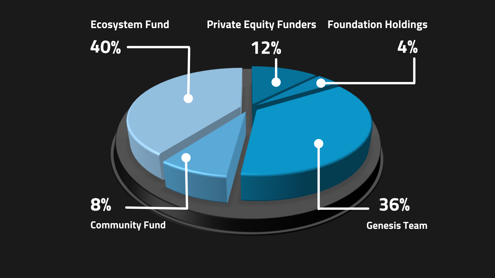

Conflux 的经济模型旨在鼓励用户参与和网络发展，同时确保技术的稳定性。 一个精心设计的经济模型对于一个去中心化的系统有效运行是必不可少的。 区块链技术建立了信任，并促进了合作者之间的高效关系，加速了价值的转移。

## **Conflux经济模型概述**

### 关键要素

**1. Value System:** Public blockchain systems require tokens to serve as a measurable unit with economic value. 代币明确了资产所有权，并作为价值互动的交易媒介。 代币也与存储资源相关联，并可以作为长期激励分配。

**2. Governance Rules:** Governance rules involve the distribution and use of tokens, as well as their economic impact under different conditions. 代币可以作为利息分配给用户，或者作为区块奖励分配给矿工。 代币也可以兑换成法定货币或其他数字货币。

**3. Community Collaboration:** Blockchain systems should be "open to everyone and beneficial to all participants." 所有用户都有权无障碍地进入系统，成为股东，为系统的建设做出贡献，并从自己的努力中受益。

### 关键参与者

Conflux Network生态系统中的参与者包括三个群体：

1\) _**Direct builders**_: _Conflux Foundation_ and the _founding team_ responsible for developing the underlying technology of the Conflux public chain and the Conflux Network operations;

2\) _**System maintainers**_: _Miners_ and _Stakers_ maintaining the normal operation and security of the whole Conflux Network system;

3\) _**Ecosystem contributors**_: _Community Users_ who continuously generate value for the Conflux Network ecosystem.

### 发展阶段

Conflux Network将在不同的发展阶段选择不同的激励模式，以确保系统从初始阶段平稳过渡到运营阶段。

- **Initial phase**: the _direct builders_ and the _ecosystem contributors_ are incentivized to resolve the cold start problem of the system;

- **Operational phase**: _system maintainers_ are incentivized to promote continuous system upgrading; self-adaptive configuration of Conflux system resources is promoted through the marketization of system resources.

## **Incentives Mechanism**

Conflux的激励机制旨在鼓励用户参与网络。 其目标是确保Conflux安全、可靠、稳定，且能够以最低的准入门槛访问，同时促进Conflux的计算和链上存储资源的合理使用。

Conflux Network使用以下经济激励来鼓励网络参与：

1. 对系统维护者或矿工的经济激励。
2. 用户可以通过质押CFX代币来赚取利息，这有助于通过PoS共识层保障网络的安全。 那些不质押的人会失去利息收入，这些利息是由新发行的CFX代币产生的。
3. 智能合约部署者必须支付一定的费用来在Conflux Network上存储数据。 这个费用是质押的，产生的利息归网络维护者所有，激励他们做好自己的工作。
4. 户可以通过将CFX代币锁定到治理平台上一定期限来赚取利息和投票权。 这也激励了参与治理。

## **CFX Token Distribution**

To understand how these factors operate within Conflux’s economic model, we need to take a look at the core of Conflux’s value system: **Conflux’s native token, CFX.**

Each CFX token consists of smaller units called **drips**, which are similar to Gwei on the Ethereum network or Satoshis on Bitcoin. 在Conflux网络上发送交易时，需要支付一小部分drip作为交易费。 这些费用将奖励给系统维护者（矿工）。

### **Initial Phase CFX Distribution**

In the **initial phase**, direct builders and ecosystem contributors are rewarded to constantly improve the ecosystem and lay a solid foundation for the entire ecosystem during the cold start phase.

Conflux Network创世区块中预挖的代币数量为50亿CFX。 The pre-mined tokens will be offered as rewards to the _direct builders_ and the _ecosystem contributors_ of Conflux Network.

**Direct builders** are rewarded to constantly improve the ecosystem and to lay a solid foundation for the entire Conflux ecosystem.

- _Private Equity Funders_: 12% of the genesis tokens will be allocated to our private round investors and will be released over two years.
- _Foundation Holdings_: 4% plus any unsold CFXs in the previous category will be allocated to support the long term financial need of Conflux Foundation. These tokens will be unlocked monthly over 2 years.
- _Genesis Team_: 36% of the genesis tokens will be awarded to the founding team including the IIIS team (of Tsinghua University), Conflux Foundation employees, and advisors. 创始团队的代币将在4年内释放，并作为一个资本池。 将设置合理的营销活动，解决系统的冷启动问题，使早期加入生态系统的用户和早期矿工获得额外的代币或更高的区块奖励。 这将鼓励他们为生态系统做出更多贡献。
- _Community Fund:_ 8% of the genesis tokens will be provided as rewards for ordinary community users for the encouragement of them to participate in the early stages of developing and maintaining the Conflux ecosystem. 这部分代币将在四年内解锁。
- _Ecosystem Fund_: 40% of the genesis tokens will be offered to community developers supporting the DApps in the Conflux ecosystem. 这部分代币将在四年内解锁。
- _Public Fund_: 0% of the genesis tokens will be allocated into the public fund account.

### **Operational Phase CFX Distribution**

在运营阶段，系统维护者受到激励，促进系统的持续升级；生态贡献者受到鼓励，不断为生态系统创造价值。 同时，通过系统资源的市场化，促进Conflux系统资源的自适应配置。

矿工是工作量证明（PoW）系统的主要维护者，主要负责确认系统中记录的交易。 他们是维持系统稳定性的重要角色。 激励是矿工收入的主要来源，所以矿工激励模型的设计直接影响了系统的可持续性。

与比特币矿工一样，Conflux上的矿工以财务奖励的形式获得他们为维护网络所贡献的计算能力。 这些奖励以区块奖励和交易费的形式获得。

矿工负责在工作量证明（PoW）系统中确认交易，并以区块奖励和交易费的形式获得财务奖励。 初始区块奖励设定为每个区块7 CFX，并随着纪元高度逐渐减少，直到在纪元高度3,615,000时达到每个区块2 CFX。

矿工还可以从智能合约部署者支付的存储抵押（CFS）代币中获得利息收入。 这些激励对于Conflux网络的可持续性至关重要。

Stakers are another crucial group of system maintainers in Conflux's Proof of Stake (PoS) consensus mechanism layer. Unlike miners in the Proof of Work (PoW) system, stakers do not compete with each other using computing power. Instead, they stake a certain amount of CFX and either run PoS nodes themselves or delegate their CFX to PoS pools. In return, they earn CFX rewards proportional to their stakes.

#### 链上DAO投票链参数

Conflux introduces internal contract [ParamControl](../../core/core-space-basics/internal-contracts/params-control.md) in [CIP-94](https://github.com/Conflux-Chain/CIPs/blob/master/CIPs/cip-94.md) to control the chain parameters including PoW base block reward and PoS base reward interest rate. In other word, the operational phase CFX distribution is now controlled by DAO.

### **CFX Annual Inflation**

:::note

The calculations presented here offer a snapshot as of August 4, 2023, based on the following conditions:

- Proof of Work (PoW) base block reward is set at 1/block
- Proof of Stake (PoS) base reward interest rate stands at 0.04 (4%)
- PoS APY (Annual Percentage Yield) is 12.9%, with 342.2 million CFX staked in PoS

This article won't update in response to changes in these parameters, so readers should check the current chain parameters to ensure the accuracy of their calculations.

:::

The Conflux Network incorporates a measure of inherent inflation, gradually adding more CFX to the overall circulation. As of now, approximately 3 billion CFX are in circulation, consisting of both the pre-mined distribution and the newly generated mining and staking rewards.

Currently, the Proof of Work (PoW) issuance rate for Conflux is 1 CFX per block, with blocks being mined every 0.5 seconds. This results in about 63 million CFX issued on an annual basis.

The Proof of Stake (PoS) issuance rate is calculated based on an Annual Percentage Yield (APY) of 0.04x, where 'x' represents the square root of the total circulation divided by the total staked amount. At present, the total CFX circulation is 3.1 billion (including 497 million that have been burnt and placed in a zero address), and the total PoS staking stands at 342.2 million. Consequently, the current APY is 12.9%, yielding an annual PoS issuance of roughly 44 million CFX.

The annual inflation rate for CFX is approximately 107 million (63 million from PoW and 44 million from PoS). Adding this to the genesis tokens of 5 billion and the issued tokens of 540 million, we reach a total CFX circulation of 5.54 billion. Hence, the current inflation rate of CFX, in relation to the genesis tokens and issued tokens, is roughly 1.9%.

Furthermore, the introduction of [CIP-107](https://github.com/Conflux-Chain/CIPs/blob/master/CIPs/cip-107.md) will result in token burning. A certain proportion of CFX will be burnt if storage collateral is sponsored, which could potentially further decrease the inflation rate.

## **References**

- [https://confluxnetwork.org/files/Conflux_Economic_Paper_20201230.pdf](https://confluxnetwork.org/files/Conflux_Economic_Paper_20201230.pdf)
- [https://medium.com/conflux-network/conflux-networks-economic-model-concept-40e6a0e52ea9](https://medium.com/conflux-network/conflux-networks-economic-model-concept-40e6a0e52ea9)
- [https://medium.com/conflux-network/conflux-networks-economic-model-pre-mined-token-distribution-and-proportions-f92fe00696ea](https://medium.com/conflux-network/conflux-networks-economic-model-pre-mined-token-distribution-and-proportions-f92fe00696ea)
- [https://medium.com/conflux-network/conflux-networks-economic-model-block-reward-components-under-the-network-s-mining-incentive-ceadd8f8408f](https://medium.com/conflux-network/conflux-networks-economic-model-block-reward-components-under-the-network-s-mining-incentive-ceadd8f8408f)
- [https://medium.com/conflux-network/the-role-of-the-cfx-token-in-the-conflux-network-5a56c2b43bb0](https://medium.com/conflux-network/the-role-of-the-cfx-token-in-the-conflux-network-5a56c2b43bb0)
