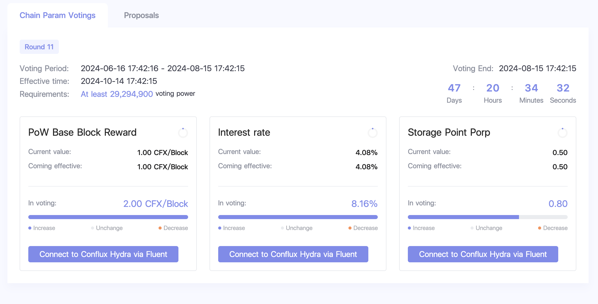

Conflux 的经济模型旨在鼓励用户参与和网络发展，同时确保技术的稳定性。 一个精心设计的经济模型对于一个去中心化的系统有效运行是必不可少的。 Blockchain technology establishes trust and promotes efficient relationships among cooperators, accelerating the transfer of value.

## Conflux Economic Model Overview

### 关键要素

**1. Value System:** Public blockchain systems require tokens to serve as a measurable unit with economic value. 代币明确了资产所有权，并作为价值互动的交易媒介。 代币也与存储资源相关联，并可以作为长期激励分配。

**2. Governance Rules:** Governance rules involve the distribution and use of tokens, as well as their economic impact under different conditions. 代币可以作为利息分配给用户，或者作为区块奖励分配给矿工。 代币也可以兑换成法定货币或其他数字货币。

**3. Community Collaboration:** Blockchain systems should be "open to everyone and beneficial to all participants." 所有用户都有权无障碍地进入系统，成为股东，为系统的建设做出贡献，并从自己的努力中受益。

### 关键参与者

Conflux Network生态系统中的参与者包括三个群体：

1. **Direct Builders**: The Conflux Foundation and founding team, responsible for developing the underlying technology and network operations.
2. **System Maintainers**: Miners and stakers who ensure the network's normal operation and security.
3. **Ecosystem Contributors**: Community users who generate value for the Conflux Network ecosystem.

### 发展阶段

Conflux Network将在不同的发展阶段选择不同的激励模式，以确保系统从初始阶段平稳过渡到运营阶段。

- **Initial phase**: the _direct builders_ and the _ecosystem contributors_ are incentivized to resolve the cold start problem of the system;

- **Operational phase**: _system maintainers_ are incentivized to promote continuous system upgrading; self-adaptive configuration of Conflux system resources is promoted through the marketization of system resources.

## Incentives Mechanism

Conflux's incentives mechanism is designed to encourage user participation, ensuring the network is safe, reliable, and stable with minimal barriers to entry. The economic incentives include:

1. PoW block rewards: By [mining](../mine-stake/mine/running-mining-node.md) PoW blocks, miners will get rewards for each mined block.
2. Transaction fee rewards: the transaction priority fee and part of transaction base fee will be miners' rewards.
3. PoS interest: By staking their CFX tokens and become a [PoS validator](../mine-stake/stake/stake.mdx), the validator can earn interest.

## CFX Token Distribution

The core of Conflux’s value system is its native token, [CFX](./glossary.md#cfx). Each CFX token consists of smaller units called drips (1 CFX = 10\*\*18 drips).

### Initial Phase CFX Distribution

In the initial phase, direct builders and ecosystem contributors receive rewards to build the ecosystem. The genesis block includes 5 billion pre-mined CFX tokens allocated as follows:

- **Private Equity Funders**: 12% allocated to private round investors, released over two years.
- **Foundation Holdings**: 4% plus unsold tokens from the previous category for long-term financial support, unlocked monthly over two years.
- **Genesis Team**: 36% for the founding team, including the IIIS team, Conflux Foundation employees, and advisors, released over four years.
- **Community Fund**: 8% for community users, unlocked within four years.
- **Ecosystem Fund**: 40% for community developers supporting DApps, unlocked within four years.

### Operational Phase CFX Distribution

The operational phase CFX distribution involves both token issuance and token burning, governed by DAO votes on key parameters.

#### Token Issuance

1. **Proof of Work (PoW) Mining**:
   - New CFX tokens are minted and rewarded to miners for each newly mined block.
   - The reward amount is determined by the `powBaseReward` parameter, which is set through DAO votes. As of July 2024, this reward is approximately 1 CFX per block.

2. **Proof of Stake (PoS) Interest**:
   - PoS validators earn interest based on the amount of CFX they stake.
   - The PoS issuance rate is calculated using an Annual Percentage Yield (APY) formula: `APY = x * interestRate`, where 'x' represents the square root of the total circulation divided by the total staked amount. The interest rate is determined by DAO votes.

#### Token Burning Mechanisms

To mitigate inflation, Conflux employs several token burning mechanisms, also governed by DAO votes:

1. **Storage Point Conversion**:
   - When collateral for storage is sponsored, a portion of the sponsored CFX is burned and converted into storage points, removing it permanently from circulation.
   - The burn ratio is determined by the `storagePointProp` parameter set by DAO votes.

2. **Base Fee**:
   - Each transaction on the Conflux Network incurs a base fee.
   - Part of this base fee is distributed to miners, while the remainder is burned. The burn ratio is determined by the `baseFeeShareProp` parameter set by DAO votes.

#### DAO Governance

Conflux uses a decentralized autonomous organization (DAO) to control key parameters affecting token distribution and burning. The DAO vote is managed by the Conflux internal contract [ParamsControl](../../core/core-space-basics/internal-contracts/params-control.md). A [frontend panel](https://confluxhub.io/governance/vote/onchain-dao-voting) is available for on-chain DAO voting.

Governed parameters include:

- The base reward for PoW blocks (`powBaseReward`).
- The PoS base interest rate (`interestRate`).
- The proportion of sponsored storage that converts to storage points (`storagePointProp`).
- The proportion of transaction base fees that are burned versus distributed to miners (`baseFeeShareProp`).

By balancing token issuance through PoW and PoS with strategic token burning and DAO governance, Conflux aims to maintain a stable and sustainable economic model.

#### CFX Annual Inflation (August 4, 2023 Snapshot)

:::note

The calculations presented here offer a snapshot as of August 4, 2023, based on the following conditions:

- Proof of Work (PoW) base block reward is set at 1/block
- Proof of Stake (PoS) base reward interest rate stands at 0.0408 (4.08%)
- PoS APY (Annual Percentage Yield) is 12.9%, with 342.2 million CFX staked in PoS

These conditions may change, so readers should check current parameters for accurate calculations. Token burning mechanisms are **NOT** considered in this snapshot but will reduce inflation.

:::

The Conflux Network incorporates a measure of inherent inflation, gradually adding more CFX to the overall circulation. As of now, approximately 3 billion CFX are in circulation, consisting of both the pre-mined distribution and the newly generated mining and staking rewards.

Currently, the Proof of Work (PoW) issuance rate for Conflux is 1 CFX per block, with blocks being mined every 0.5 seconds. This results in about 63 million CFX issued on an annual basis.

The Proof of Stake (PoS) issuance rate is calculated based on an Annual Percentage Yield (APY) of 0.04x, where 'x' represents the square root of the total circulation divided by the total staked amount. At present, the total CFX circulation is 3.1 billion (including 497 million that have been burnt and placed in a zero address), and the total PoS staking stands at 342.2 million. Consequently, the current APY is 12.9%, yielding an annual PoS issuance of roughly 44 million CFX.

The annual inflation rate for CFX is approximately 107 million (63 million from PoW and 44 million from PoS). Adding this to the genesis tokens of 5 billion and the issued tokens of 540 million, we reach a total CFX circulation of 5.54 billion. Hence, the current inflation rate of CFX, in relation to the genesis tokens and issued tokens, is roughly 1.9%.

## 参考资料

- [Conflux Economic Paper](https://confluxnetwork.org/files/Conflux_Economic_Paper_20201230.pdf)
- [Conflux Network’s Economic Model Concept](https://medium.com/conflux-network/conflux-networks-economic-model-concept-40e6a0e52ea9)
- [Pre-mined Token Distribution and Proportions](https://medium.com/conflux-network/conflux-networks-economic-model-pre-mined-token-distribution-and-proportions-f92fe00696ea)
- [Block Reward Components](https://medium.com/conflux-network/conflux-networks-economic-model-block-reward-components-under-the-network-s-mining-incentive-ceadd8f8408f)
- [The Role of the CFX Token](https://medium.com/conflux-network/the-role-of-the-cfx-token-in-the-conflux-network-5a56c2b43bb0)
