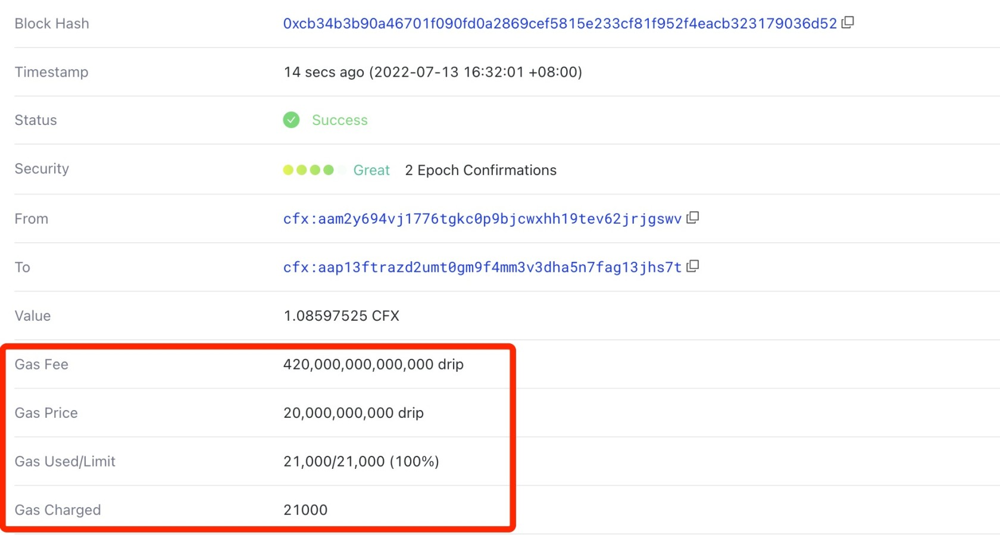

Conflux users(both Core Space and eSpace) usually see fields like `gasFee`, `gas`, and `gasPrice` when they are sending transactions using their wallets (Fluent) or SDK. This article is going to explain in detail about what these concepts mean.

## gasFee

在现实生活中，当我们在银行向别人汇款时，我们通常要支付交易费用。 在区块链（比特币、以太坊、Conflux）中发送交易也是一样的。 `gasFee`是发送交易的费用。 通常，它需要用链的原生代币来支付。 以Conflux为例，需要用CFX来支付交易费用（gas费用）。

## 为什么要支付费用

众所周知，区块链实际上是一个去中心化的账本，由矿工维护。 矿工存储数据和生成区块（计算哈希）有一定的成本。 因此，为了激励矿工积极参与链维护和保护网络安全，区块链共识系统被设计为包含一个对矿工的奖励机制，而交易费就是矿工的奖励之一，它将支付给参与生成区块的矿工。 这个机制可以保证整个去中心化网络的可持续性。

另外，gas费用机制也可以防止滥用交易，从而提高区块链利用效率。

## 什么是Gas

Gas的概念借鉴了现实中的“汽油”。 汽车消耗汽油来行驶。 汽车行驶得越远，消耗的汽油就越多。 在EVM区块链中，gas表示执行一笔交易所需的工作总量。 Therefore, it is a **unit that measures the amount of computation** required to perform certain operations.

具体来说，所有Conflux的交易都是由EVM执行的，包括普通的CFX转账和智能合约方法调用。 当这些操作被执行时，它们被编译成单个OPCode。 执行每个OPCode所需的工作量不同。 关于OPCode gas费用的更多信息可以在[这里](https://ethereum.org/en/developers/docs/evm/opcodes/)找到。

通常，一笔普通的CFX转账所消耗的gas为`21000`。 一笔智能合约交易通常需要更多，具体取决于合约执行的复杂度。

## Gas Limit

在构造一笔交易时，`gas`字段非常重要，因为该字段本身表示交易执行所能消耗的`gas的上限`。

正确填写gas字段非常重要。 如果燃料限制设置为小于实际所需gas量的值，交易将失败。 如果gas限制设置得太高，你可能会支付比你实际需要的更多的gas。

:::info

It should be mentioned that transaction will typically fail if the gas limit is exactly set to gas consumption due to [EIP-150](https://eips.ethereum.org/EIPS/eip-150).

:::

Conflux网络中单笔交易的最大gas限制是15M。 这确保了交易不会过度消耗EVM资源。

## gasPrice

交易的gasPrice由交易发送者指定，表示该人愿意支付的每单位gas的费用。 The unit of gasPrice is GDrip, where 1 GDrip is equal to 0.000000001 CFX (10**-9 CFX).

交易的gasPrice值影响了交易被矿工打包的速度，因为矿工会优先打包gasPrice较高的交易，以获得更多的利润。 当网络不拥堵时，将gasPrice设置为1Gdrip就足以正常打包。 然而，当网络拥堵时，更多的交易在等待打包。 这时，如果gasPrice设置得比大多数其他交易低，它将不会被打包，而是一直等待。

因此，如果你想让交易快速打包，你可以将gasPrice设置得高一些。 通常在Conflux中将其设置为10G-1000G就足够高，以确保它快速执行。

注意：不要将gasPrice设置得太高。 它可能导致天价的交易费用。 如果gasPrice设置为1CFX，那么一笔普通转账的费用是21000 CFX，这对于一笔交易来说是相当多的。

## 如何计算gasFee

gasFee是一笔交易支付的总gas费用。 It is calculated as `gasFee = gasCharged * gasPrice`. gasFee采用CFX的最小单位Drip。

假设有一笔1 CFX的普通转账，gas限制可以设置为21,000。 如果gasPrice设置为1GDrip，那么交易的总成本是`1 + 21000 * 0.000000001 = 1.000021 CFX`，其中1 CFX转到收款人的账户，0.000021 CFX是矿工的奖励。

### gasUsed

The actual gas consumed during transaction execution.

### gasCharged

The charged amount of gas. **The `gasCharged` may be greater than `gasUsed`, because not all unused gas will be refunded.**

In a Conflux transaction, if the `gas limit` is more than the actual amount of gas consumed (`gasUsed`), the exceeding part will be returned. The returning amount of gas **can only be up to** a quarter of the `gas limit`.

### 示例

假设一笔普通CFX转账的gas限制设置为100k，实际执行消耗了21,000，由于交易的gas限制设置得太高，最多有25,000的gas费用会被退还（gas limit的25%）。 该交易使用的gas将是`0.000075 CFX`。

如果交易的gas限制设置得不是那么高，以前面的例子为例，但将gas限制设置为25000，比实际使用的多4000，超出部分不超过gas限制的四分之一。 这部分将被完全退还，最终收取的费用仍然是`0.000021 CFX`。

## How to pay less gasFee？

There are strategies you can use to reduce the cost:

1.Gas prices go up and down every once in a while based on how congested Conflux is. When gas prices are high, waiting just a few minutes before making a transaction could see a significant drop in what you pay.

2.If you're a smart contract developer aiming to reduce gas costs, start by optimizing data storage, improving function execution, and utilizing efficient loops, among others. For a deeper dive into these techniques and more, check out our dedicated [Gas Optimization](/docs/general/build/smart-contracts/gas-optimization/) tutorial.

## 了解更多

- [Ethereum Developer Documentation: Gas and Fees](https://ethereum.org/en/developers/docs/gas/)

## 常见问题解答

### 1. Conflux网络中有没有符合EIP-1559标准的交易？

目前，在Conflux网络中，只有符合EIP-155标准的交易。