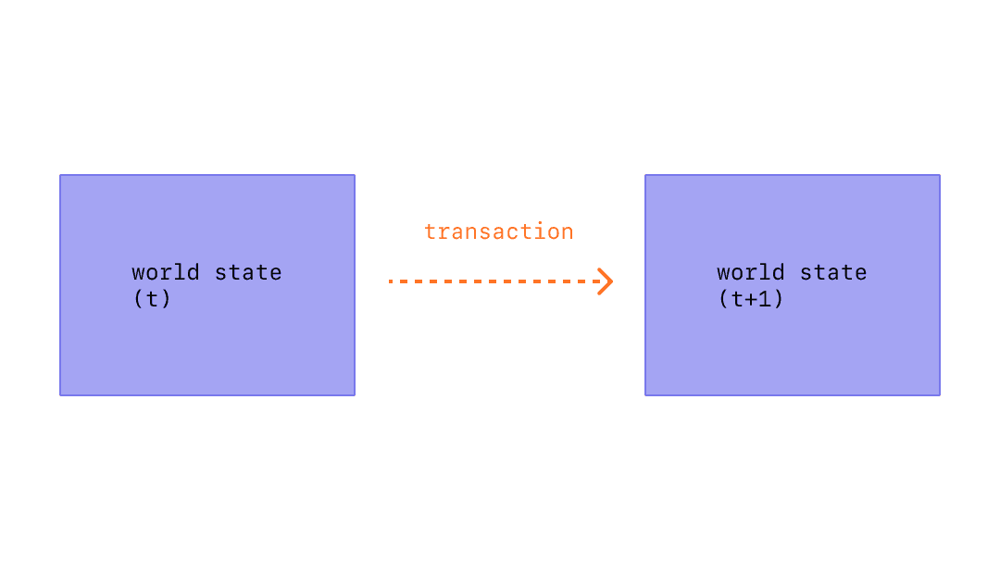

一笔交易是由具有Conflux账户的外部参与者创建的单一指令，该指令使用发送者账户的私钥进行了数字签名。 A transaction can involve a **simple transfer of CFX** (the native currency of Conflux), a **transfer of tokens** (such as ERC20 or ERC721), a **deployment of a new smart contract**, or an **execution of a function on an existing smart contract**. 交易是在区块链上存储或更新数据的唯一方式。

## 前提条件

To help you better understand this page, we recommend you first read [Accounts](./accounts.md).

## What's a Transaction?

An transaction refers to an action initiated by an externally-owned account, in other words an account managed by a human, not a contract. For example, if Bob sends Alice 1 CFX, Bob's account must be debited and Alice's must be credited. This state-changing action takes place within a transaction.

Transactions, which change the state of the EVM, need to be broadcast to the whole network. Any node can broadcast a request for a transaction to be executed on the EVM; after this happens, a validator will execute the transaction and propagate the resulting state change to the rest of the network.

A submitted transaction includes the following information:

* from – the address of the sender, that will be signing the transaction. 这将是一个外部拥有账户（EOA），因为合约账户不能发送交易。
* recipient – the receiving address (if an externally-owned account, the transaction will transfer value. 如果是合约账户，则交易将执行合约代码）。
* signature – the identifier of the sender. 这是在发送者的私钥签署交易并确认发送者已经授权该交易时生成的。
* nonce - a sequentially incrementing counter which indicates the transaction number from the account
* value – amount of CFX to transfer from sender to recipient (denominated in Drip, where 1CFX equals 1e+18Drip)
* input data – optional field to include arbitrary data
* gasLimit – the maximum amount of gas units that can be consumed by the transaction. EVM 指定了每个计算步骤所需的gas单位量。
* gasPrice - the price of the consumed gas to be included as a tip to the validator
* chainId - the id of the blockchain, which is used to prevent replay attacks

The Core Space transaction includes the following additional information:

* storageLimit - the maximum amount of storage space that can be consumed by the transaction.
* epochHeight - the epoch number of the blockchain, which is used to sets an expiration time for the transaction

## Gas Fee

Transactions require a fee and must be included in a validated block. The fee is paid in CFX and is calculated by multiplying the gasCharged by the gasPrice.

Gas fees are used to compensate miners, motivating them to package, validate blocks, and maintain the security of the blockchain.

For specific calculation details, please refer to [Transaction Fee](./gas.md).

## 交易生命周期

Once the transaction has been submitted the following happens:

1. A transaction hash is cryptographically generated: 0x97d99bc7729211111a21b12c933c949d4f31684f1d6954ff477d0477538ff017
2. The transaction is then broadcasted to the network and added to a transaction pool consisting of all other pending network transactions.
3. A validator must pick your transaction and include it in a block in order to verify the transaction and consider it "successful".
4. As time passes the block containing your transaction will be upgraded to "justified" then "finalized". These upgrades make it much more certain that your transaction was successful and will never be altered. Once a block is "finalized" it could only ever be changed by a network level attack that would cost many billions of dollars.

为了更详细地了解交易生命周期，你可以参考 [交易生命周期](/docs/core/core-space-basics/transactions/lifecycle.md)。

## Transaction Status

The transactions that are included in a block will eventually be executed, generating a [transaction **Receipt**](/docs/core/core-space-basics/transactions/receipt.md). However, not all transactions will be executed successfully; typically, transactions can have two states: **Success** or **Failure**.

For eSpace transactions, you can determine the execution status through the **status** field in the Receipt, where **1 represents success, and 0 represents failure**.

For Core transactions, you can check the execution status through the **outcomeStatus** field in the Receipt, where **0 represents success, and 1 represents failure**.

In addition to this, the Receipt also includes other information about the transaction execution, such as block information and event details.

### Edge Case: Failure without Bumping Nonce

Typically, a failed transaction will still increase the sender's nonce, and the user will need to pay gas fees. However, the v2.4 hardfork introduces an edge case: in a non-pivot block, if the transaction fee setting is insufficient to cover the burnt fee, the transaction will fail, but the sender's nonce will not increase. For a detailed illustration, check the [base fee](./basefee.md#minimum-fee-per-gas-during-transaction-execution).

## 详细信息

如果你想了解交易详情，你可以参考 [Core 空间](/docs/core/core-space-basics/transactions/overview.md) 中的交易解释。

## Intro Video

import Tabs from '@theme/Tabs';
import TabItem from '@theme/TabItem';

<Tabs>
  <TabItem value="youtube" label="Transactions on Conflux Network">
<iframe width="560" height="315" src="https://www.youtube.com/embed/GIeD2khbbXs?si=cTRZo6DalLkLguXi" title="YouTube 视频播放器" frameborder="0" allow="accelerometer; autoplay; clipboard-write; encrypted-media; gyroscope; picture-in-picture; web-share" allowfullscreen></iframe>
  </TabItem>
</Tabs>