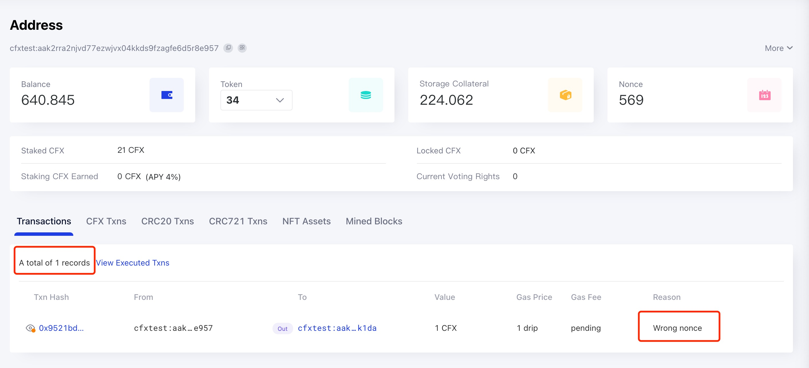

由于当前的区块链系统可能存在吞吐量低和准入门槛高等问题，因此通过区块链发送的某些交易可能无法被打包确认。 以 Conflux 为例，Conflux 网络通常每秒可以产生两个区块。 在交易` 成功发送后 `，它应该在约` 20 秒 `内被打包并执行，具体时间取决于网络拥塞程度。 如果交易长时间未被打包，很可能出现了问题，需要发送者进行手动干预。

## 如何查找待处理交易的原因？

如果待处理交易已成功插入 [ConfluxScan](https://www.confluxscan.io/) 使用的节点的交易池中，则可以在 Scan 上通过哈希搜索该交易，并在交易详细信息页面上查看交易状态为` Pending `。

 此时，我们可以进入交易发送者的` 账户详情页面 `，并通过账户页面上的` View Pending Txns `选项卡查看用户的待处理交易。

/

In this tab, you can see the total number of pending transactions of this user and the earliest pending transactions (up to 10). The most important thing is that you can also see the pending reasons for the first pending transaction. There are four possible reasons:

* Wrong nonce
* Stale epoch height
* Internal error
* Ready to pack

该页面使用 RPC 方法 [`cfx_getAccountPendingTransactions`](../../../core/build/json-rpc/cfx-namespace.md#cfx_getaccountpendingtransactions) 来获取一个账户的当前待处理交易信息。

### Wrong Nonce

这种错误意味着发送的交易使用了错误的 nonce。 通常情况下，交易需要按照 nonce 的顺序一个一个地执行。 如果队列中有 nonce 更小的待处理交易，这笔交易将等待直到所有先前的交易都成功执行。

在这种情况下，我们需要使用正确的 nonce 重新发送交易。 需要注意的是，在所有先前的交易都执行完成之后（并且余额充足的情况下），待处理交易将自动执行。

### Stale Epoch Height

The error message tells that `The epoch height of the first tx is too old to be packed. The sender needs to submit a new transaction to update the tx pool.`. Update the corresponding transaction with a correct `epochHeight` parameter(e.g. use `cfx_epochNumber`) will solve the issue.

### Internal Error

The error message tells that `The full node internal error. The sender needs to submit a new transaction to update the tx pool.`. This is typically triggered by certain complex balance setting. Make sure your account has enough balance, then submit a new transaction will solve the issue.

### Ready to Pack

This situation means that the transaction itself has reached the conditions that can be packaged, but because the entire network is relatively congested or for other reasons, it has not been packaged.

If the transaction is in this state for a long time, the gasPrice of the transaction can be increased appropriately to resend the transaction, which can improve the speed to package and execute a transaction.

## 如何正确设置 gasPrice？

交易的打包和执行速度主要受交易的 gasPrice 影响。 gasPrice 越高，交易被矿工打包的速度就越快，因此正确设置 gasPrice 非常重要。

您可以使用全节点的 `cfx_gasPrice` RPC 方法来获取建议的 gasPrice 值。 该方法会根据最新几个块的 gas 使用情况和其中交易的 gasPrice 给出建议的值。
