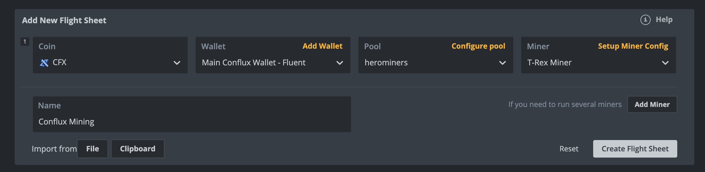

## Conflux网络PoW（工作量证明）- GPU挖矿指南

### Mining with HiveOS

HiveOS is a popular mining operating system that supports Conflux mining. Here's how to set it up:

1. **Create a HiveOS Account**
   - Go to [HiveOS website](https://hiveon.com/os/)
   - Sign up for a new account if you don't have one

2. **Create a Flight Sheet**
   - In your HiveOS dashboard, go to Flight Sheets
   - Click "Create Flight Sheet"
   - Select "Conflux (CFX)" as the coin
   - Choose your preferred miner software (i.e. T-rex, GMiner and Nbminer)
   - Different miner software have different mining fees and can have different mining speeds. A good miner software should have low mining fees, high mining speed (at low power consumption), good stability for the GPU, and potential support for dual-mining (for optimized mining profitability).

3. **Configure Mining Settings**
   - **Pool URL**: Choose a mining pool:
      - If not setting up your own node, Woolypooly, Herominers, etc. all support Conflux mining
      - The pool of choice should have low fees, and support the distribution of mining rewards desired (i.e. solo mining, PPLNS, etc.). Some pools require login and have different minimum payout thresholds. Other pools/nodes may have result in lower accepted/stale shares and thereby result in lower payouts over time
   - **Wallet Address**: Enter your Conflux wallet address (in core CFX side with Fluent) whereby the mining rewards are distributed to
   - **Worker Name**: Create a unique name for your rig

4. **Apply Flight Sheet**
   - Save your flight sheet
   - Select your rig(s)
   - Apply the flight sheet to begin mining

Some websites with overclocking settings for the GPU and estimated mining profitability:

- [Hashrate.no](https://hashrate.no/)
- [WhatToMine](https://whattomine.com/coins/337-cfx-octopus)

:::tip
Make sure to use a Base32 wallet address starting with 'cfx:' for mining.
:::

:::note
Mining profitability depends on various factors including electricity costs, hardware efficiency, and current network difficulty. Use mining calculators to estimate potential returns.
:::

