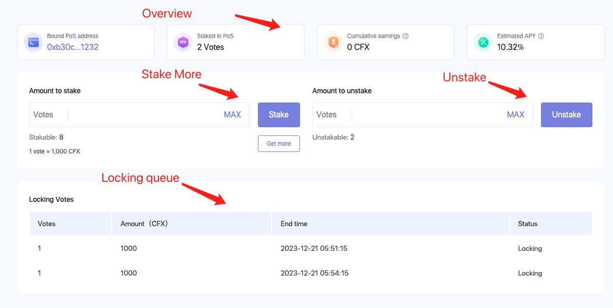

To become a solo validator, you’ll need to:

1. Run a Conflux node.
2. Register it in PoS.
3. Stake CFX in this PoS node.

This guide will walk you through the process of setting up a solo validator.

## 1. 运行Conflux节点

运行PoS节点同样是运行Conflux节点。 你可以按照[运行节点指南](/docs/general/run-a-node/Overview)来操作。 运行全节点或归档节点都可以。

节点的PoS配置文件位于下载的节点包中的 `pos_config` 目录。 此目录中的 `pos_config.yaml` 文件是PoS配置文件，通常不需要修改此文件中的设置。

首次启动节点时，系统会提示您设置密码以保护节点的PoS私钥。 请务必记住这个密码，因为一旦忘记，您将无法找回密码。 稍后重新启动节点时，将需要输入此密码。 私钥存储在节点目录的 `pos_config/pos_key` 文件中，建议备份此文件。

首次启动节点时，建议使用区块链数据快照，因为它可以大大加快节点同步速度。 有关如何使用区块链数据快照的信息，请参阅[区块链数据快照](/docs/general/run-a-node/snapshot-tool) 。

Once the node data is synchronized to the latest block (and the "Catch-up mode" in the node logs changes to false), you can proceed with PoS registration.

## 2. 在PoS中注册

### 前提条件

要成为验证者，你需要在PoS中注册你的节点。 注册节点需要一个 **Conflux Core账户** 和节点的 **PoS注册数据** 。

首先，你需要安装Fluent Wallet，并且账户中拥有至少 1000 CFX + gasFee。 因为每一个 PoS 投票需要1000 CFX。

然后，您可以在节点目录中运行以下命令来获取PoS注册数据：

```bash
./conflux rpc local pos register --power 1
# it will return something like this:
[
  "0xe335b451eb0d497f27d8d73d12d6c5f13b12b5c0ebad872dc59536341cd1f31c4ede98d8000000000000000000000000000000000000000000000000000000000000000100000000000000000000000000000000000000000000000000000000000000a0000000000000000000000000000000000000000000000000000000000000010000000000000000000000000000000000000000000000000000000000000001600000000000000000000000000000000000000000000000000000000000000030808c124f4a9b389f0c53a279cff171083c878437369189f03416836dfe7e10873b28db2df8109e226707388ac6588a6a0000000000000000000000000000000000000000000000000000000000000000000000000000000000000000000000210256c97da1270db8aad8dd7ed6785953c691b77dd9c0830c327ff3b4e637e9bb4200000000000000000000000000000000000000000000000000000000000000000000000000000000000000000000000000000000000000000000000000004000000000000000000000000000000000000000000000000000000000000000a00000000000000000000000000000000000000000000000000000000000000030b748cd4ed52f203e09a8299a5e29444a05fd0e8499de0a81ed4c00bb23ddd910f8eec13f0c67b8833f8bd4fbb1217f2b000000000000000000000000000000000000000000000000000000000000000000000000000000000000000000000020455b9bb17f42f8f6cd14450acb13959a1ddf2302b2c5ecf25c82cee371c2cf1f",
  "eb0d497f27d8d73d12d6c5f13b12b5c0ebad872dc59536341cd1f31c4ede98d8"
]
```

运行后会输出两个字符串，第一个是注册数据，第二个是 **PoS节点地址** 。

### 在此PoS节点中质押CFX

在您可以在PoS中注册您的节点之前，您需要在PoW中质押一些CFX，您可以使用[ConfluxHub的PoW质押工具](https://confluxhub.io/governance/pow-stake)来进行。


这个工具非常容易使用，只需连接您的Fluent钱包，输入您想要质押的CFX数量，然后点击“质押”按钮。 这里我们可以选择质押1000 CFX。

### Register

然后我们可以使用[ConfluxHub的PoS注册工具](https://confluxhub.io/pos/register)来注册我们的节点。

1. 将我们在上一步中获得的注册数据粘贴到“全节点数据”输入框中。
2. 在“投票”输入框中输入1。
3. 点击“注册并绑定”按钮。
4. 它会弹出一个窗口来确认交易，点击“确认”按钮。


交易执行后，注册数据将同步到PoS链上，同步过程大约需要10分钟。

## 3. Stake CFX in this PoS node

注册数据同步到PoS链后，您可以进入像[这样的页面](https://confluxhub.io/pos/increase)。



这是PoS验证者仪表板，您可以：

1. 查看验证者的状态：PoS地址，它拥有多少投票，获得了多少奖励等。
2. 向此验证者质押更多投票，或从中撤销投票。
3. 查看验证者的锁定和解锁投票。

### 质押更多投票

您可以随时向此验证者[**质押更多投票**](#stake-in-pow)，首先您需要在PoW中质押更多CFX，然后在“投票”输入框中输入您想要质押的投票数量，并点击“质押”按钮。 然后这些投票将在大约10分钟内同步到PoS链。

通常新质押的投票将在13天内处于**锁定中**状态。 13天后，这些投票将处于**已锁定**状态。 **锁定中**状态的投票也将获得奖励。

### 撤销投票

如果您想从这个验证者那里撤销一些投票，您可以在“投票”输入框中输入您想要撤销的投票数量，并点击“撤销”按钮。 然后这些投票将在大约10分钟内同步到PoS链。

通常撤销的投票将在1-14天内处于**解锁中**状态。 之后，这些投票将处于**已解锁**状态，并可以使用[ConfluxHub的PoW质押工具](#stake-in-pow)提现到您的账户。

## 在ConfluxScan中查看验证者的状态

您还可以在[ConfluxScan](https://confluxscan.io/)中查看验证者的状态。 通过访问此链接 **`https://confluxscan.io/pos/accounts/0x<your-pos-node-address>?tab=overview`**

在这个页面上，您可以查看：

1. 详细的验证者状态。
2. 进入历史。
3. 投票历史。
4. 待定权利状态：锁定和解锁投票。


## ConfluxHub主网与测试网

- [Confluxhub Mainnet](https://confluxhub.io/governance/pow-stake)
- [Confluxhub Testnet](https://test.confluxhub.io/governance/pow-stake)

## 常见问题解答

### 注册过程在Conflux的哪个space进行？

注册过程发生在Core Space中，此过程中需要Fluent Wallet。

### 如何领取我的奖励？

奖励将每半小时自动发送到您的 Core Space 账户。

### 预期的质押收益率是多少？

大约为每年10-14%

### 为什么我的节点没有被选中？

拥有的票数越多，被选中的可能性越高。 网络中总共有 **300** 个席位，您可以通过以下公式计算被选为验证者所需的票数：

网络中总质押CFX总量 / 300 = 被选为验证者所需的票数

另一个原因可能是您的节点未正确运行。您可以检查节点状态：

1. 节点是否与最新区块同步？
2. 节点的 `pos_key` 和 `pos_db/secure_storage.json` 是否匹配？ 如果不确定，您可以删除 `pos_db/secure_storage.json` 文件并重启节点；节点将重新生成 `pos_db/secure_storage.json` 文件。

### 运行节点时需注意哪些风险？

需要注意的风险包括：

1. PoS私钥的泄露或丢失风险。 请安全存储PoS私钥，避免将其上传至任何公共服务器。
2. PoS节点运行的稳定性。 如果节点被选为PoS委员会成员并且超过1.5小时未参与PoS投票，将被强制退休。 退休后将不再有奖励，但也不会有任何处罚。
3. 在两个PoS节点之间共享pos_key文件可能导致该节点的所有PoS票权永久锁定。 这是 **最严重的风险，应极为谨慎对待** 。

### 如何重新生成PoS私钥？

删除 `pos_config/pos_key` 和 `pos_db/secure_storage.json` ，然后重启节点将重新生成PoS私钥。**请确保您确实想删除这两个文件，因为一旦删除，您的PoS账户将无法恢复。**

### 在PoS中，从CFX质押到提现需要多长时间？

答：14天。

### How long does it take for unstaked PoS votes to be credited?

答：通常需要1-14天，这取决于质押的持续时间。 如果您的PoS投票已经质押超过13天，则撤销只需要一天。 如果是最近质押的，则需要满14天。

### 是否可以修改绑定到PoW账户的PoS节点？

答：可以修改，但需要撤销与PoS节点关联的所有投票。 一旦完成撤销过程，就可以将节点直接绑定到另一个PoS节点。

### PoS节点是否可以绑定到PoW的合约账户（非EOA账户）？ 合约是否需要实现receive或fallback函数？

答：可以将PoS节点绑定到合约账户，且无需实现receive或fallback函数。 这是因为奖励是由链直接挖给PoW账户，不涉及转账。
