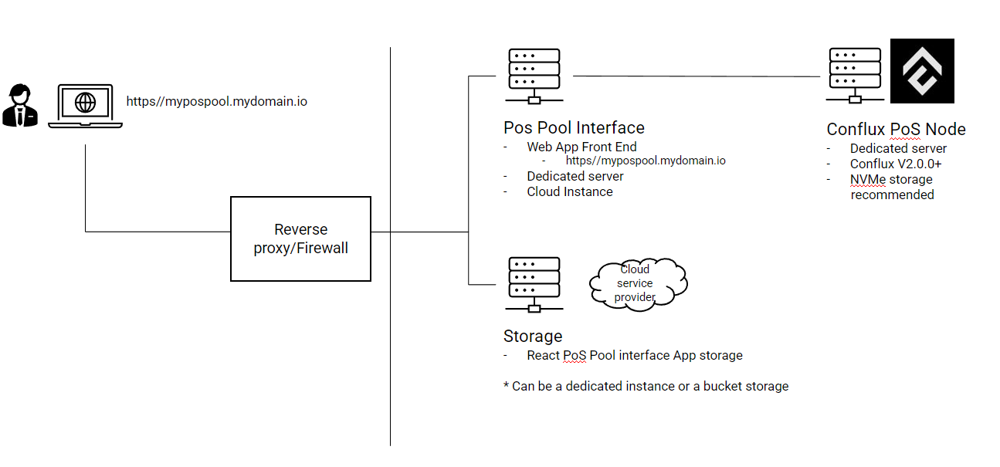

在本节中，我们提供了一个指南，介绍了如何部署、配置和管理一个**PoS池**，允许 CFX 持有者通过与PoS池前端应用程序进行交互而无需处理技术复杂性就加入PoS协议。

## 参考架构

Please note this configuration guide is to do the technical setup of the PoS Pool staking environment.

Conflux的PoS池配置有两个主要组成部分：接口应用程序和全节点。 It needs technical knowledge for configuration of instances, ports, contracts deployment and storage configuration.

推荐配置反向代理和防火墙，但这超出了本指南的范围。

## conflux-fans/pos-pool

[conflux-fans/pos-pool](https://github.com/conflux-fans/pos-pool)是一个提供PoS池接口和PoS池合约的开源项目。 我们可以使用它来建立一个PoS池dApp。

### 前提条件

PoS池运营商需要具备以下基础设施：

* 一个全节点/归档节点
* A Web Server Farm, or a single web server to run the POS Pool application

### 运行全节点/归档节点

首先，我们需要按照Conflux文档中的[说明](../../run-a-node/)运行一个全节点/归档节点。

### 部署PoS池合约

然后，我们需要按照pos-pool文档中的[说明](https://github.com/conflux-fans/pos-pool/tree/main/contract#setup)部署PoS池合约。

### Setup Pool Interface

Finally, we need to setup the PoS Pool interface following the [instructions](https://github.com/conflux-fans/pos-pool/blob/main/interface/README.md)

## 总结

**Conflux-fans/pos-pool**是PoS池的一个参考实现。 使用它需自担风险。 如果遇到任何问题，您可以查阅其[文档](https://github.com/conflux-fans/pos-pool/tree/main/contract/docs)、[常见问题解答](https://github.com/conflux-fans/pos-pool/tree/main#faqs)和[问题](https://github.com/conflux-fans/pos-pool/issues)。