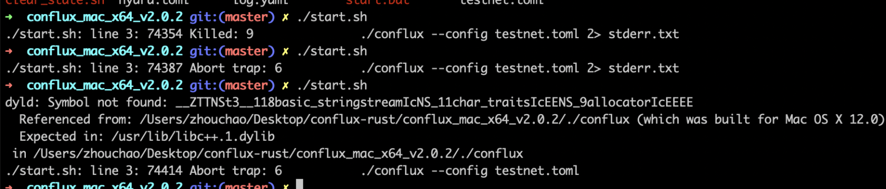

## Node startup failure.

### Linux: illegal instruction？

如果在使用官方提供的二进制文件启动节点时遇到 'illegal instruction' 错误，这表明您的CPU指令集与编译二进制文件时使用的指令集不匹配。 您可以尝试从发布页面下载兼容版本或自行编译。

### Linux: GLIBC_2.27 not found？

Conflux二进制文件依赖于 **glibc** 库。 如果系统未安装该库，或者安装的版本**过低**，您可能会遇到此错误。

### kvdb_rocksdb - DB has been previously marked as corrupted, attempting repair

这个错误发生是因为节点的数据文件已损坏，无法启动。 在这种情况下，您可以尝试删除数据目录，让节点重新同步数据。

如果您想快速启动节点，可以直接下载节点数据快照，解压并启动节点。

### Err value: PKCS#8 cryptographic error


这个错误可能是由于为pos_key输入的密码不正确。

### No such device or address

`failed to start full client: Os { code: 6, kind: Uncategorized, message: "No such device or address" }`

使用Docker启动节点时可能出现这个错误。 节点尝试从标准输入读取 pos_key 密码，如果无法读取，则返回错误。 在这种情况下，您可以在配置文件中配置密码，或将其设置为环境变量。

### Mac System Symbol not found



如果出现这种情况，表明宿主系统的版本过低。 目前，只支持macOS 12或以上的系统。

此外，在Mac上运行节点程序时，重要的是根据您电脑的架构选择正确的处理器版本。 M1和x86版本不可互换。

### Windows System  ExecutionContext exists for cur_era_genesis core\src\block_data_manager\mod.rs

在Windows系统上使用数据快照启动节点时，您可能会遇到以下错误：


### 节点在启动后不久崩溃。

如果这个问题发生在Linux系统上，可能是由于启动账户权限不足。 您可以尝试以sudo模式启动。

## 节点数据同步问题及其解决方法：

### 节点启动后无法连接到其他节点

可能是由于使用了错误的配置文件，例如使用主网二进制文件与测试网配置，测试网二进制文件与主网配置，或者在启动节点时**未指定配置文件**。

通常不连接到其他节点的根本原因是没有**正确指定启动节点**。

另一种可能性是由于网络问题导致节点无法连接到网络。

### 如何确定节点是否正常运行？

1. 检查运行日志中的**latest epoch**：

如果节点的运行日志中的**latest epoch**不断增加，或者通过`cfx_getStatus`方法获得的**epochNumber**持续上升，说明节点正在正常运行。

```txt
Catch-up mode: false, latest epoch: 85959xxxx
```

2. Check **StatisticsInner** in the running logs:

If the **latest epoch** in the node's running logs is not increasing, but the numbers in **SyncGraphStatistics** and **ConsensusGraphStatistics** within **StatisticsInner** keep growing, the node is still running normally.

```txt
Statistics: StatisticsInner { 
    sync_graph: SyncGraphStatistics { 
        inserted_block_count: 1195746, 
        inserted_header_count: 1324647 
    }, 
    consensus_graph: ConsensusGraphStatistics { 
        inserted_block_count: 154808, 
        activated_block_count: 1305980, 
        processed_block_count: 1305982 
    } 
}
```

3. Check **construct_pivot_state** in the running logs:

If the **index** or **height** keep increase, the node is running normally.

```txt
cfxcore::con - construct_pivot_state: index 30774 height 86370774 compute_epoch true
```

### 如何确定节点是否同步到最新的区块？

如果节点的运行日志显示**Catch-up mode: false**，表示节点已经同步到最新数据。

### 为什么我的节点没有在同步？

节点同步可能遇到各种问题，常见的包括：

1. 节点机器上的磁盘空间不足。
2. 网络问题，如进出带宽不足（推荐至少5M）。
3. Linux最大文件打开限制设置不够高（ulimit -n 10000）。
4. 配置文件指定不正确；没有正确的配置文件设置，无法定位启动节点，导致数据同步问题。 (当通过 Docker 和 挂载目录 启动时，很容易忘记指定配置文件。)
5. 检查节点的运行日志是否有任何错误。 （通过 start.sh 启动时，错误信息存储在 stderr.txt 中。）

如果检查了上述所有问题都不存在，但节点的 **latest epoch** 没有增加，那么节点可能正常运行但正在执行其他任务，如创建检查点。 在这种情况下，建议观察一段时间，因为这种情况可能持续数小时甚至数十小时。

### 重启节点后，纪元高度保持不变？

重启节点后，可能会 era 检查点进行状态重建操作。 这个过程需要较长时间，从半小时到几小时不等。 请耐心等待。

### 重启后同步为何需要较长时间？

重启节点后，它会从上一个检查点同步数据并重放区块数据。 所需时间根据距离上一个检查点的距离而异。 之后，它将开始从最新区块同步。

这是正常现象，通常会花费几分钟到十多分钟的时间。

### 为什么区块高度停止增长？

如果区块高度停止增长，您可以检查日志或终端以确定是否有任何错误。 如果没有错误，最有可能是由于网络原因，您可以尝试重启节点。

### 如何检查错误日志？

如果您通过 `start.sh` 运行节点，您可以在同一目录下的 `stderr.txt` 中检查错误日志。

### 在测试网上从头开始同步数据，同步过程中卡住

要在测试网上进行完整同步，需要将选项 `additional_maintained_snapshot_count` 增加到50。

### failed to calculate mempool broadcast RTT: SystemTimeError(1.2762543s)

```text
details = '''panicked at 'failed to calculate mempool broadcast RTT: SystemTimeError(1.2762543s)', core\src\pos\mempool\shared_mempool\peer_manager.rs:400:18'''
backtrace = '''
   0:     0x7ff737fa5645 - backtrace::backtrace::trace::hab5abe5046f447b5
   1:     0x7ff737fa4aac - backtrace::capture::Backtrace::new::hd9f1f4afb992e4d5
   2:     0x7ff73781b172 - crash_handler::setup_panic_handler::he3eed2ba07c7a235
   3:     0x7ff7380d6cf6 - std::panicking::rust_panic_with_hook
                               at /rustc/9d1b2106e23b1abd32fce1f17267604a5102f57a\/library\std\src\panicking.rs:610
   4:     0x7ff7380d6afb - std::panicking::begin_panic_handler::closure$0
                               at /rustc/9d1b2106e23b1abd32fce1f17267604a5102f57a\/library\std\src\panicking.rs:502
   5:     0x7ff7380d4377 - std::sys_common::backtrace::__rust_end_short_backtrace<std::panicking::begin_panic_handler::closure$0,never$>
                               at /rustc/9d1b2106e23b1abd32fce1f17267604a5102f57a\/library\std\src\sys_common\backtrace.rs:139
   6:     0x7ff7380d67f9 - std::panicking::begin_panic_handler
                               at /rustc/9d1b2106e23b1abd32fce1f17267604a5102f57a\/library\std\src\panicking.rs:498
   7:     0x7ff7384c8e10 - core::panicking::panic_fmt
                               at /rustc/9d1b2106e23b1abd32fce1f17267604a5102f57a\/library\core\src\panicking.rs:116
   8:     0x7ff7384c8f23 - core::result::unwrap_failed
                               at /rustc/9d1b2106e23b1abd32fce1f17267604a5102f57a\/library\core\src\result.rs:1690
   9:     0x7ff7374fcb6f - cfxcore::pos::mempool::shared_mempool::peer_manager::PeerManager::process_broadcast_ack::h66a5c6263f1cb4c5
  10:     0x7ff7374f5e19 - cfxcore::pos::mempool::shared_mempool::coordinator::coordinator::{{closure}}::h6c1ff8196b71855b
  11:     0x7ff737543216 - std::panicking::try::hd909c3032f511b0c
  12:     0x7ff73776aca6 - tokio::runtime::task::harness::Harness<T,S>::complete::hf2bbf17ca3ded03d
  13:     0x7ff73775b7ee - tokio::runtime::task::harness::Harness<T,S>::poll::h0348d72954fb7fe3
  14:     0x7ff7379a174f - std::thread::local::LocalKey<T>::with::h1b1b4832535dd8eb
  15:     0x7ff7379a0508 - tokio::runtime::thread_pool::worker::Context::run::h1871366c06b8b19b
  16:     0x7ff73799f313 - tokio::runtime::thread_pool::worker::Context::run::h1871366c06b8b19b
  17:     0x7ff737997b08 - tokio::macros::scoped_tls::ScopedKey<T>::set::h72c7679a82ac49e7
  18:     0x7ff73799ee3a - tokio::runtime::thread_pool::worker::run::he96293bdc96c9c85
  19:     0x7ff7379a25d5 - tokio::runtime::task::core::CoreStage<T>::poll::hfebd390d78b509ef
  20:     0x7ff7379a6036 - std::panicking::try::h2cdfe9794da6da4e
  21:     0x7ff7379a4150 - tokio::runtime::task::harness::Harness<T,S>::poll::h32aca2917e8ece97
  22:     0x7ff737994efc - tokio::runtime::blocking::pool::Inner::run::h50dc8a99eae64ddb
  23:     0x7ff737990855 - std::sys_common::backtrace::__rust_begin_short_backtrace::hd7f858c23b97e5cf
  24:     0x7ff7379a1203 - <&T as core::fmt::Debug>::fmt::hd9ffef8910ae9eb8
  25:     0x7ff7380dd69c - alloc::boxed::impl$44::call_once
                               at /rustc/9d1b2106e23b1abd32fce1f17267604a5102f57a\library\alloc\src\boxed.rs:1854
  26:     0x7ff7380dd69c - alloc::boxed::impl$44::call_once
                               at /rustc/9d1b2106e23b1abd32fce1f17267604a5102f57a\library\alloc\src\boxed.rs:1854
  27:     0x7ff7380dd69c - std::sys::windows::thread::impl$0::new::thread_start
                               at /rustc/9d1b2106e23b1abd32fce1f17267604a5102f57a\/library\std\src\sys\windows\thread.rs:58
  28:     0x7ffc35637034 - BaseThreadInitThunk
  29:     0x7ffc36822651 - RtlUserThreadStart
```

This error is caused by the system API returning a system time that is set backward. 建议及时同步时间，以避免系统时间偏差的扩大。

## 正常节点运行日志

在节点运行期间，出现以下信息，这些信息不影响节点的正常功能，可以忽略。

### ERROR IO Worker #2 cfxcore::con - Fail to recover state_valid


### INFO COW copy failed, check file system support

INFO Background Snapshot cfx_storage: - COW copy failed, check file system support. Command "cp" "-R" "--reflink=always"

这些消息是提示，表明机器的文件系统不支持写时复制（COW）功能。 这不会影响节点的操作。 如果机器支持COW，可以帮助提高节点性能。

### WARN  Socket IO Worker #2  cfxcore::tra - an unexecuted tx is garbage-collected.

过多的交易在交易池中会导致池中的交易被回收。 这不会影响节点的正常运行。