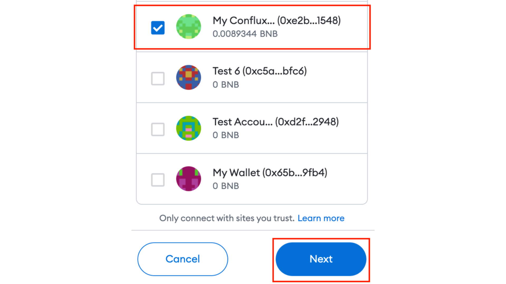
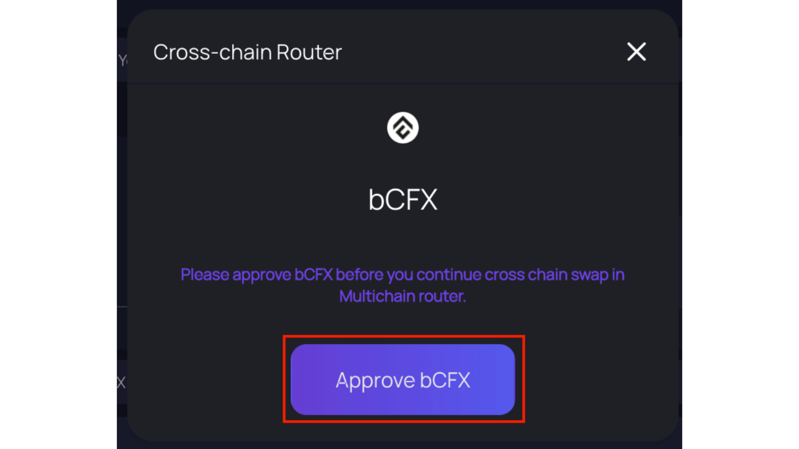
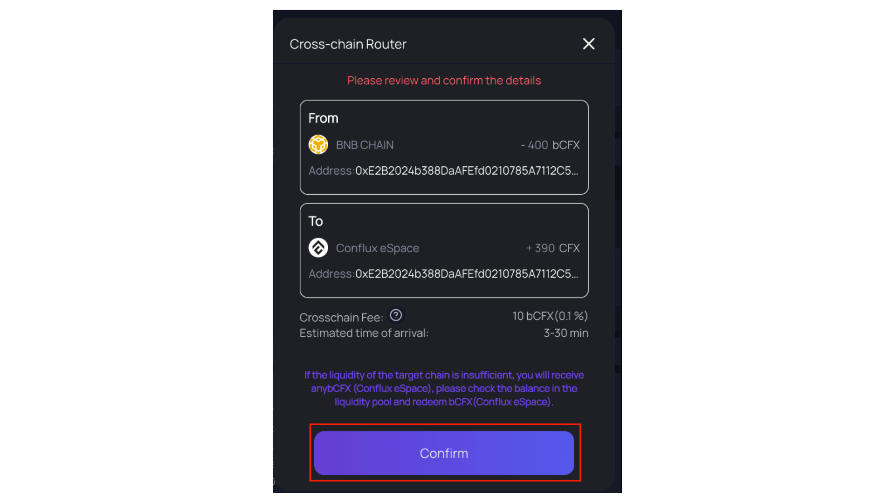
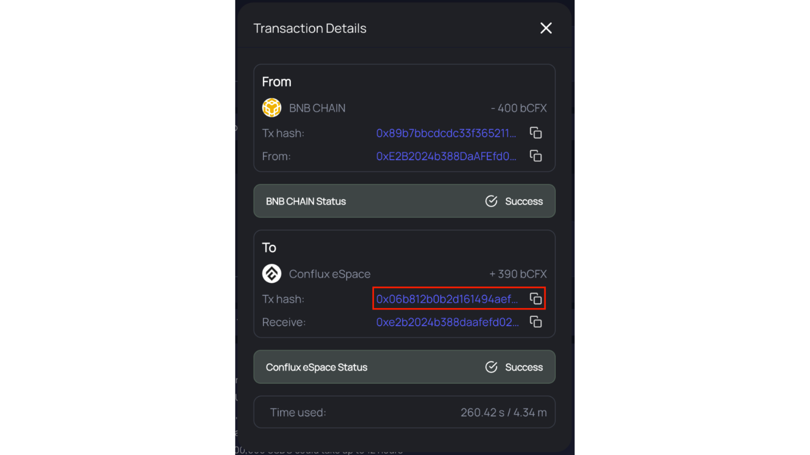

:::note 提醒币安用户和 bCFX 持有者：在币安上，Conflux 被列为封装的 ERC-20 代币(bCFX)，而不是原生的 CFX。 Conflux eSpace和BNB Chain使用兼容EVM的地址，但这些地址位于不同的区块链上。
:::

[Multichain](https://conflux.multichain.org/#/router)是支持多个网络的跨链桥。 通过 Multichain，您可以在不同的网络之间桥接不同的代币到 Conflux eSpace 或从 Conflux eSpace 到其他网络。 在本教程中，我们将通过Multichain将BNB Chain中的bCFX转移到Conflux eSpace。

## 前提条件
- 一个存有 bCFX 和 BNB 的 BNB Chain 账户。
- 为了本教程的目的，我们将使用 Multichain 将 bCFX 从 BNB Chain 桥接到 Conflux eSpace。 然而，Multichain也支持其它链和代币。
- 请确保你的MetaMask钱包已经连接到了Conflux eSpace网络。

## 通过Multichain将bCFX桥接到Conflux eSpace

1. 请前往[Multichain](https://conflux.multichain.org/#/router)
2. 点击**连接钱包**按钮开始连接你的钱包。

3. 在“连接钱包”对话框中，点击 **MetaMask**。

4. 在使用 MetaMask 连接对话框中，选择您希望连接的钱包，然后点击**Next**。

5. 点击 **Connect** 确认连接到该网站。

6. 在 From 框中，切换到 **BNB CHAIN mainnet** 网络。

7. 在代币列表中，搜索 bCFX 并点击 **bCFX** 代币。

8. 在金额字段中，输入您希望转移到Conflux eSpace的bCFX数量。

9. 在 "To" 区域，切换到 **Conflux eSpace mainnet** 网络。

10. 由于 Multichain 只支持将 BNB Chain 上的 bCFX 作为CFX桥接到Conflux ，因此请将代币选择为 CFX。

11. 确认您将在 Conflux 中收到的 CFX 数量。

12. 点击 **Approve bCFX** 开始桥接您的代币。

13. 在跨链路由器对话框中，点击**Approve bCFX**，开始批准 Multichain 转移你的代币。

14. 请在MetaMask中点击**Confirm**，以授权Multichain转移您的代币。

15. 一旦转账被批准，点击 Swap 按钮开始在 Conflux eSpace 中提取你的资金。

16. 在跨链路由器对话框中，审查和确认交易详情，然后点击**Confirm**。

17. 在 MetaMask 的通知中，点击 **Confirm** 以确认交易并桥接您的资产。
- **注意**: 此交易可能需要几分钟来完成。

18. Once the transaction is completed, click the Tx hash to view the transaction details in [Confluxscan](https://confluxscan.io/).

您现在已经将您的资金桥接到 Conflux eSpace！

