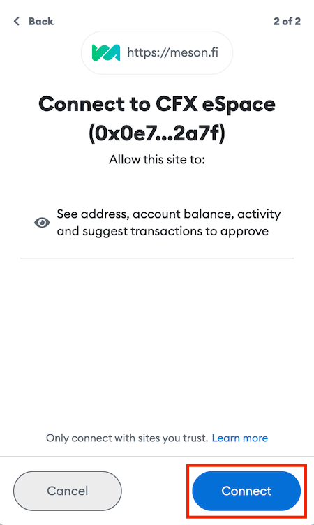
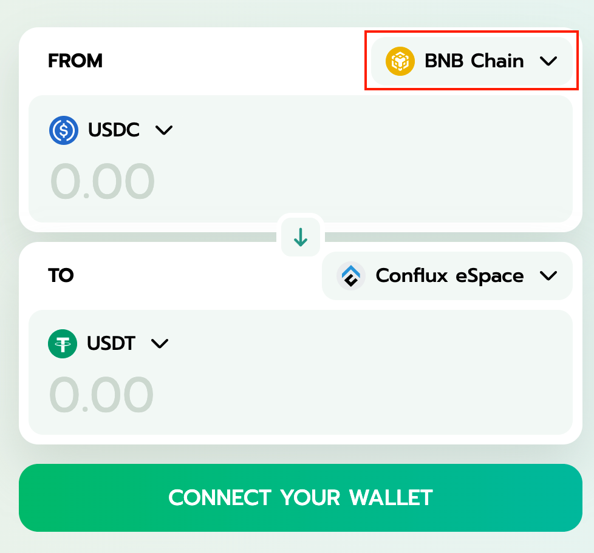

# 使用 Meson 跨链转移稳定币

[Meson](https://meson.fi/zh) 是一个支持多个网络的稳定币跨链交换协议。 使用Meson，您可以将来自不同网络的USDC或USDT代币桥接到Conflux eSpace，或者从Conflux eSpace桥接到其他网络。
- 在本指南中，我们将通过 Meson 将 BNB Chain 上的 USDC 转换为 Conflux eSpace 上的 USDT。

## 前提条件

- 在以下任意网络中有USDC或USDT稳定币：
- Ethereum (USDC/USDT)
- BNB Chain (USDC/USDT)
- Tron (USDT)
- Avalanche (USDC)
- Fantom (USDC)
- Polygon (USDC)
- Conflux (USDC/USDT)
- 请确保你的MetaMask钱包已经连接到了Conflux eSpace网络。

## 使用 Meson 将稳定币桥接到 Conflux eSpace

1. 前往[Meson](https://meson.fi/zh)。
2. 点击**Connect Wallet**，将MetaMask连接到Meson。

3. 选择您希望在 Meson 上使用的账户，然后点击下一步。

4. 点击**Connect**确认连接到该网站。

你的 MetaMask 钱包现在已经连接到 Meson。 现在让我们开始跨链。

5. 在**FROM**下拉列表中，选择您将要转移资产的网络(例如：BNB Chain)。

6. 在token type下拉列表中，选择**USDC**。

7. 输入您想转移的 USDC 数量。

8. 在 **TO** 下拉列表中，选择 **Conflux eSpace**。

9. 确认交易细节，然后点击 **Swap**。

10. 在弹出的 Approve 窗口中，点击 **Approve**，以调用 MetaMask 并授权 Meson 访问您的资金。

:::note  
授权操作需要燃气费，不过这是你唯一需要支付燃气费的时候，其它步骤的燃气费由 Meson 承担。
:::

11. 在 MetaMask 中，点击 **Confirm** 来授权 Meson 访问您的资金。

12. 一旦你允许 MetaMask 访问你的资金，点击 Swap Summary 中的 **Confirm** 来确认即将进行的兑换交易。

13. 现在在 MetaMask 中，点击 **Sign** 以签名并继续执行交易。

14. 在Swap Summary中，等待交换请求被处理。 :::note    
    这可能需要约1分钟。
:::

15. 一旦交换请求交易被处理，点击 MetaMask 上的 **Sign** 来释放在 Conflux 中的资金。

您现在已经将您的资金桥接到 Conflux eSpace！

## 验证交易

验证交易：

1. 打开钱包菜单。

2. 点击 Swap ID 以打开 Meson 交易浏览器。

3. 你可以在两个网络的区块链浏览器上验证交易。

## 其他资源

- 了解更多关于Meson的信息，请查看[Meson's blog](https://medium.com/@mesonfi)。
