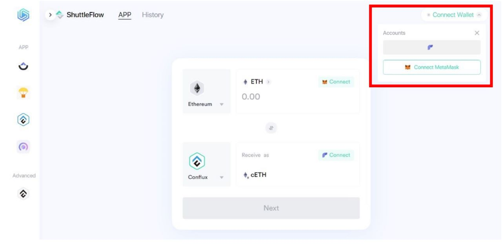
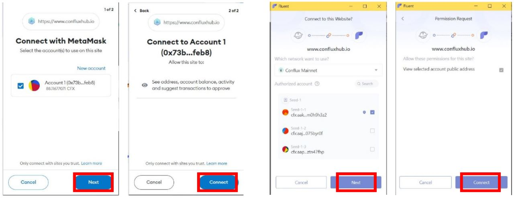

## 使用ShuttleFlow跨链转移资金

要将资金从其他链转到Conflux Core Space，用户可以在 [ConfluxHub](https://www.confluxhub.io/shuttle-flow)的ShuttleFlow 页面做到这一点。

ShuttleFlow是一个去中心化的跨链资产转移协议，允许用户在不同的区块链网络之间转移他们的资产，例如Conflux Core、以太坊和币安智能链。 通过使用ShuttleFlow，用户可以快速、安全和低成本地转移其资产。

下面是关于如何使用ShuttleFlow转移资产的分步指南：

**第 1 步：连接您的钱包**

第一步是连接你的钱包。 您需要在Conflux Core网络上使用Fluent钱包，在其他网络上使用MetaMask。

 

**第 2 步：选择资产和网络**

一旦你的钱包连接成功，选择你想要转移的资产和你想要转移到的网络。 在这种情况下，我们将从Conflux Core转移CFX到Binance Smart Chain。

**第 3 步：发起转账**

点击 **Next** 按钮来发起转账。

**第 4 步：输入转账信息**

输入您想要转移的CFX数量和您希望接收代币的BSC地址。 您还需要批准交易并支付燃气费用。

**第5步：确认并等待转账完成**

一旦您输入了所有必要的信息并支付了燃气费用，请确认交易。 随后，ShuttleFlow 将处理该转账，并且您需要等待交易确认。

**第 6 步：检查您的钱包**

转移完成后，您应该在您的 BSC 钱包中看到已转移的资产。 恭喜！ 您已成功使用 ShuttleFlow 转移您的资产。

:::note 
当从另一个链转移资产到 Conflux Core 时，该过程类似。
:::