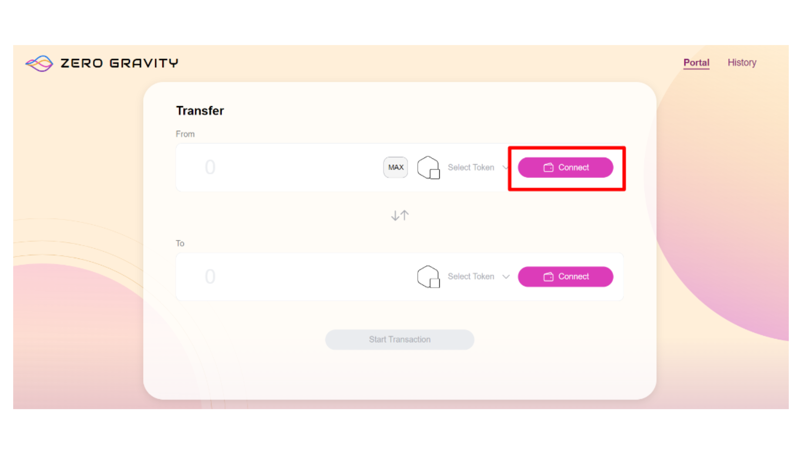
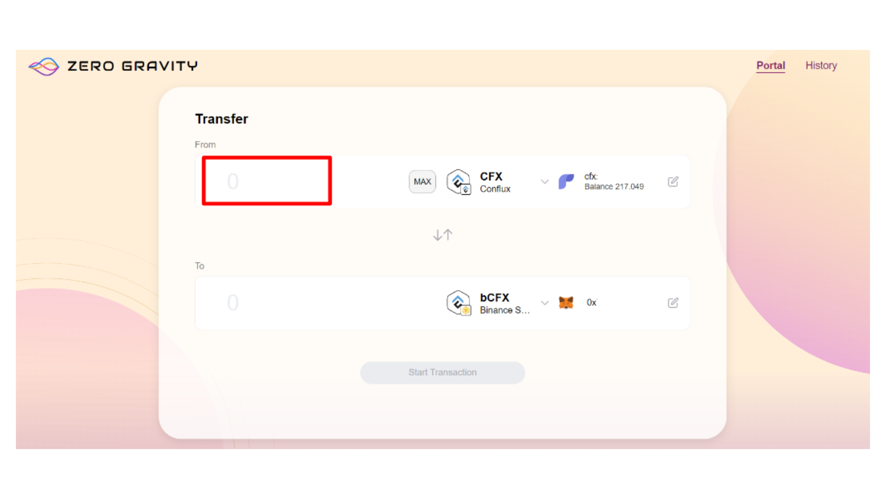

# 使用Zero Gravity跨链转移资产

使用[Zero Gravity](https://portal.zglabs.org/)是在Conflux Core Space和其他链之间转移资产的最简单方法之一。
开始之前，我们建议设置两个钱包：Fluent 用于 Core Space 和 MetaMask 用于您选择的其他链。
在本教程中，我们将解释从Conflux Core Space转移CFX到BNB Smart Chain的步骤。

## 在使用教程前，您需要准备

- 拥有至少200 CFX的Fluent钱包。
- MetaMask钱包。

## 从Conflux Core转移CFX到BNB Smart Chain

1. 访问Zero Gravity网页应用：https\://portal.zglabs.org/

2. 点击连接钱包将您的Fluent连接到Zero Gravity。

3. 点击连接钱包将您的MetaMask连接到Zero Gravity。

4. 在FROM下拉列表中，选择您要从哪个网络和代币转移资产。

5. 在TO下拉列表中，选择您要转移资产的目标网络。

6. 输入您想要转移的金额。

7. 点击开始交易。

8. 确认交易细节。

9. 完成跨链转移后，您可以使用相应的区块链浏览器验证资产转移。 资产将显示在您的目的钱包中。

## 常见问题解答

### Q: 如果我的CFX从另一个链（如Binance Smart Chain）转移到Conflux Network，在提现过程中卡在持续加载循环中，我该怎么办？

**A:** 如果跨链桥接界面持续加载而无法完成CFX提现，这可能是前端问题。 首先清除您的网络浏览器缓存，以消除可能导致问题的任何存储数据。 如果问题仍然存在，请尝试切换到另一个网络浏览器并再次尝试提现。 这一步经常有助于解决浏览器特定的故障或跨链桥用户界面的兼容性问题。

### Q: 为什么我收到**PeggedCFX**而不是CFX？

**A**: 收到 _**PeggedCFX**_ 表明跨链桥中CFX流动性不足，这种情况通常出现在Conflux eSpace。 一旦eSpace被提供了额外的流动性，您可以访问 [https://confluxhub.io/espace-bridge/espace-cross-chain](https://confluxhub.io/espace-bridge/espace-cross-chain) 来领取您的CFX。 或者，您可以选择将PeggedCFX发送回Binance Smart Chain（BSC）。
