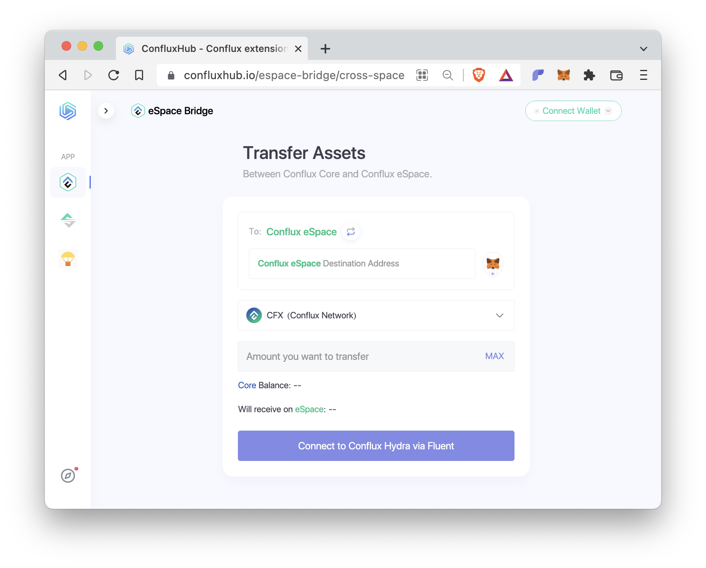

# 跨空间转账

## ConfluxHub

使用[ConfluxHub](https://confluxhub.io/espace-bridge/cross-space)是在Core Space和eSpace之间转移资产最简单的方式。 我们建议您设置两个钱包：用于Core Space的[Fluent](https://fluentwallet.com/)和用于eSpace的[MetaMask](https://metamask.io/)。

按照这些步骤进行跨空间转账：

- 点击 `连接钱包` 来将您的Fluent和MetaMask钱包连接到 ConfluxHub。
- `To: Conflux eSpace` 顶部显示了您正在从Core Space转账到eSpace。 如果您想要在另一个方向进行传输，请点击此文本旁边的箭头。
- 在 `Conflux eSpace Destination Address` 字段中输入您的eSpace地址，或点击右边的 MetaMask图标自动填写此字段。
- 接下来，选择您想要转移的代币，输入转移数量。
- 如果底部的按钮显示为`Approve`，则需要点击该按钮先提交一个ERC20代币的授权。
- 一旦底部的按钮显示 `Transfer`，点击它进行转账。

将资产从 eSpace 转移到 Core Space 的跨空间转账也是一个类似的过程，但包含两个主要步骤：首先，将代币转移到 eSpace 上的桥接合约。 第二步，从 Core Space 上的桥接合约中提取代币。 请按照网站的说明进行操作。

**⚠️ 当进行跨空间转账时，请始终仔细检查地址，以避免意外的资产损失。**
