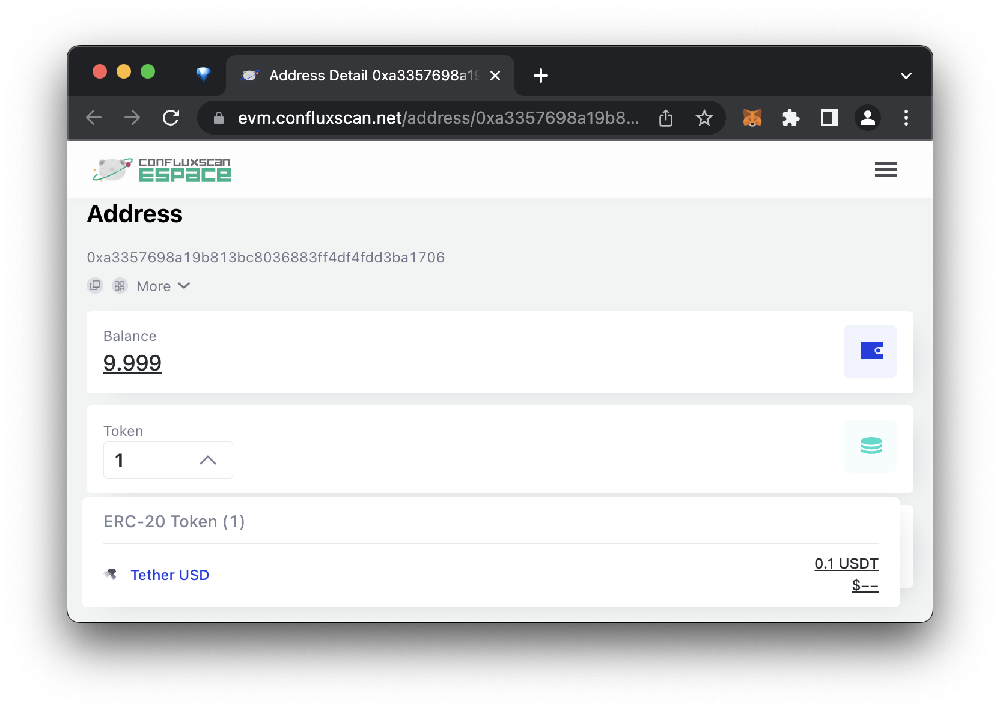

import { DiscordLink } from "../../../templates/links.tsx"

:::tip

此钱包支持Core和eSpace两种模式

:::

## 简介

您现在可以使用 **Ledger Nano S** 或 **Ledger Nano X** 硬件钱包在 Core Space 和 eSpace 上安全地存储您的资产。 在这个指南中，我们将向您展示如何使用 Ledger 设备与 Conflux 互动以及如何转移资产。

## 在 Conflux eSpace 上使用 Ledger

### 开始前的准备工作：

在您开始之前，请确保您已经做了以下工作：

**-**  初始化了您的 [Nano S](https://support.ledger.com/hc/en-us/articles/360000613793-Set-up-your-Ledger-Nano-S?docs=true) 或 [Nano X](https://support.ledger.com/hc/en-us/articles/360018784134-Set-up-your-Ledger-Nano-X?docs=true) 设备。

**-**  更新您的 [Nano S](https://support.ledger.com/hc/en-us/articles/360002731113-Update-Ledger-Nano-S-firmware?docs=true) 或 [Nano X](https://support.ledger.com/hc/en-us/articles/360013349800-Update-Ledger-Nano-X-firmware?docs=true) 设备到最新的固件版本。

**-**  安装 [Ledger Live](https://www.ledger.com/ledger-live) 并将其更新到最新版本。

**-**  在兼容的桌面浏览器上安装[Fluent Wallet](https://fluentwallet.com/)。

如果您遇到任何问题，请在 <DiscordLink>Discord</DiscordLink> 或者 [Telegram](https://t.me/Conflux_English) 上联系我们，我们很乐意提供帮助。

### 安装

:::note
Conflux的Ledger应用程序目前只提供 **未经审核的开发者版本**。 请自行承担使用风险。
:::

您可以通过以下步骤在您的Ledger设备上安装 **Conflux应用程序**：

**1.** 通过 USB 将您的Ledger Nano S 或 Ledger Nano X 设备连接到您的计算机。

**2.**  输入您的 PIN 码解锁您的设备。

**3.**  打开Ledger Live.

**4.**  点击右上角的齿轮图标来打开设置。

**5.**  转到“Experimental features”并启用"Developer mode"。

**6.**  在左边的菜单中，点击“Manager”打开Ledger Live 应用程序管理器。

**7.**  当您的Ledger设备显示“Allow Ledger manager”时，同时按两个按钮以继续。

**8.**  回到Ledger Live, 在“App catalog”选项卡下，在搜索字段中输入“Conflux”。

**9.**  一旦Ledger Live显示Conflux 应用程序，请按“安装”。

Conflux 应用就安装成功了。

### 连接您的Ledger设备到Fluent

您可以通过以下步骤从您的Ledger设备导入账户到您的Fluent wallet：

**1.** 如果当前打开了Ledger Live，请退出。

**2.** 通过 USB 将您的Ledger Nano S 或 Ledger Nano X 设备连接到您的计算机。

**3.** 输入您的 PIN 码解锁您的设备。

**4.** 在您的设备上找到到Conflux应用，并按下两个按钮打开它。

**5.** 在Fluent中，在右上角打开菜单并选择“帐户管理”。

**6.** 点击"添加"并选择"硬件钱包"。 仔细阅读说明并点击"开始连接"。

**7.** 在“连接你的Ledger”页面上，点击"连接"。

**8.** 一个浏览器弹出窗口将会说"Fluent Wallet想要进行连接"。 从列表中选择您的Ledger设备，然后点击“连接”。

**9.** 几秒后，“选择地址”页面会在Fluent Wallet显示。 选择一个或多个您想要导入到 Fluent 的账户，然后点击“导入”。

您的账户现在已经可在 Fluent 中使用，名称为 "LedgerNanoS-1"（或类似名称）。

### 使用Ledger：加密资产转账

假设您在Ledger设备上的账户中有一些CFX代币，则以下步骤说明如何在Conflux上进行CFX转账。

:::note
如果您没有CFX，可以在列在[这里](https://123cfx.com/#Exchanges)的交易所之一购买。
:::

请确保您已经将您的Ledger账户已经导入到您的Fluent 钱包，方法和上一节的步骤相同。 如果当前打开了Ledger Live，请退出。

**1.** 通过 USB 将您的Ledger Nano S 或 Ledger Nano X 设备连接到您的计算机。

**2.** 输入您的 PIN 码解锁您的设备。

**3.** 在您的设备上找到到**Conflux应用**，并按下两个按钮打开它。

**4.** 在 Fluent钱包中, 中选择您的 Ledger 账户(例如，"LedgerNanoS-1")。

**5.** 点击 "Send" 并输入收款地址。

**6.** 在“代币和数量”下，输入CFX的转账金额，然后点击“下一步”。

**7.** 仔细检查交易细节，然后点击“确认”。

**8.** 您的Ledger设备将显示“审核交易”。 **仔细检查交易金额和收款地址**，可以通过多次按下设备上的右按钮来完成。

**9.** 如果一切看起来正确，请在"接受并发送"界面上同时按下两个按钮以批准交易。 否则，按“拒绝”界面上的两个按钮来拒绝交易。

交易被批准后，它现在已被签名并发送到Conflux网络。 您可以在 Fluent 中看到交易状态。 如果您在“历史记录”中点击交易右上角的箭头图标， 您可以在 [Conflux Scan](https://confluxscan.io) 上看到更多交易细节。

### 后续步骤

你可以在 [confluxnetwork.org](https://confluxnetwork.org) 了解更多关于Conflux的信息。 您可以在 [Conflux Scan](https://confluxscan.io) 上检查交易和帐户细节。

如果您遇到任何问题，请在 <DiscordLink>Discord</DiscordLink> 或者 [Telegram](https://t.me/Conflux_English) 上联系我们，我们很乐意提供帮助。

## 在 Conflux eSpace 上使用 Ledger

:::note
**Conflux eSpace 的 Ledger 应用程序目前尚未在 Ledger Live 中提供。**
:::

### 开始前的准备工作：

在您开始之前，请确保您已经做了以下工作：

- 初始化了您的 [Nano S](https://support.ledger.com/hc/en-us/articles/360000613793-Set-up-your-Ledger-Nano-S?docs=true) 或 [Nano X](https://support.ledger.com/hc/en-us/articles/360018784134-Set-up-your-Ledger-Nano-X?docs=true) 设备。
- 更新您的 [Nano S](https://support.ledger.com/hc/en-us/articles/360002731113-Update-Ledger-Nano-S-firmware?docs=true) 或 [Nano X](https://support.ledger.com/hc/en-us/articles/360013349800-Update-Ledger-Nano-X-firmware?docs=true) 设备到最新的固件版本。
- 安装 [Ledger Live](https://www.ledger.com/ledger-live) 并将其更新到最新版本。
- 在兼容的桌面浏览器上安装[MetaMask](https://metamask.io)。

如果您遇到任何问题，请在 <DiscordLink>Discord</DiscordLink> 或者 [Telegram](https://t.me/Conflux_English) 上联系我们，我们很乐意提供帮助。

### 安装

您可以通过以下步骤在您的 Ledger 设备上安装 **以太坊应用程序**：

1. 通过 USB 将您的Ledger Nano S 或 Ledger Nano X 设备连接到您的计算机。
1. 输入您的 PIN 码解锁您的设备。
1. 打开 Ledger Live。
1. 在左边的菜单中，点击“管理”打开Ledger Live 应用程序管理器。
1. 当您的Ledger设备显示“允许Ledger管理器”时，请按下两个按钮以继续。
1. 回到 Ledger Live, 在 “App catalog” 选项卡下，在搜索字段中输入 “Conflux”。
1. 当 Ledger Live 上显示 Conflux 应用程序时，请点击“安装”。
1. 现在，以太坊应用程序就已经安装成功了。

### 设置 MetaMask

#### 连接您的 MetaMask 钱包到 Conflux eSpace

您可以通过以下步骤添加 Conflux eSpace 网络到您的 MetaMask 钱包：

1. 打开浏览器，访问 https://evmchainlist.org。
1. 搜索“Conflux eSpace”
1. 点击“连接钱包”以允许该网站向MetaMask发送请求。
1. 点击“Conflux eSpace”下面的“添加到MetaMask”。
1. 当 MetaMask 提示“允许此站点添加网络？”时，点击“批准”。
1. 当 MetaMask 提示“允许此站点切换网络？”时，点击“批准”。

您的 MetaMask 钱包现在已连接到 Conflux eSpace。 您可以随时通过Metamask中的网络选择菜单切换到其他网络。

您也可以手动在“设置”、“网络”、“添加网络”下将 Conflux eSpace 添加到 MetaMask 中：

- **Network Name**: Conflux eSpace
- **New RPC URL**: https://evm.confluxrpc.com
- **Chain ID**: 1030
- **货币符号**：CFX
- **区块链浏览器 URL**：https://evm.confluxscan.net

#### 连接您的Ledger设备到MetaMask

你可以按照以下步骤将 Ledger 设备中的账户导入到 MetaMask 钱包中：

1. 如果当前打开了Ledger Live，请退出。
2. 通过 USB 将您的Ledger Nano S 或 Ledger Nano X 设备连接到您的计算机。
3. 输入您的 PIN 码解锁您的设备。
4. Navigate to the Ethereum app on your device and press both buttons to open it.
5. 在 MetaMask 中，找到 "Settings"、"Advanced"、"Preferred Ledger Connection Type"，并选择 "WebHID"。
6. 在 MetaMask 中打开右上角菜单，然后点击“连接硬件钱包”。
7. 选择"Ledger"并点击"继续"。
8. 您将看到一个浏览器弹出窗口，上面显示着 "MetaMask 希望连接到 HID 设备"。 从列表中选择您的Ledger设备，然后点击“连接”。
9. 几秒钟后，MetaMask会显示“选择账户”页面。 请选择您想要导入到 MetaMask 的一个或多个账户，然后点击“解锁”。
10. 你的账户现在可以在 MetaMask 中看到，显示为 "Ledger 1"。

### 使用Ledger

#### 发送加密资产

假设您在Ledger设备上的账户有一些CFX代币，以下步骤展示了如何在Conflux eSpace上进行CFX转账。

*Note: If you do not have CFX, you can purchase at one of the exchanges listed [here](/docs/category/from-exchanges).*

1. 确认您已经通过上一节中的步骤将您的 Ledger 账户导入到 MetaMask 钱包中。 如果当前打开了Ledger Live，请退出。
2. 通过 USB 将您的Ledger Nano S 或 Ledger Nano X 设备连接到您的计算机。
3. 输入您的 PIN 码解锁您的设备。
4. Navigate to the Ethereum app on your device and press both buttons to open it.
5. 在 MetaMask 中选择您的 Ledger 账户(例如，“Ledger 1”)。
6. 点击“发送”并输入接收方地址(应以`0x`开头)。
7. 在“金额”下，输入要转移的 CFX 数量，然后单击“下一步”。
8. 仔细检查交易详情，然后点击“确认”。
9. 您的Ledger设备现在将显示“审核交易”。 **仔细检查交易金额和收款地址**，可以通过多次按下设备上的右按钮来完成。
10. 如果所有信息都正确，请按下“接受并发送”屏幕上的两个按钮以批准交易。 否则，按“拒绝”界面上的两个按钮来拒绝交易。
11. 交易被批准后，它现在已被签名并发送到Conflux网络。 你可以在 MetaMask 中查看交易状态。 如果你点击该交易并点击“在区块浏览器中查看”，你可以在[Conflux Scan](https://evm.confluxscan.io)上查看更多细节。

#### 接收加密资产

为了将 CFX 和 ERC20 代币接收到您的 Ledger 钱包账户中，只需从 MetaMask 中复制您的地址并与发送方分享即可。 你只需要在发送资金时使用你的Ledger设备签名交易，而在接收资金时不需要签名交易。 MetaMask在“账户详情”下也可以为您提供易于使用的二维码。

#### 获取CFX

有多种方法可以在 Conflux eSpace 上获得 CFX 和其他代币。

- 你可以通过多个中心化交易所(例如[KuCoin](https://www.kucoin.com))获取CFX并提取到Conflux eSpace。
- 你也可以使用去中心化交易所，如[Swappi](https://app.swappi.io/#/swap)进行交易。
- 最后，您还可以通过跨链应用程序，例如[Multichain](https://app.multichain.org/#/router)，[meson.fi](https://meson.fi/)，[cBridge](https://cbridge.celer.network/#/transfer)或[Conflux eSpace Bridge](https://confluxhub.io/espace-bridge)将加密资产从其他链转移到Conflux eSpace。

#### 查看您的余额

最简单的检查您的Ledger账户中持有的CFX和ERC20代币余额的方法是在MetaMask中查看它们。

另外一种查看您的Ledger账户中CFX和ERC20代币余额的方法是单击“在区块链浏览器中查看账户”，或者前往https://evm.confluxscan.net并手动搜索您的地址以查看您的代币余额和交易历史记录。

