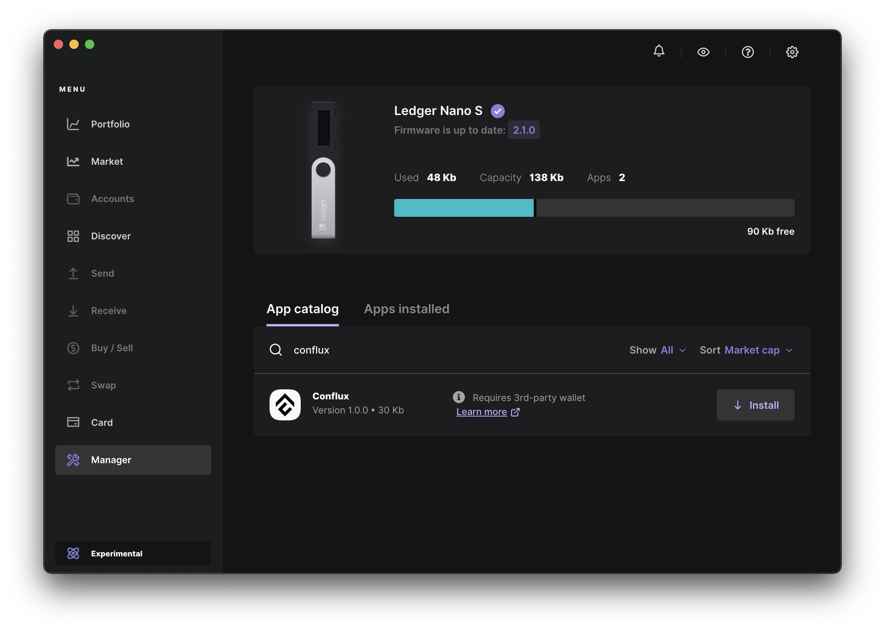
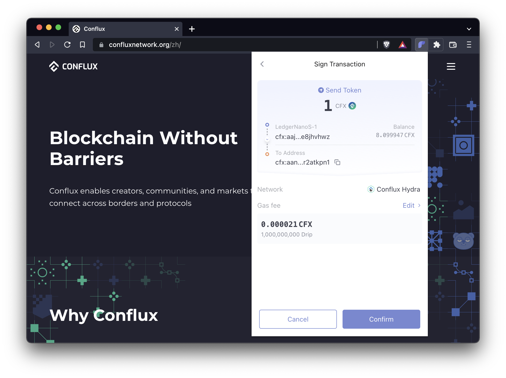

import { DiscordLink } from "../../../templates/links.tsx"

:::tip

此钱包支持Core和eSpace两种模式

:::

## 简介

You can now use your **Ledger Nano S+**, **Nano X**, **Stax**, or **Flex** hardware wallet to securely store your assets on both Core and eSpace. 在这个指南中，我们将向您展示如何使用 Ledger 设备与 Conflux 互动以及如何转移资产。

## 在 Conflux eSpace 上使用 Ledger

:::note
For Ledger Nano S users: You'll need to manually set up the development environment and load the app. Please refer to the [detailed instructions](https://github.com/conflux-chain/app-conflux?tab=readme-ov-file#2-if-my-device-is-a-nano-s-what-should-i-do).
:::

### 开始前的准备工作：

在您开始之前，请确保您已经做了以下工作：

- Updated your Ledger device to the latest firmware version

- Installed [Ledger Live](https://www.ledger.com/ledger-live) and updated it to the latest version

- Installed [Fluent Wallet](https://fluentwallet.com/) version 2.8.0 or later on Chrome or Edge browser (Firefox is not supported)

如果您遇到任何问题，请在 <DiscordLink>Discord</DiscordLink> 或者 [Telegram](https://t.me/Conflux_English) 上联系我们，我们很乐意提供帮助。

For detailed usage instructions, you can refer to the [official documentation](https://github.com/Conflux-Chain/app-conflux/tree/develop/docs/how-to-use).

### 安装

You can install the **Conflux app** on your Ledger device by following these steps:

**1.** Connect your Ledger device to your computer through USB.

**2.** 输入您的 PIN 码解锁您的设备。

**3.** Open Ledger Live.

**4.** In the menu on the left, click "Manager" to open the Ledger Live app manager.

**5.** When your Ledger device displays "Allow Ledger manager", press both buttons to continue.

**6.** Back in Ledger Live, under the "App catalog" tab, enter "Conflux" in the search field.

**7.** Once Ledger Live shows the Conflux app, press "Install".

Conflux 应用就安装成功了。

### 连接您的Ledger设备到Fluent

您可以通过以下步骤从您的Ledger设备导入账户到您的Fluent wallet：

**1.** 如果当前打开了Ledger Live，请退出。

**2.** Connect your Ledger device to your computer through USB.

**3.** 输入您的 PIN 码解锁您的设备。

**4.** 在您的设备上找到到Conflux应用，并按下两个按钮打开它。

**5.** 在Fluent中，在右上角打开菜单并选择“帐户管理”。

**6.** 点击"添加"并选择"硬件钱包"。 仔细阅读说明并点击"开始连接"。

**7.** 在“连接你的Ledger”页面上，点击"连接"。

**8.** 一个浏览器弹出窗口将会说"Fluent Wallet想要进行连接"。 从列表中选择您的Ledger设备，然后点击“连接”。

**9.** 几秒后，“选择地址”页面会在Fluent Wallet显示。 选择一个或多个您想要导入到 Fluent 的账户，然后点击“导入”。

您的账户现在已经可在 Fluent 中使用，名称为 "LedgerNanoS-1"（或类似名称）。

### 使用Ledger：加密资产转账

假设您在Ledger设备上的账户中有一些CFX代币，则以下步骤说明如何在Conflux上进行CFX转账。

:::note
如果您没有CFX，可以在列在[这里](https://123cfx.com/#Exchanges)的交易所之一购买。
:::

请确保您已经将您的Ledger账户已经导入到您的Fluent 钱包，方法和上一节的步骤相同。 如果当前打开了Ledger Live，请退出。

**1.** Connect your Ledger device to your computer through USB.

**2.** 输入您的 PIN 码解锁您的设备。

**3.** 在您的设备上找到到**Conflux应用**，并按下两个按钮打开它。

**4.** 在 Fluent钱包中, 中选择您的 Ledger 账户(例如，"LedgerNanoS-1")。

**5.** 点击 "Send" 并输入收款地址。

**6.** 在“代币和数量”下，输入CFX的转账金额，然后点击“下一步”。

**7.** 仔细检查交易细节，然后点击“确认”。

**8.** 您的Ledger设备将显示“审核交易”。 **仔细检查交易金额和收款地址**，可以通过多次按下设备上的右按钮来完成。

**9.** 如果一切看起来正确，请在"接受并发送"界面上同时按下两个按钮以批准交易。 否则，按“拒绝”界面上的两个按钮来拒绝交易。

交易被批准后，它现在已被签名并发送到Conflux网络。 您可以在 Fluent 中看到交易状态。 如果您在“历史记录”中点击交易右上角的箭头图标， 您可以在 [Conflux Scan](https://confluxscan.io) 上看到更多交易细节。

### 后续步骤

你可以在 [confluxnetwork.org](https://confluxnetwork.org) 了解更多关于Conflux的信息。 您可以在 [Conflux Scan](https://confluxscan.io) 上检查交易和帐户细节。

如果您遇到任何问题，请在 <DiscordLink>Discord</DiscordLink> 或者 [Telegram](https://t.me/Conflux_English) 上联系我们，我们很乐意提供帮助。

## 在 Conflux eSpace 上使用 Ledger

:::note
**For Conflux eSpace, you should use The Ledger Ethereum app.**
:::

### 开始前的准备工作：

在您开始之前，请确保您已经做了以下工作：

- Updated your Ledger device (Nano S+, Nano X, Stax, or Flex) to the latest firmware version
- Installed [Ledger Live](https://www.ledger.com/ledger-live) and updated it to the latest version
- Installed [MetaMask](https://MetaMask.io) on Chrome or Edge browser (Firefox is not supported)

如果您遇到任何问题，请在 <DiscordLink>Discord</DiscordLink> 或者 [Telegram](https://t.me/Conflux_English) 上联系我们，我们很乐意提供帮助。

### 安装

You can install the **Ethereum app** on your Ledger device by following these steps:

1. Connect your Ledger device to your computer through USB.
1. 输入您的 PIN 码解锁您的设备。
1. 打开 Ledger Live。
1. 在左边的菜单中，点击“管理”打开Ledger Live 应用程序管理器。
1. 当您的Ledger设备显示“允许Ledger管理器”时，请按下两个按钮以继续。
1. 回到 Ledger Live, 在 “App catalog” 选项卡下，在搜索字段中输入 “Conflux”。
1. 当 Ledger Live 上显示 Conflux 应用程序时，请点击“安装”。
1. 现在，以太坊应用程序就已经安装成功了。

### 设置 MetaMask

#### 连接您的 MetaMask 钱包到 Conflux eSpace

You can add the Conflux eSpace network to your MetaMask wallet by following these steps:

1. 打开浏览器，访问 https://evmchainlist.org。
1. 搜索“Conflux eSpace”
1. 点击“连接钱包”以允许该网站向MetaMask发送请求。
1. 点击“Conflux eSpace”下面的“添加到MetaMask”。
1. 当 MetaMask 提示“允许此站点添加网络？”时，点击“批准”。
1. 当 MetaMask 提示“允许此站点切换网络？”时，点击“批准”。

Your MetaMask wallet is now connected to Conflux eSpace. You can switch to other networks anytime through the network selection dropdown menu in MetaMask.

Alternatively, you can add Conflux eSpace to MetaMask manually under "Settings", "Networks", "Add Network":

- **Network Name**: Conflux eSpace
- **New RPC URL**: https://evm.confluxrpc.com
- **Chain ID**: 1030
- **Currency Symbol**: CFX
- **Block Explorer URL**: https://evm.confluxscan.net

#### 连接您的Ledger设备到MetaMask

You can import accounts from your Ledger device into your MetaMask wallet by following these steps:

1. 如果当前打开了Ledger Live，请退出。
2. Connect your Ledger device to your computer through USB.
3. 输入您的 PIN 码解锁您的设备。
4. Navigate to the Ethereum app on your device and press both buttons to open it.
5. 在 MetaMask 中，找到 "Settings"、"Advanced"、"Preferred Ledger Connection Type"，并选择 "WebHID"。
6. 在 MetaMask 中打开右上角菜单，然后点击“连接硬件钱包”。
7. 选择"Ledger"并点击"继续"。
8. 您将看到一个浏览器弹出窗口，上面显示着 "MetaMask 希望连接到 HID 设备"。 从列表中选择您的Ledger设备，然后点击“连接”。
9. 几秒钟后，MetaMask会显示“选择账户”页面。 请选择您想要导入到 MetaMask 的一个或多个账户，然后点击“解锁”。
10. 你的账户现在可以在 MetaMask 中看到，显示为 "Ledger 1"。

### 使用Ledger

#### 发送加密资产

Assuming your account on the Ledger device has some CFX tokens, the steps below show how to make a CFX transfer on Conflux eSpace.

*Note: If you do not have CFX, you can purchase at one of the exchanges listed [here](/docs/category/from-exchanges).*

1. 确认您已经通过上一节中的步骤将您的 Ledger 账户导入到 MetaMask 钱包中。 如果当前打开了Ledger Live，请退出。
2. Connect your Ledger device to your computer through USB.
3. 输入您的 PIN 码解锁您的设备。
4. Navigate to the Ethereum app on your device and press both buttons to open it.
5. 在 MetaMask 中选择您的 Ledger 账户(例如，“Ledger 1”)。
6. 点击“发送”并输入接收方地址(应以`0x`开头)。
7. 在“金额”下，输入要转移的 CFX 数量，然后单击“下一步”。
8. 仔细检查交易详情，然后点击“确认”。
9. 您的Ledger设备现在将显示“审核交易”。 **仔细检查交易金额和收款地址**，可以通过多次按下设备上的右按钮来完成。
10. 如果所有信息都正确，请按下“接受并发送”屏幕上的两个按钮以批准交易。 否则，按“拒绝”界面上的两个按钮来拒绝交易。
11. 交易被批准后，它现在已被签名并发送到Conflux网络。 你可以在 MetaMask 中查看交易状态。 如果你点击该交易并点击“在区块浏览器中查看”，你可以在[Conflux Scan](https://evm.confluxscan.io)上查看更多细节。

#### 接收加密资产

In order to receive CFX and ERC20 tokens to your Ledger wallet account, simply copy your address from MetaMask and share it with the sender. You only need to sign transactions using your Ledger device when sending funds, not when receiving them. MetaMask can also provide you with an easy-to-use QR code under "Account details".

#### 获取CFX

There are multiple ways of obtaining CFX and other tokens on Conflux eSpace.

- You can obtain CFX and withdraw it to Conflux eSpace through a variety of centralized exchanges (e.g., [KuCoin](https://www.kucoin.com)).
- You can also use a decentralized exchange like [Swappi](https://app.swappi.io/#/swap).
- Finally, you can also transfer crypto assets from other chains to Conflux eSpace through cross-chain apps like [Multichain](https://app.multichain.org/#/router), [meson.fi](https://meson.fi/), [cBridge](https://cbridge.celer.network/#/transfer), or the [Conflux eSpace Bridge](https://confluxhub.io/espace-bridge).

#### 查看您的余额

The easiest way to check your CFX and ERC20 token balances held by your Ledger account is to simply view them in MetaMask.

Alternatively, you can click on "View Account in Explorer", or navigate to https://evm.confluxscan.net and manually search for your address to see your token balances and transaction history.

